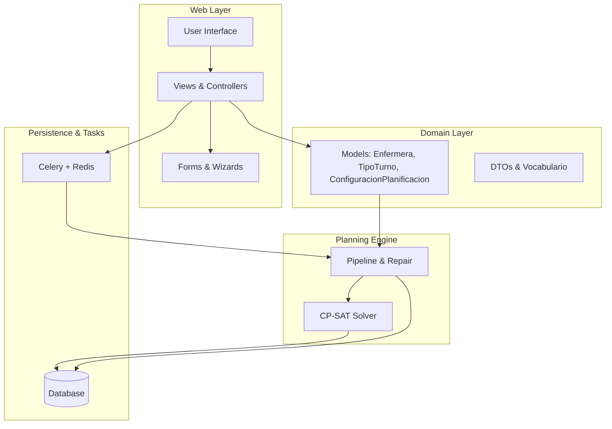
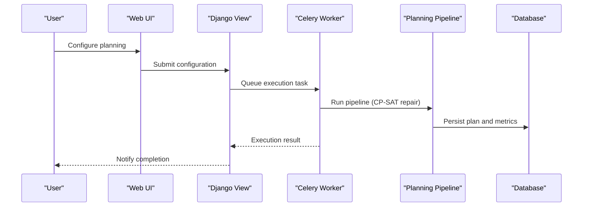
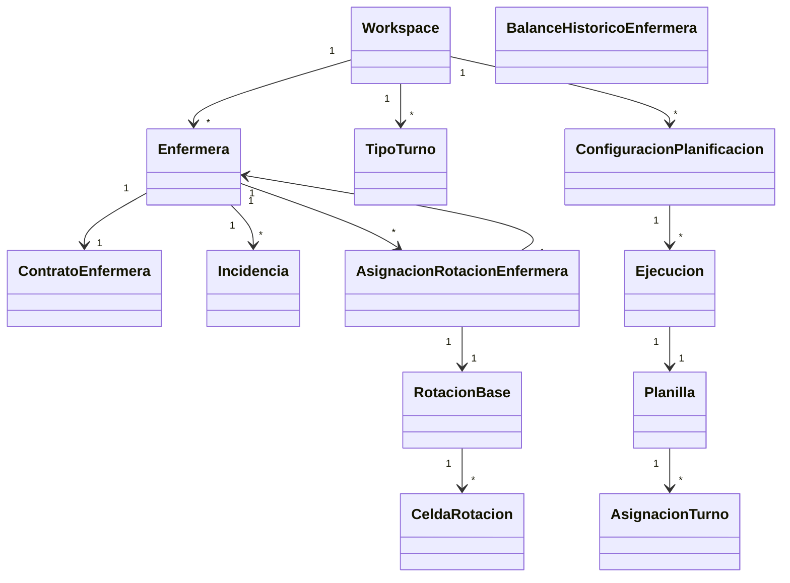

# Target Audience and Use Cases

<cite>
**Referenced Files in This Document**
- [README.md](file://README.md)
- [WIKI.md](file://docs/WIKI.md)
- [models.py](file://turnos/models.py)
- [vocabulario.py](file://turnos/dominio/vocabulario.py)
- [restricciones-turnos-enfermeria-sacyl-2025.md](file://restricciones-turnos-enfermeria-sacyl-2025.md)
- [tasks.py](file://turnos/tasks.py)
- [exportacion.py](file://turnos/utils/exportacion.py)
- [dashboard.html](file://turnos/templates/turnos/dashboard.html)
- [urls.py](file://turnos/urls.py)
</cite>

## Table of Contents
1. [Introduction](#introduction)
2. [Project Structure](#project-structure)
3. [Core Components](#core-components)
4. [Architecture Overview](#architecture-overview)
5. [Detailed Component Analysis](#detailed-component-analysis)
6. [Dependency Analysis](#dependency-analysis)
7. [Performance Considerations](#performance-considerations)
8. [Troubleshooting Guide](#troubleshooting-guide)
9. [Conclusion](#conclusion)
10. [Appendices](#appendices)

## Introduction
This nursing shift scheduling system automates the generation of monthly roster-like schedules for nurses using an intelligent constraint satisfaction engine. It replaces manual, error-prone scheduling with a reliable, repeatable process that respects operational needs, legal/regulatory constraints, and staff preferences. The system targets healthcare organizations seeking to reduce administrative burden, improve coverage consistency, and ensure compliance with labor regulations while enhancing staff satisfaction.

## Project Structure
The system is built as a Django web application with asynchronous task processing and a robust domain model supporting advanced planning features:
- Web interface for configuration, execution, and reporting
- Asynchronous execution via Celery/Redis
- Constraint-driven planning engine using OR-Tools CP-SAT
- Multi-workspace support for organizational isolation
- Rich export capabilities (Excel, PDF, CSV, iCalendar)

**Diagram sources**
- [WIKI.md](file://docs/WIKI.md)
- [models.py](file://turnos/models.py)
- [tasks.py](file://turnos/tasks.py)

**Section sources**
- [README.md](file://README.md)
- [WIKI.md](file://docs/WIKI.md)

## Core Components
- Multi-workspace organization: isolates data per facility or department
- Nurse registry: manages profiles, contact info, preferences, and contracts
- Turn types: flexible, configurable shift types with dynamic timing and special statuses
- Planning configuration: wizard-driven setup of period, demand, hard and soft constraints, and solver parameters
- Execution engine: asynchronous planning with CP-SAT repair and validation
- Results and exports: comprehensive reporting and multiple export formats

Key capabilities:
- Automated monthly rosters with cyclic rotation patterns
- Coverage guarantees and equity objectives
- Historical balance consideration for annual fairness
- Regulatory compliance builder (e.g., SACYL 2025)
- Real-time dashboards and statistics

**Section sources**
- [models.py](file://turnos/models.py)
- [WIKI.md](file://docs/WIKI.md)

## Architecture Overview
The system follows a layered architecture:
- Presentation: Django templates and views with Bootstrap frontend
- Domain: Django models and typed DTOs for planning logic
- Planning: CP-SAT-based repair pipeline over deterministic base rotations
- Persistence: Django ORM with PostgreSQL in production
- Background processing: Celery with Redis for task orchestration

**Diagram sources**
- [tasks.py](file://turnos/tasks.py)
- [WIKI.md](file://docs/WIKI.md)

**Section sources**
- [tasks.py](file://turnos/tasks.py)
- [WIKI.md](file://docs/WIKI.md)

## Detailed Component Analysis

### Target Audiences and Primary User Groups
The system serves multiple stakeholder roles within healthcare organizations:

- Healthcare administrators
  - Responsible for strategic workforce planning, budgeting, and policy alignment
  - Use the dashboard to monitor execution volumes, coverage consistency, and system health
  - Benefit from standardized compliance reporting and exportable statistics

- Facility managers
  - Manage day-to-day operations and ensure adequate coverage across units
  - Use the wizard to configure shifts, demand patterns, and constraints per service area
  - Rely on automated coverage guarantees and conflict detection

- Human resources (HR) personnel
  - Maintain nurse contracts, entitlements, and leave records
  - Align planning with labor regulations and entitlements (e.g., vacation, rest periods)
  - Track historical balances for equitable treatment year-round

- Scheduling coordinators
  - Execute planning runs, review results, and export schedules for distribution
  - Apply exceptions (vacation, training, incapacity) and adjust preferences
  - Generate reports for management review and audit trails

These roles share common goals: reduce manual effort, minimize coverage gaps, and ensure regulatory adherence.

**Section sources**
- [dashboard.html](file://turnos/templates/turnos/dashboard.html)
- [urls.py](file://turnos/urls.py)

### Use Cases and Industry Applications
The system supports diverse nursing environments:

- Hospital staff scheduling
  - Monthly rosters with rotating cycles across medical/surgical units
  - Coverage guarantees per shift type and daily demand
  - Equity objectives for night work, weekends, and holidays

- Emergency department rotations
  - High-demand night coverage with strict limits on consecutive night shifts
  - Minimum rest between shifts and maximum weekly hours
  - Coverage thresholds aligned with ED staffing protocols

- Intensive care unit (ICU) coverage
  - Specialized shift patterns with mandatory rest periods after long nights
  - Coverage minimums for critical care ratios
  - Historical balance to prevent burnout and fatigue

- Outpatient clinic scheduling
  - Predictable morning and afternoon slots with balanced workload
  - Leave and training blocks integrated into the schedule
  - Preference-based distribution for part-time and variable schedules

- Specialized unit planning
  - Psychiatric, dialysis, or oncology units with specific shift requirements
  - Compliance with regional labor laws (e.g., SACYL 2025)
  - Exportable calendars for staff calendar systems

Industry-specific examples:
- Regional regulatory compliance (e.g., SACYL 2025) embedded as canonical constraints
- Contract-driven planning with weekly/monthly targets
- Historical balance to maintain long-term equity across shifts and days off

**Section sources**
- [restricciones-turnos-enfermeria-sacyl-2025.md](file://restricciones-turnos-enfermeria-sacyl-2025.md)
- [WIKI.md](file://docs/WIKI.md)

### Problem Scenarios Addressed
The system resolves common pain points in nursing scheduling:

- Manual scheduling inefficiencies
  - Time-intensive manual creation and constant adjustments
  - Inconsistent application of policies across schedulers
  - Solution: guided wizard and automated constraint enforcement

- Coverage gaps and understaffing
  - Missed minimums per shift or unit
  - Last-minute substitutions causing imbalance
  - Solution: demand-driven planning with hard coverage constraints

- Staff dissatisfaction and burnout
  - Unpredictable or unfair distribution of night shifts, weekends, and holidays
  - Lack of preference consideration
  - Solution: soft equity objectives and preference modeling

- Regulatory compliance issues
  - Violations of maximum working hours, rest periods, and entitlements
  - Audit trail challenges
  - Solution: canonical constraints and validation reports

- Administrative burden
  - Excessive time spent on planning and approvals
  - Difficulties generating exportable schedules
  - Solution: asynchronous execution and multiple export formats

**Section sources**
- [WIKI.md](file://docs/WIKI.md)
- [restricciones-turnos-enfermeria-sacyl-2025.md](file://restricciones-turnos-enfermeria-sacyl-2025.md)

### Success Metrics and Expected Outcomes
Measurable improvements include:

- Reduced scheduling time
  - Automated planning reduces manual effort by focusing on exceptions and approvals
  - Wizard accelerates configuration for recurring periods

- Improved staff satisfaction scores
  - Fair distribution of shifts and days off through equity objectives
  - Preference accommodation within policy bounds

- Better coverage consistency
  - Hard constraints guarantee minimum coverage per shift and day
  - Validation reports highlight violations before distribution

- Compliance with labor regulations
  - Built-in canonical constraints enforce maximum hours, rest periods, and entitlements
  - Exportable compliance reports for audits

- Operational efficiency
  - Dashboards track execution volumes and quality indicators
  - Export formats integrate with calendars and payroll systems

**Section sources**
- [WIKI.md](file://docs/WIKI.md)
- [exportacion.py](file://turnos/utils/exportacion.py)

### Case Study Insights and ROI
While specific ROI figures are not included in the repository, the system’s design yields tangible benefits:

- Reduced administrative overhead
  - Centralized configuration and asynchronous processing minimize front-line scheduling time
- Lower risk of errors
  - Constraint validation prevents coverage shortfalls and policy breaches
- Scalable planning
  - Multi-workspace architecture supports multiple facilities or departments with isolated data
- Regulatory assurance
  - Canonical constraints and validation reports simplify audits and inspections

These factors contribute to improved operational reliability and staff morale, indirectly supporting cost savings and productivity gains.

**Section sources**
- [WIKI.md](file://docs/WIKI.md)
- [models.py](file://turnos/models.py)

## Dependency Analysis
The system exhibits clear separation of concerns and minimal coupling:

**Diagram sources**
- [models.py](file://turnos/models.py)

**Section sources**
- [models.py](file://turnos/models.py)

## Performance Considerations
- Asynchronous execution
  - Long-running planning tasks run in Celery workers to avoid blocking the web interface
- Solver tuning
  - Adjustable parallel workers and timeout enable balancing speed and solution quality
- Data volume
  - Bulk creation of assignments improves persistence performance for large plans
- Export throughput
  - Efficient Excel/PDF generation with optimized styles and sheets

[No sources needed since this section provides general guidance]

## Troubleshooting Guide
Common issues and resolutions:

- Planning fails with “infeasible” state
  - Verify coverage demands and nurse availability
  - Review hard constraints and reduce requirements if needed
  - Increase solver timeout and parallel workers for complex periods

- Celery worker not processing tasks
  - Confirm Redis connectivity and worker status
  - Restart workers and inspect logs for errors

- Export failures
  - Ensure required libraries are installed (openpyxl, reportlab, icalendar)
  - Validate permissions for temporary storage

- Dashboard statistics missing
  - Confirm database connectivity and recent execution records

**Section sources**
- [WIKI.md](file://docs/WIKI.md)

## Conclusion
This nursing shift scheduling system delivers a comprehensive solution for healthcare organizations seeking reliable, compliant, and fair scheduling. By automating planning, enforcing constraints, and providing rich reporting and export capabilities, it significantly reduces administrative burden, improves coverage consistency, and enhances staff satisfaction. Its modular architecture and multi-workspace support make it adaptable to diverse healthcare environments, from general hospitals to specialized units.

[No sources needed since this section summarizes without analyzing specific files]

## Appendices

### Regulatory Compliance Builder
The system includes a canonical vocabulary and builder for regional regulations (e.g., SACYL 2025), enabling organizations to embed legal requirements directly into planning configurations.

**Section sources**
- [restricciones-turnos-enfermeria-sacyl-2025.md](file://restricciones-turnos-enfermeria-sacyl-2025.md)
- [vocabulario.py](file://turnos/dominio/vocabulario.py)