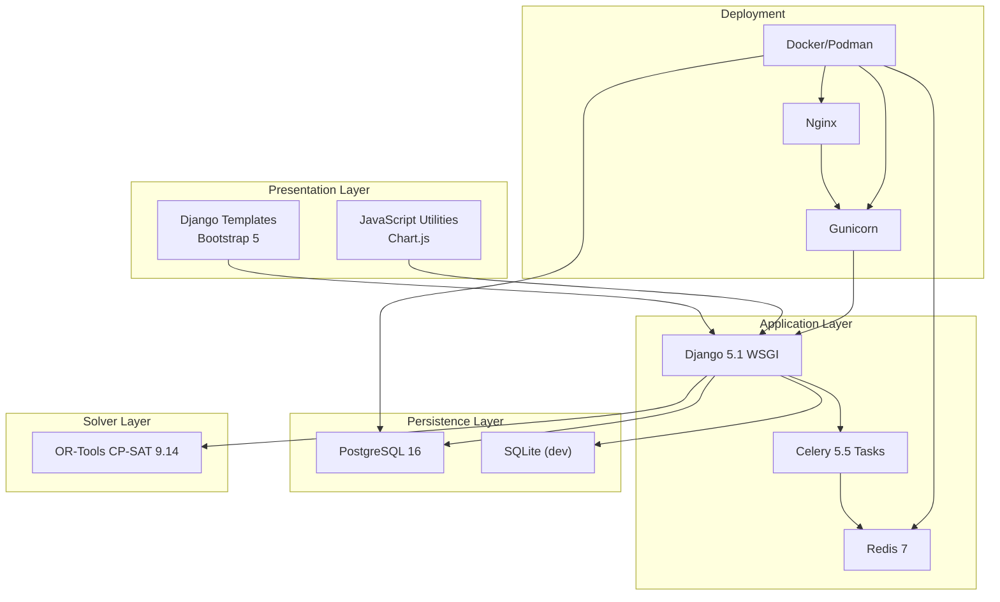
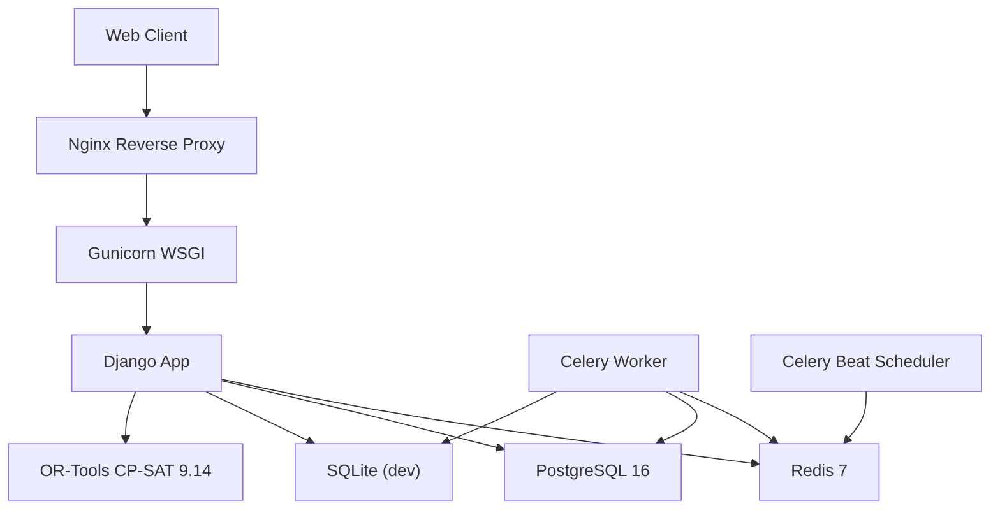
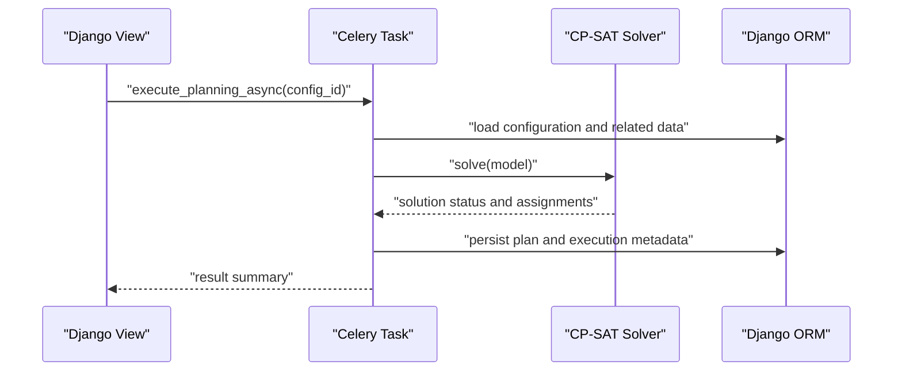
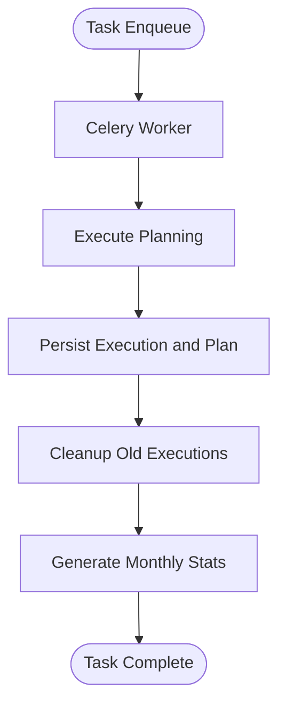
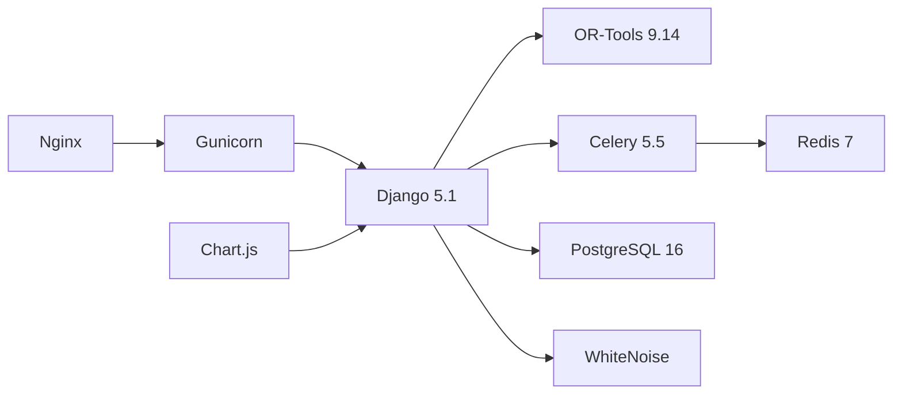

# Technology Stack and Architecture Overview

<cite>
**Referenced Files in This Document**
- [README.md](file://README.md)
- [requirements.txt](file://requirements.txt)
- [Dockerfile](file://Dockerfile)
- [docker-compose.yml](file://docker-compose.yml)
- [docker-compose.dev.yml](file://docker-compose.dev.yml)
- [docker-entrypoint.sh](file://docker-entrypoint.sh)
- [proyecto_turnos/settings.py](file://proyecto_turnos/settings.py)
- [proyecto_turnos/celery.py](file://proyecto_turnos/celery.py)
- [turnos/tasks.py](file://turnos/tasks.py)
- [turnos/resolvedor.py](file://turnos/resolvedor.py)
- [docs/ARQUITECTURA.md](file://docs/ARQUITECTURA.md)
- [static/js/main.js](file://static/js/main.js)
- [static/js/charts.js](file://static/js/charts.js)
</cite>

## Table of Contents
1. [Introduction](#introduction)
2. [Project Structure](#project-structure)
3. [Core Components](#core-components)
4. [Architecture Overview](#architecture-overview)
5. [Detailed Component Analysis](#detailed-component-analysis)
6. [Dependency Analysis](#dependency-analysis)
7. [Performance Considerations](#performance-considerations)
8. [Troubleshooting Guide](#troubleshooting-guide)
9. [Conclusion](#conclusion)
10. [Appendices](#appendices)

## Introduction
This document presents the complete technology stack and architecture of the nursing shift scheduling system. It explains the backend framework (Django 5.1), the constraint satisfaction solver (OR-Tools CP-SAT 9.14), asynchronous processing (Celery 5.5 + Redis 7), database systems (PostgreSQL 16 in production, SQLite in development), frontend technologies (Bootstrap 5 + Chart.js), and deployment infrastructure (Gunicorn + Nginx). It also documents containerization support via Docker and Podman (including rootless containers), system requirements, dependency management, upgrade paths, security considerations, performance characteristics, and scalability implications. Architectural diagrams illustrate component relationships and data flow patterns.

## Project Structure
The project follows a layered architecture:
- Presentation layer: Django templates, forms, and static assets (Bootstrap 5, Chart.js)
- Domain and persistence layer: Django models and ORM (PostgreSQL/SQLite)
- Planning engine: Constraint Satisfaction Solver (CP-SAT) and orchestration pipeline
- Background processing: Celery tasks with Redis broker/cache
- Deployment: Docker/Podman with Gunicorn and Nginx

**Diagram sources**
- [Dockerfile:1-87](file://Dockerfile#L1-L87)
- [docker-compose.yml:1-168](file://docker-compose.yml#L1-L168)
- [proyecto_turnos/settings.py:62-76](file://proyecto_turnos/settings.py#L62-L76)
- [proyecto_turnos/celery.py:1-14](file://proyecto_turnos/celery.py#L1-L14)
- [turnos/resolvedor.py:1-113](file://turnos/resolvedor.py#L1-L113)

**Section sources**
- [README.md:58-69](file://README.md#L58-L69)
- [docs/ARQUITECTURA.md:18-49](file://docs/ARQUITECTURA.md#L18-L49)

## Core Components
- Backend framework: Django 5.1 with WhiteNoise for static files and environment-driven configuration
- Constraint satisfaction solver: OR-Tools CP-SAT 9.14 integrated for shift scheduling repairs
- Asynchronous processing: Celery 5.5 with Redis 7 as broker/result backend
- Database: PostgreSQL 16 for production, SQLite for development
- Frontend: Bootstrap 5 and Chart.js for dashboards and visualizations
- Deployment: Gunicorn as WSGI server and Nginx as reverse proxy/load balancer
- Containerization: Docker and Podman with rootless user configuration

**Section sources**
- [requirements.txt:17-37](file://requirements.txt#L17-L37)
- [proyecto_turnos/settings.py:134-160](file://proyecto_turnos/settings.py#L134-L160)
- [Dockerfile:1-87](file://Dockerfile#L1-L87)
- [README.md:58-69](file://README.md#L58-L69)

## Architecture Overview
The system orchestrates a deterministic base rotation with CP-SAT repairs, ensuring hard constraints while optimizing soft objectives. Celery handles long-running planning tasks asynchronously, persisting results to the database and exposing them via the Django web interface.

**Diagram sources**
- [docker-compose.yml:129-152](file://docker-compose.yml#L129-L152)
- [proyecto_turnos/settings.py:134-160](file://proyecto_turnos/settings.py#L134-L160)
- [turnos/tasks.py:17-240](file://turnos/tasks.py#L17-L240)

## Detailed Component Analysis

### Backend Framework: Django 5.1
- Environment-driven configuration for databases, static storage, and Celery
- WhiteNoise middleware for serving static files efficiently
- Password validators and internationalization settings
- Security middleware and CSRF protection enabled

Key configuration highlights:
- Database selection via DATABASE_URL or fallback to SQLite
- Static files compression and manifest storage
- Email backend configurable via environment
- Celery broker and result backend configured with JSON serialization

**Section sources**
- [proyecto_turnos/settings.py:62-160](file://proyecto_turnos/settings.py#L62-L160)

### Constraint Satisfaction Solver: OR-Tools CP-SAT 9.14
- The solver is invoked to repair and optimize shifts around a deterministic base rotation
- Parameters include number of workers, time limits, and optional random seed
- Results validated post-solve and returned as structured data

**Diagram sources**
- [turnos/tasks.py:17-240](file://turnos/tasks.py#L17-L240)
- [turnos/resolvedor.py:21-51](file://turnos/resolvedor.py#L21-L51)

**Section sources**
- [turnos/resolvedor.py:1-113](file://turnos/resolvedor.py#L1-L113)
- [requirements.txt](file://requirements.txt#L37)

### Asynchronous Processing: Celery 5.5 + Redis 7
- Celery app configured from Django settings with JSON serialization
- Dedicated worker and beat services orchestrated via docker-compose
- Tasks include planning execution, cleanup, and statistics generation
- Timeouts and retry policies configured for robust operation

**Diagram sources**
- [proyecto_turnos/celery.py:1-14](file://proyecto_turnos/celery.py#L1-L14)
- [turnos/tasks.py:17-240](file://turnos/tasks.py#L17-L240)
- [docker-compose.yml:81-128](file://docker-compose.yml#L81-L128)

**Section sources**
- [proyecto_turnos/celery.py:1-14](file://proyecto_turnos/celery.py#L1-L14)
- [proyecto_turnos/settings.py:134-160](file://proyecto_turnos/settings.py#L134-L160)
- [turnos/tasks.py:17-240](file://turnos/tasks.py#L17-L240)
- [docker-compose.yml:81-128](file://docker-compose.yml#L81-L128)

### Database Systems: PostgreSQL 16 and SQLite
- Production uses PostgreSQL 16 with environment-driven connection
- Development defaults to SQLite with explicit timeout
- Docker Compose provisions both databases with health checks

**Section sources**
- [proyecto_turnos/settings.py:62-76](file://proyecto_turnos/settings.py#L62-L76)
- [docker-compose.yml:4-25](file://docker-compose.yml#L4-L25)
- [docker-compose.dev.yml:22-31](file://docker-compose.dev.yml#L22-L31)

### Frontend Technologies: Bootstrap 5 + Chart.js
- Bootstrap 5 for responsive UI components and navigation
- Chart.js for dashboard visualizations (bars, lines, doughnuts)
- Utility JavaScript module for loaders, forms, tables, and live search

**Section sources**
- [static/js/main.js:1-590](file://static/js/main.js#L1-L590)
- [static/js/charts.js:1-275](file://static/js/charts.js#L1-L275)

### Deployment Infrastructure: Gunicorn + Nginx
- Gunicorn serves Django via WSGI with configurable workers and threads
- Nginx acts as reverse proxy and serves static/media assets
- Dockerized deployment supports rootless containers and health checks

**Section sources**
- [Dockerfile:82-87](file://Dockerfile#L82-L87)
- [docker-compose.yml:129-152](file://docker-compose.yml#L129-L152)

### Containerization Support: Docker and Podman (Rootless)
- Rootless user “django” created inside the container for security
- Entrypoint waits for PostgreSQL and Redis readiness before launching services
- Both Docker and Podman compose files provided for production and development

**Section sources**
- [Dockerfile:16-17](file://Dockerfile#L16-L17)
- [docker-entrypoint.sh:1-15](file://docker-entrypoint.sh#L1-L15)
- [docker-compose.yml:4-80](file://docker-compose.yml#L4-L80)
- [docker-compose.dev.yml:1-68](file://docker-compose.dev.yml#L1-L68)

## Dependency Analysis
The system’s dependencies are declared in requirements.txt and enforced by the container build process. The following diagram maps major runtime dependencies and their roles.

**Diagram sources**
- [requirements.txt:17-37](file://requirements.txt#L17-L37)
- [Dockerfile:51-53](file://Dockerfile#L51-L53)
- [proyecto_turnos/settings.py:103-110](file://proyecto_turnos/settings.py#L103-L110)

**Section sources**
- [requirements.txt:1-67](file://requirements.txt#L1-L67)
- [Dockerfile:51-53](file://Dockerfile#L51-L53)

## Performance Considerations
- Solver scaling: CP-SAT worker count and time limits are configurable per configuration
- Database I/O: Bulk creation of assignments reduces round-trips during plan persistence
- Background processing: Long-running tasks offloaded to Celery workers with timeouts and retries
- Static delivery: WhiteNoise and Nginx improve static asset performance
- Container resource allocation: Configure Gunicorn workers and threads according to host CPU cores

[No sources needed since this section provides general guidance]

## Troubleshooting Guide
Common operational issues and remedies:
- Database connectivity: Verify DATABASE_URL and credentials; ensure PostgreSQL is healthy
- Redis availability: Confirm Redis password and network reachability
- Celery task failures: Inspect task logs, verify broker connectivity, and review retry counts
- Static files not served: Check WhiteNoise configuration and collectstatic in production
- Container startup: Entrypoint waits for DB and Redis; inspect health checks and logs

**Section sources**
- [proyecto_turnos/settings.py:62-76](file://proyecto_turnos/settings.py#L62-L76)
- [docker-entrypoint.sh:4-11](file://docker-entrypoint.sh#L4-L11)
- [docker-compose.yml:174-179](file://docker-compose.yml#L174-L179)

## Conclusion
The system combines a robust Django backend, a specialized CP-SAT solver for shift scheduling, and a scalable asynchronous processing layer powered by Celery and Redis. Containerized deployments with Docker and Podman enable secure, reproducible environments. The architecture emphasizes deterministic base rotations with targeted repairs, ensuring predictable and fair schedules aligned with hard and soft constraints.

[No sources needed since this section summarizes without analyzing specific files]

## Appendices

### System Requirements and Upgrade Paths
- Python: 3.11 (as used by the base image)
- Django: >=5.1, <5.2
- OR-Tools: 9.14
- Celery: 5.5
- Redis: 7
- PostgreSQL: 16 (production)
- SQLite: for development

Upgrade recommendations:
- Pin versions in requirements.txt to ensure reproducibility
- Test upgrades in development (docker-compose.dev.yml) before production rollout
- Validate CP-SAT model changes after upgrading OR-Tools

**Section sources**
- [requirements.txt:17-37](file://requirements.txt#L17-L37)
- [Dockerfile:1-2](file://Dockerfile#L1-L2)

### Security Considerations
- Use environment variables for secrets (SECRET_KEY, DATABASE_URL, REDIS_PASSWORD)
- Restrict ALLOWED_HOSTS and configure HTTPS via Nginx
- Enable maintenance mode via environment flag for controlled updates
- Run containers as non-root user (rootless) for reduced privilege exposure

**Section sources**
- [proyecto_turnos/settings.py:10-12](file://proyecto_turnos/settings.py#L10-L12)
- [Dockerfile:16-17](file://Dockerfile#L16-L17)
- [docker-compose.yml:31-32](file://docker-compose.yml#L31-L32)