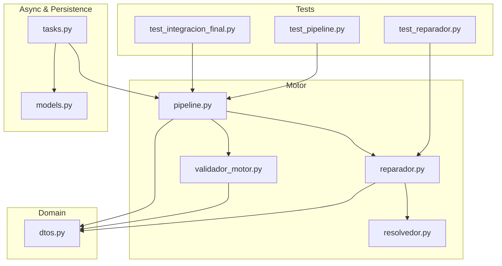
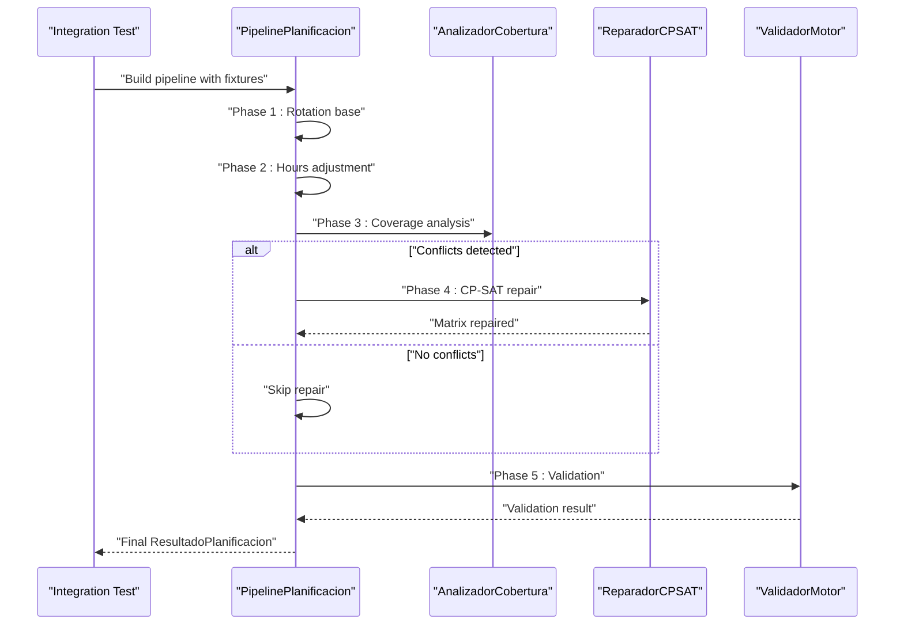
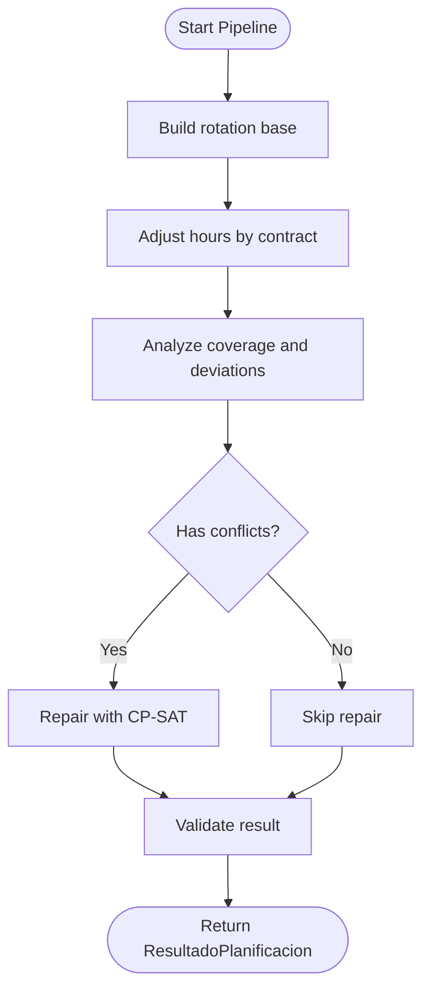
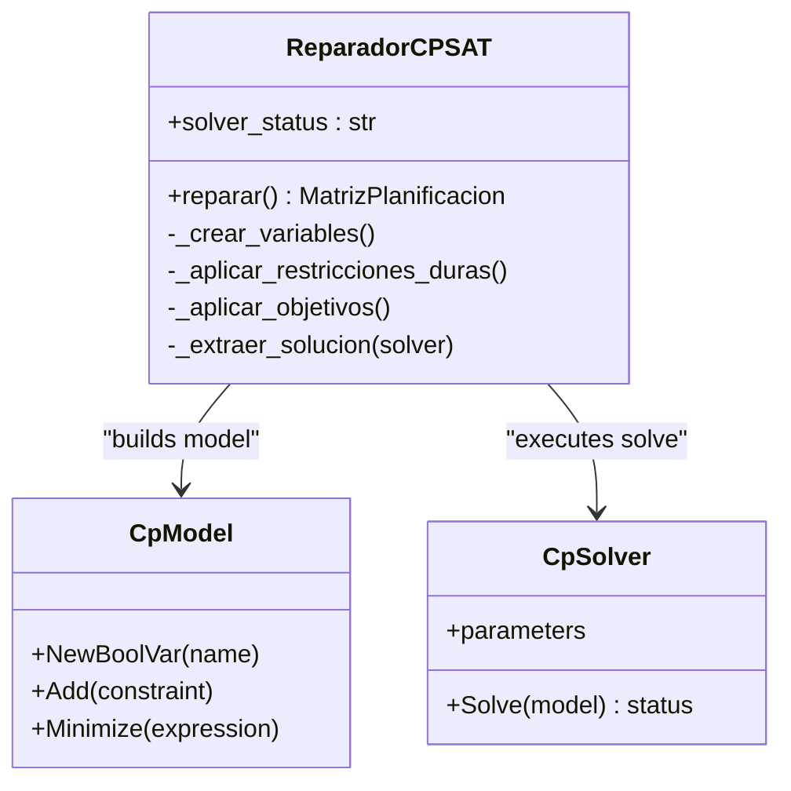
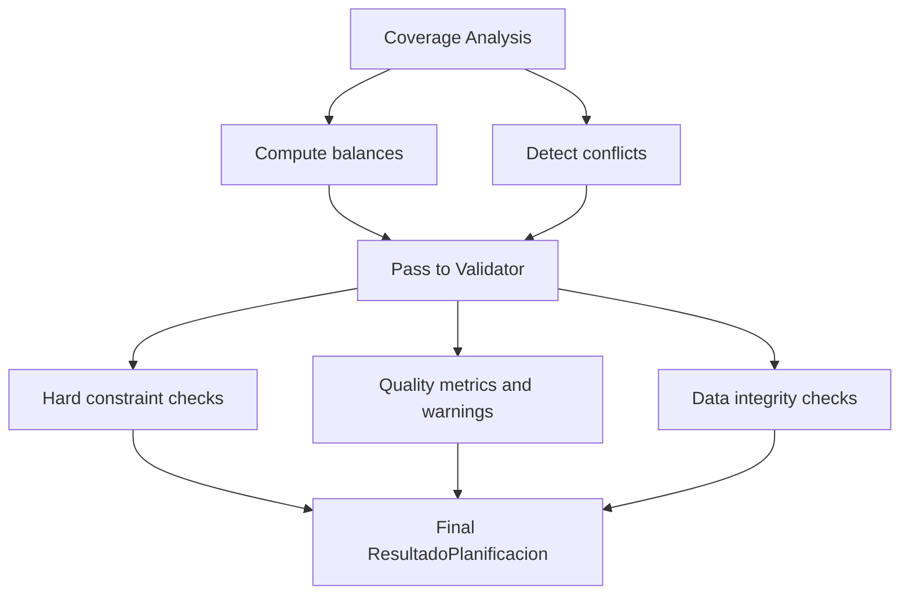
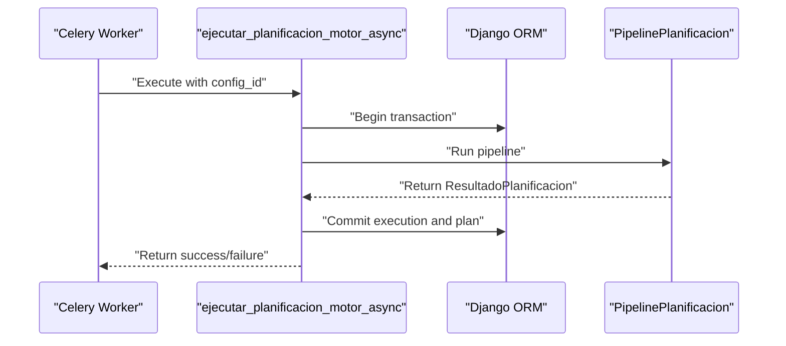
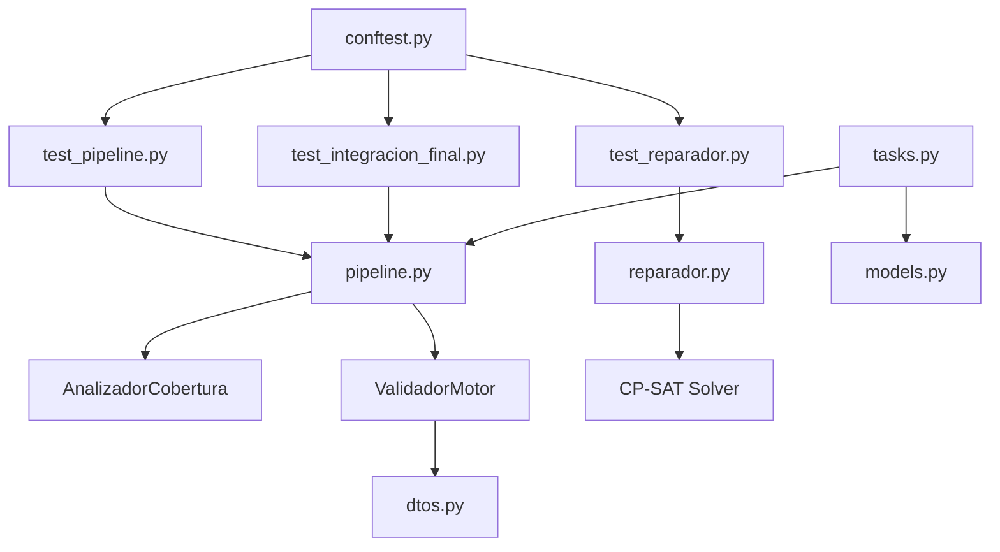

# Integration Testing

<cite>
**Referenced Files in This Document**
- [test_integracion_final.py](file://turnos/tests/test_motor/test_integracion_final.py)
- [test_pipeline.py](file://turnos/tests/test_motor/test_pipeline.py)
- [test_reparador.py](file://turnos/tests/test_motor/test_reparador.py)
- [pipeline.py](file://turnos/motor/pipeline.py)
- [reparador.py](file://turnos/motor/reparador.py)
- [validador_motor.py](file://turnos/motor/validador_motor.py)
- [resolvedor.py](file://turnos/resolvedor.py)
- [tasks.py](file://turnos/tasks.py)
- [dtos.py](file://turnos/dominio/dtos.py)
- [conftest.py](file://turnos/tests/conftest.py)
- [models.py](file://turnos/models.py)
- [run_planificacion.py](file://turnos/management/commands/run_planificacion.py)
</cite>

## Table of Contents
1. [Introduction](#introduction)
2. [Project Structure](#project-structure)
3. [Core Components](#core-components)
4. [Architecture Overview](#architecture-overview)
5. [Detailed Component Analysis](#detailed-component-analysis)
6. [Dependency Analysis](#dependency-analysis)
7. [Performance Considerations](#performance-considerations)
8. [Troubleshooting Guide](#troubleshooting-guide)
9. [Conclusion](#conclusion)
10. [Appendices](#appendices)

## Introduction
This document describes integration testing strategies for the planning pipeline, constraint satisfaction processes, and solver integration. It focuses on validating end-to-end workflows, CP-SAT solver interactions, and data flow across components. It also covers testing of constraint validation, coverage analysis, conflict resolution, asynchronous task processing, database transactions, and cross-component communication patterns. Performance and load testing considerations for the constraint satisfaction engine are included.

## Project Structure
The integration tests are organized under the motor test suite and validate coordinated behavior among:
- Planning pipeline orchestration
- Constraint satisfaction via CP-SAT
- Coverage analysis and validation
- Asynchronous task execution and database persistence

**Diagram sources**
- [test_integracion_final.py:1-1086](file://turnos/tests/test_motor/test_integracion_final.py#L1-L1086)
- [test_pipeline.py:1-362](file://turnos/tests/test_motor/test_pipeline.py#L1-L362)
- [test_reparador.py:1-286](file://turnos/tests/test_motor/test_reparador.py#L1-L286)
- [pipeline.py:1-267](file://turnos/motor/pipeline.py#L1-L267)
- [reparador.py:1-609](file://turnos/motor/reparador.py#L1-L609)
- [validador_motor.py:1-451](file://turnos/motor/validador_motor.py#L1-L451)
- [resolvedor.py:1-113](file://turnos/resolvedor.py#L1-L113)
- [dtos.py:1-274](file://turnos/dominio/dtos.py#L1-L274)
- [tasks.py:1-716](file://turnos/tasks.py#L1-L716)
- [models.py:1-825](file://turnos/models.py#L1-L825)

**Section sources**
- [test_integracion_final.py:1-1086](file://turnos/tests/test_motor/test_integracion_final.py#L1-L1086)
- [test_pipeline.py:1-362](file://turnos/tests/test_motor/test_pipeline.py#L1-L362)
- [test_reparador.py:1-286](file://turnos/tests/test_motor/test_reparador.py#L1-L286)
- [pipeline.py:1-267](file://turnos/motor/pipeline.py#L1-L267)
- [reparador.py:1-609](file://turnos/motor/reparador.py#L1-L609)
- [validador_motor.py:1-451](file://turnos/motor/validador_motor.py#L1-L451)
- [resolvedor.py:1-113](file://turnos/resolvedor.py#L1-L113)
- [dtos.py:1-274](file://turnos/dominio/dtos.py#L1-L274)
- [tasks.py:1-716](file://turnos/tasks.py#L1-L716)
- [models.py:1-825](file://turnos/models.py#L1-L825)

## Core Components
- Pipeline orchestration: Executes five sequential phases—rotation base, hours adjustment, coverage analysis, CP-SAT repair, and validation—without applying incidences automatically.
- CP-SAT repair: Applies hard constraints and weighted soft objectives to resolve conflicts while preserving rotation proximity.
- Coverage analyzer: Computes coverage and deviation metrics and detects conflicts.
- Validator: Final verification of hard constraints, quality metrics, and data integrity.
- Asynchronous tasks: Celery tasks encapsulate transactional execution, result processing, and plan creation.
- Domain transfer objects: DTOs define internal structures and metadata for solver variables and results.

Key integration points validated by tests:
- End-to-end execution path and result attributes
- Solver status propagation and solution extraction
- Historical balance integration and persistence
- Cross-component data flow and configuration passing

**Section sources**
- [pipeline.py:31-267](file://turnos/motor/pipeline.py#L31-L267)
- [reparador.py:24-609](file://turnos/motor/reparador.py#L24-L609)
- [validador_motor.py:23-451](file://turnos/motor/validador_motor.py#L23-L451)
- [resolvedor.py:11-113](file://turnos/resolvedor.py#L11-L113)
- [dtos.py:197-274](file://turnos/dominio/dtos.py#L197-L274)
- [tasks.py:17-716](file://turnos/tasks.py#L17-L716)

## Architecture Overview
The integration workflow spans deterministic construction, constraint evaluation, solver-driven repair, and final validation.

**Diagram sources**
- [pipeline.py:92-245](file://turnos/motor/pipeline.py#L92-L245)
- [reparador.py:63-96](file://turnos/motor/reparador.py#L63-L96)
- [validador_motor.py:48-86](file://turnos/motor/validador_motor.py#L48-L86)
- [test_integracion_final.py:202-270](file://turnos/tests/test_motor/test_integracion_final.py#L202-L270)

**Section sources**
- [pipeline.py:92-245](file://turnos/motor/pipeline.py#L92-L245)
- [test_integracion_final.py:202-270](file://turnos/tests/test_motor/test_integracion_final.py#L202-L270)

## Detailed Component Analysis

### Planning Pipeline Integration
The pipeline orchestrates five phases and validates configuration propagation and result attributes. Tests confirm:
- Rotation base reproducibility and cell ownership markers
- Hours adjustment impact tracking
- Coverage analysis structure and conflict detection
- CP-SAT repair invocation and solver status
- Final validation result composition

**Diagram sources**
- [pipeline.py:107-234](file://turnos/motor/pipeline.py#L107-L234)
- [test_pipeline.py:271-362](file://turnos/tests/test_motor/test_pipeline.py#L271-L362)

**Section sources**
- [pipeline.py:92-245](file://turnos/motor/pipeline.py#L92-L245)
- [test_pipeline.py:84-362](file://turnos/tests/test_motor/test_pipeline.py#L84-L362)

### CP-SAT Solver Integration and Conflict Resolution
The CP-SAT repair applies hard constraints and weighted objectives to minimize rotation deviations and balance metrics. Tests validate:
- Solver status population and acceptable statuses
- Variable collection and availability of free sentinel
- Objective weights and historical balance influence
- Preservation of rotation base under minimal deviation

**Diagram sources**
- [reparador.py:24-96](file://turnos/motor/reparador.py#L24-L96)
- [reparador.py:97-132](file://turnos/motor/reparador.py#L97-L132)
- [reparador.py:133-296](file://turnos/motor/reparador.py#L133-L296)
- [reparador.py:297-580](file://turnos/motor/reparador.py#L297-L580)
- [reparador.py:581-609](file://turnos/motor/reparador.py#L581-L609)

**Section sources**
- [reparador.py:63-96](file://turnos/motor/reparador.py#L63-L96)
- [reparador.py:97-132](file://turnos/motor/reparador.py#L97-L132)
- [reparador.py:297-580](file://turnos/motor/reparador.py#L297-L580)
- [test_reparador.py:80-286](file://turnos/tests/test_motor/test_reparador.py#L80-L286)

### Coverage Analysis and Constraint Validation
Coverage analysis computes balances and detects conflicts. Validation ensures hard constraints compliance and data integrity. Tests verify:
- Balance computation with historical accumulation
- Violation detection for coverage minimums and rest periods
- Enum-based comparisons and property correctness

**Diagram sources**
- [validador_motor.py:48-86](file://turnos/motor/validador_motor.py#L48-L86)
- [validador_motor.py:88-311](file://turnos/motor/validador_motor.py#L88-L311)
- [validador_motor.py:312-388](file://turnos/motor/validador_motor.py#L312-L388)
- [validador_motor.py:389-451](file://turnos/motor/validador_motor.py#L389-L451)

**Section sources**
- [validador_motor.py:88-311](file://turnos/motor/validador_motor.py#L88-L311)
- [validador_motor.py:312-388](file://turnos/motor/validador_motor.py#L312-L388)
- [validador_motor.py:389-451](file://turnos/motor/validador_motor.py#L389-L451)
- [test_integracion_final.py:378-447](file://turnos/tests/test_motor/test_integracion_final.py#L378-L447)

### Asynchronous Task Processing and Database Transactions
Celery tasks encapsulate transactional execution, result processing, plan creation, and historical balance updates. Tests validate:
- Atomic transaction boundaries around execution and persistence
- Result composition and state transitions
- Plan creation and assignment bulk creation
- Historical balance update_or_create semantics

**Diagram sources**
- [tasks.py:333-685](file://turnos/tasks.py#L333-L685)
- [pipeline.py:92-245](file://turnos/motor/pipeline.py#L92-L245)
- [models.py:1-825](file://turnos/models.py#L1-L825)

**Section sources**
- [tasks.py:17-240](file://turnos/tasks.py#L17-L240)
- [tasks.py:242-314](file://turnos/tasks.py#L242-L314)
- [tasks.py:333-685](file://turnos/tasks.py#L333-L685)
- [models.py:1-825](file://turnos/models.py#L1-L825)

### Cross-Component Communication Patterns
Tests demonstrate:
- Fixture-driven construction of matrices and configurations
- DTO usage for solver variables and result structures
- Configuration normalization and propagation through pipeline stages
- Historical balance injection into coverage and solver components

**Section sources**
- [test_pipeline.py:20-142](file://turnos/tests/test_motor/test_pipeline.py#L20-L142)
- [test_integracion_final.py:326-377](file://turnos/tests/test_motor/test_integracion_final.py#L326-L377)
- [dtos.py:197-274](file://turnos/dominio/dtos.py#L197-L274)

## Dependency Analysis
Integration tests rely on shared fixtures and Django database contexts. The pipeline depends on coverage analysis, CP-SAT repair, and validator components. Asynchronous tasks depend on pipeline execution and model persistence.

**Diagram sources**
- [conftest.py:1-67](file://turnos/tests/conftest.py#L1-L67)
- [test_pipeline.py:1-362](file://turnos/tests/test_motor/test_pipeline.py#L1-L362)
- [test_integracion_final.py:1-1086](file://turnos/tests/test_motor/test_integracion_final.py#L1-L1086)
- [test_reparador.py:1-286](file://turnos/tests/test_motor/test_reparador.py#L1-L286)
- [pipeline.py:1-267](file://turnos/motor/pipeline.py#L1-L267)
- [reparador.py:1-609](file://turnos/motor/reparador.py#L1-L609)
- [validador_motor.py:1-451](file://turnos/motor/validador_motor.py#L1-L451)
- [dtos.py:1-274](file://turnos/dominio/dtos.py#L1-L274)
- [tasks.py:1-716](file://turnos/tasks.py#L1-L716)
- [models.py:1-825](file://turnos/models.py#L1-L825)

**Section sources**
- [conftest.py:1-67](file://turnos/tests/conftest.py#L1-L67)
- [test_pipeline.py:1-362](file://turnos/tests/test_motor/test_pipeline.py#L1-L362)
- [test_integracion_final.py:1-1086](file://turnos/tests/test_motor/test_integracion_final.py#L1-L1086)
- [test_reparador.py:1-286](file://turnos/tests/test_motor/test_reparador.py#L1-L286)
- [pipeline.py:1-267](file://turnos/motor/pipeline.py#L1-L267)
- [reparador.py:1-609](file://turnos/motor/reparador.py#L1-L609)
- [validador_motor.py:1-451](file://turnos/motor/validador_motor.py#L1-L451)
- [dtos.py:1-274](file://turnos/dominio/dtos.py#L1-L274)
- [tasks.py:1-716](file://turnos/tasks.py#L1-L716)
- [models.py:1-825](file://turnos/models.py#L1-L825)

## Performance Considerations
- CP-SAT solver parameters: worker count and timeout are configured in the repair component and resolvedor module. Tests should validate that solver status reflects feasibility and optimal outcomes.
- Pipeline phases: coverage analysis and repair introduce computational overhead; tests should measure and assert bounded modification percentages and solver execution times.
- Asynchronous execution: Celery tasks process results atomically; tests should verify transaction boundaries and bulk creation performance.
- Historical balances: integration with solver and validator impacts computation cost; tests should validate that balance updates occur efficiently and consistently.

[No sources needed since this section provides general guidance]

## Troubleshooting Guide
Common issues and diagnostics validated by tests:
- CP-SAT solver status: Confirm acceptable statuses and fallback behavior when infeasible.
- Variable scoping: Ensure variables include the free sentinel and turn availability.
- Historical balance persistence: Validate update_or_create semantics and absence handling.
- Configuration duplication: Verify JSON fields are copied during duplication.
- Canonical relationships: Confirm plan and execution relationships are correctly established.
- Enum comparisons: Validate that validations compare against enums, not strings.

**Section sources**
- [test_reparador.py:130-155](file://turnos/tests/test_motor/test_reparador.py#L130-L155)
- [test_reparador.py:156-185](file://turnos/tests/test_motor/test_reparador.py#L156-L185)
- [test_integracion_final.py:540-620](file://turnos/tests/test_motor/test_integracion_final.py#L540-L620)
- [test_integracion_final.py:622-688](file://turnos/tests/test_motor/test_integracion_final.py#L622-L688)
- [test_integracion_final.py:690-754](file://turnos/tests/test_motor/test_integracion_final.py#L690-L754)
- [test_integracion_final.py:756-800](file://turnos/tests/test_motor/test_integracion_final.py#L756-L800)

## Conclusion
The integration tests comprehensively validate the planning pipeline, CP-SAT solver interactions, and cross-component data flows. They ensure end-to-end correctness, constraint satisfaction, historical balance integration, and robust asynchronous execution with proper transactional boundaries. These tests serve as a foundation for regression prevention and performance monitoring as the system evolves.

[No sources needed since this section summarizes without analyzing specific files]

## Appendices

### Testing Strategies and Examples
- End-to-end planning workflow: Execute pipeline with realistic fixtures and assert result attributes and balances.
- CP-SAT solver interactions: Verify solver status, variable collection, and objective penalties.
- Constraint validation: Detect violations for coverage minimums, consecutive shifts, night shifts, and rest periods.
- Coverage analysis: Validate balance computations and conflict detection.
- Conflict resolution: Confirm repair preserves rotation proximity and respects hard constraints.
- Asynchronous task processing: Validate atomic transactions, plan creation, and historical balance updates.
- Database transactions: Ensure update_or_create and duplication behaviors are preserved.
- Cross-component communication: Confirm configuration propagation and DTO usage across pipeline stages.

**Section sources**
- [test_integracion_final.py:141-270](file://turnos/tests/test_motor/test_integracion_final.py#L141-L270)
- [test_pipeline.py:271-362](file://turnos/tests/test_motor/test_pipeline.py#L271-L362)
- [test_reparador.py:80-286](file://turnos/tests/test_motor/test_reparador.py#L80-L286)
- [tasks.py:333-685](file://turnos/tasks.py#L333-L685)