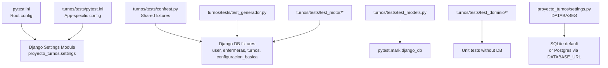
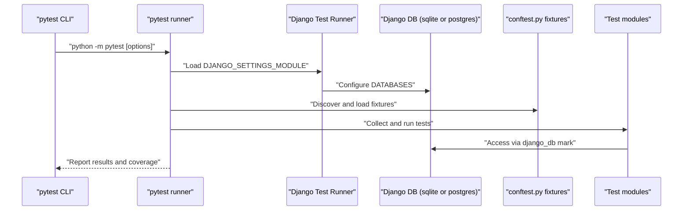
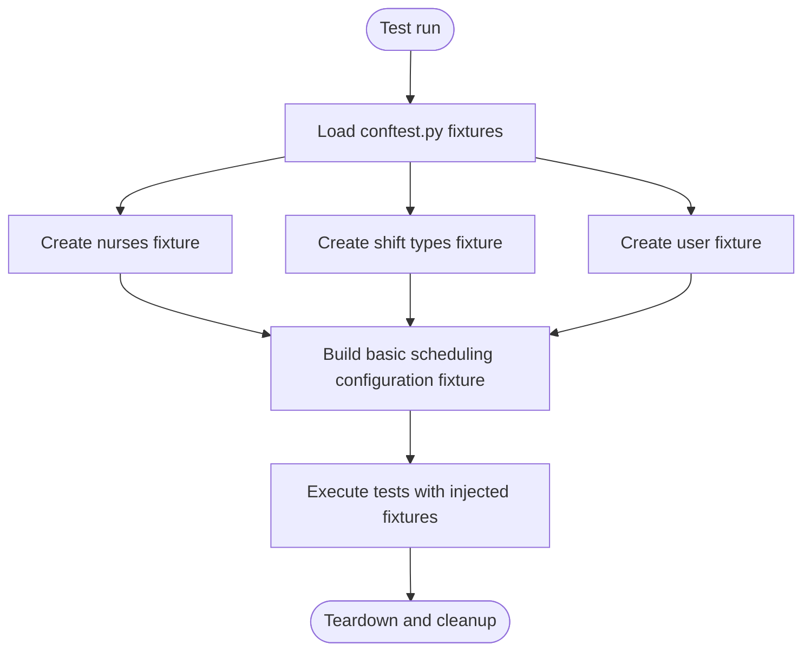
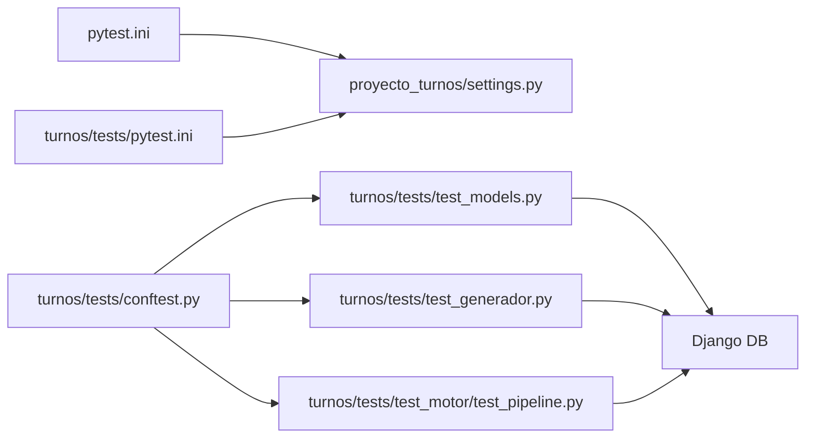

# Test Configuration and Setup

<cite>
**Referenced Files in This Document**
- [pytest.ini](file://pytest.ini)
- [turnos/tests/pytest.ini](file://turnos/tests/pytest.ini)
- [turnos/tests/conftest.py](file://turnos/tests/conftest.py)
- [turnos/tests/README.md](file://turnos/tests/README.md)
- [turnos/tests/test_models.py](file://turnos/tests/test_models.py)
- [turnos/tests/test_generador.py](file://turnos/tests/test_generador.py)
- [turnos/tests/test_dominio/test_dtos.py](file://turnos/tests/test_dominio/test_dtos.py)
- [turnos/tests/test_dominio/test_normalizacion.py](file://turnos/tests/test_dominio/test_normalizacion.py)
- [turnos/tests/test_motor/test_pipeline.py](file://turnos/tests/test_motor/test_pipeline.py)
- [proyecto_turnos/settings.py](file://proyecto_turnos/settings.py)
- [manage.py](file://manage.py)
</cite>

## Table of Contents
1. [Introduction](#introduction)
2. [Project Structure](#project-structure)
3. [Core Components](#core-components)
4. [Architecture Overview](#architecture-overview)
5. [Detailed Component Analysis](#detailed-component-analysis)
6. [Dependency Analysis](#dependency-analysis)
7. [Performance Considerations](#performance-considerations)
8. [Troubleshooting Guide](#troubleshooting-guide)
9. [Conclusion](#conclusion)
10. [Appendices](#appendices)

## Introduction
This document explains the complete test configuration and setup for the Django application, focusing on pytest configuration, Django test database setup, and test environment initialization. It covers test discovery patterns, naming conventions, fixtures, shared configuration, database isolation strategies, and coverage reporting. It also provides guidance for continuous integration environments and automated testing pipelines.

## Project Structure
The test suite is organized under the turnos app with a dedicated tests directory containing configuration, fixtures, and test modules. Two pytest configuration files exist: one at the repository root and another inside the tests directory. The tests rely on pytest-django for Django integration and use fixtures to create reusable test data.

**Diagram sources**
- [pytest.ini:1-6](file://pytest.ini#L1-L6)
- [turnos/tests/pytest.ini:1-6](file://turnos/tests/pytest.ini#L1-L6)
- [turnos/tests/conftest.py:1-67](file://turnos/tests/conftest.py#L1-L67)
- [turnos/tests/test_models.py:1-36](file://turnos/tests/test_models.py#L1-L36)
- [turnos/tests/test_generador.py:1-25](file://turnos/tests/test_generador.py#L1-L25)
- [turnos/tests/test_dominio/test_dtos.py:1-238](file://turnos/tests/test_dominio/test_dtos.py#L1-L238)
- [turnos/tests/test_motor/test_pipeline.py:1-362](file://turnos/tests/test_motor/test_pipeline.py#L1-L362)
- [proyecto_turnos/settings.py:62-76](file://proyecto_turnos/settings.py#L62-L76)

**Section sources**
- [pytest.ini:1-6](file://pytest.ini#L1-L6)
- [turnos/tests/pytest.ini:1-6](file://turnos/tests/pytest.ini#L1-L6)
- [turnos/tests/README.md:1-32](file://turnos/tests/README.md#L1-L32)

## Core Components
- pytest configuration
  - Root and app-specific pytest.ini define the Django settings module and test discovery patterns.
  - Discovery patterns: python_files, python_classes, python_functions.
- Django settings integration
  - DJANGO_SETTINGS_MODULE points to the project settings module.
  - DATABASES defaults to SQLite unless DATABASE_URL is set.
- Test fixtures
  - Shared fixtures in conftest.py create users, nurses, shift types, and a basic scheduling configuration.
  - Fixtures are scoped implicitly per-test and use the db fixture to ensure database availability.
- Coverage reporting
  - The tests README demonstrates coverage collection for the turnos package with HTML reports.

**Section sources**
- [pytest.ini:1-6](file://pytest.ini#L1-L6)
- [turnos/tests/pytest.ini:1-6](file://turnos/tests/pytest.ini#L1-L6)
- [turnos/tests/conftest.py:1-67](file://turnos/tests/conftest.py#L1-L67)
- [turnos/tests/README.md:13-24](file://turnos/tests/README.md#L13-L24)
- [proyecto_turnos/settings.py:62-76](file://proyecto_turnos/settings.py#L62-L76)

## Architecture Overview
The test architecture leverages pytest-django to initialize the Django environment and manage test databases. Fixtures encapsulate common setup logic, while individual test modules focus on specific units or integration scenarios. Coverage is configured via pytest command-line options.

**Diagram sources**
- [pytest.ini:1-6](file://pytest.ini#L1-L6)
- [turnos/tests/pytest.ini:1-6](file://turnos/tests/pytest.ini#L1-L6)
- [turnos/tests/conftest.py:1-67](file://turnos/tests/conftest.py#L1-L67)
- [proyecto_turnos/settings.py:62-76](file://proyecto_turnos/settings.py#L62-L76)

## Detailed Component Analysis

### pytest Configuration and Test Discovery
- Root pytest.ini
  - Sets DJANGO_SETTINGS_MODULE to the project settings module.
  - Defines test discovery patterns for files, classes, and functions.
- App-specific pytest.ini
  - Mirrors root configuration for consistency within the tests directory.
- Test discovery patterns
  - python_files: test_* pattern.
  - python_classes: Test* pattern.
  - python_functions: test_* pattern.

**Section sources**
- [pytest.ini:1-6](file://pytest.ini#L1-L6)
- [turnos/tests/pytest.ini:1-6](file://turnos/tests/pytest.ini#L1-L6)

### Django Settings and Database Setup
- Settings module
  - DJANGO_SETTINGS_MODULE is configured in pytest.ini and via manage.py for CLI commands.
- Database configuration
  - Defaults to SQLite when DATABASE_URL is not set.
  - Supports Postgres via DATABASE_URL parsed by dj_database_url.
- Environment variables
  - SECRET_KEY, DEBUG, ALLOWED_HOSTS, EMAIL_BACKEND, SITE_URL, MAINTENANCE_MODE, and Celery settings influence runtime behavior.

**Section sources**
- [pytest.ini:2](file://pytest.ini#L2)
- [manage.py:9](file://manage.py#L9)
- [proyecto_turnos/settings.py:62-76](file://proyecto_turnos/settings.py#L62-L76)
- [proyecto_turnos/settings.py:10-12](file://proyecto_turnos/settings.py#L10-L12)
- [proyecto_turnos/settings.py:125-132](file://proyecto_turnos/settings.py#L125-L132)

### Test Environment Initialization
- pytest-django lifecycle
  - The pytest.ini configuration enables pytest-django to initialize Django before test collection.
  - Tests requiring database access use the django_db mark.
- Test database
  - pytest-django manages per-test database creation and teardown by default.
  - DATABASES configuration determines whether SQLite or Postgres is used.

**Section sources**
- [turnos/tests/test_models.py:6](file://turnos/tests/test_models.py#L6)
- [turnos/tests/test_generador.py:5](file://turnos/tests/test_generador.py#L5)
- [proyecto_turnos/settings.py:62-76](file://proyecto_turnos/settings.py#L62-L76)

### Fixtures and Shared Configuration Patterns
- conftest.py fixtures
  - user: creates a test user for authentication-dependent tests.
  - enfermeras: bulk creates multiple nurses with unique identifiers.
  - turnos: creates standard shift types (morning, afternoon, night).
  - configuracion_basica: builds a scheduling configuration linked to user, nurses, and shift types.
- Fixture dependencies
  - configuracion_basica depends on db, user, enfermeras, and turnos.
- Usage patterns
  - Fixtures are injected into tests by name, enabling concise and repeatable setups.

**Diagram sources**
- [turnos/tests/conftest.py:9-67](file://turnos/tests/conftest.py#L9-L67)

**Section sources**
- [turnos/tests/conftest.py:1-67](file://turnos/tests/conftest.py#L1-L67)

### Database Isolation Strategies
- Per-test isolation
  - pytest-django typically isolates each test in its own database transaction or separate database, ensuring tests do not interfere with each other.
- Fixture-scoped data
  - Fixtures create deterministic datasets scoped to the test session or function scope, depending on fixture definition.
- Explicit database marks
  - Tests requiring database access are decorated with the django_db marker to ensure the database is initialized.

**Section sources**
- [turnos/tests/test_models.py:6](file://turnos/tests/test_models.py#L6)
- [turnos/tests/test_generador.py:5](file://turnos/tests/test_generador.py#L5)

### Coverage Reporting Configuration
- Coverage invocation
  - The tests README demonstrates collecting coverage for the turnos package and generating HTML reports.
- Scope
  - Coverage targets the turnos package to measure test effectiveness across application modules.

**Section sources**
- [turnos/tests/README.md:19-24](file://turnos/tests/README.md#L19-L24)

### Test Discovery Patterns and Naming Conventions
- File naming
  - python_files pattern: test_*.py.
- Class naming
  - python_classes pattern: Test*.
- Function naming
  - python_functions pattern: test_*.
- Examples
  - Model tests use Test* classes with test_* methods.
  - Domain and motor tests follow similar patterns without requiring database access.

**Section sources**
- [turnos/tests/pytest.ini:3-5](file://turnos/tests/pytest.ini#L3-L5)
- [turnos/tests/test_models.py:6-36](file://turnos/tests/test_models.py#L6-L36)
- [turnos/tests/test_dominio/test_dtos.py:19-238](file://turnos/tests/test_dominio/test_dtos.py#L19-L238)
- [turnos/tests/test_motor/test_pipeline.py:84-362](file://turnos/tests/test_motor/test_pipeline.py#L84-L362)

### Selective Test Execution
- Running all tests
  - Execute pytest from the repository root or tests directory.
- Running specific tests
  - Pass a specific test file path to limit execution to that module.
- Coverage-aware runs
  - Combine pytest with coverage options to generate reports for targeted modules.

**Section sources**
- [turnos/tests/README.md:15-24](file://turnos/tests/README.md#L15-L24)

### Continuous Integration Environments and Automated Pipelines
- Environment preparation
  - Install pytest, pytest-django, pytest-cov, and factory-boy as indicated in the tests README.
- Configuration alignment
  - Ensure DJANGO_SETTINGS_MODULE is set consistently across local and CI environments.
- Database selection
  - Prefer SQLite for speed in CI; configure DATABASE_URL for Postgres when integration tests require it.
- Coverage reporting
  - Integrate coverage collection into CI jobs to track test coverage over time.

**Section sources**
- [turnos/tests/README.md:7-11](file://turnos/tests/README.md#L7-L11)
- [pytest.ini:2](file://pytest.ini#L2)
- [proyecto_turnos/settings.py:62-76](file://proyecto_turnos/settings.py#L62-L76)

## Dependency Analysis
The test configuration and execution depend on the following relationships:
- pytest.ini and turnos/tests/pytest.ini define the Django settings module and discovery patterns.
- conftest.py fixtures provide shared setup logic for model and generator tests.
- Individual test modules depend on fixtures and the django_db marker for database access.
- Coverage reporting relies on pytest-cov invoked via command-line options.

**Diagram sources**
- [pytest.ini:1-6](file://pytest.ini#L1-L6)
- [turnos/tests/pytest.ini:1-6](file://turnos/tests/pytest.ini#L1-L6)
- [turnos/tests/conftest.py:1-67](file://turnos/tests/conftest.py#L1-L67)
- [turnos/tests/test_models.py:1-36](file://turnos/tests/test_models.py#L1-L36)
- [turnos/tests/test_generador.py:1-25](file://turnos/tests/test_generador.py#L1-L25)
- [turnos/tests/test_motor/test_pipeline.py:1-362](file://turnos/tests/test_motor/test_pipeline.py#L1-L362)
- [proyecto_turnos/settings.py:62-76](file://proyecto_turnos/settings.py#L62-L76)

**Section sources**
- [pytest.ini:1-6](file://pytest.ini#L1-L6)
- [turnos/tests/pytest.ini:1-6](file://turnos/tests/pytest.ini#L1-L6)
- [turnos/tests/conftest.py:1-67](file://turnos/tests/conftest.py#L1-L67)
- [turnos/tests/test_models.py:1-36](file://turnos/tests/test_models.py#L1-L36)
- [turnos/tests/test_generador.py:1-25](file://turnos/tests/test_generador.py#L1-L25)
- [turnos/tests/test_motor/test_pipeline.py:1-362](file://turnos/tests/test_motor/test_pipeline.py#L1-L362)
- [proyecto_turnos/settings.py:62-76](file://proyecto_turnos/settings.py#L62-L76)

## Performance Considerations
- Use SQLite for local development and CI to minimize startup overhead.
- Keep fixtures minimal and focused to reduce test setup time.
- Avoid unnecessary database writes in tests that do not require persistence.
- Leverage coverage reporting selectively to avoid slowing down frequent local iterations.

## Troubleshooting Guide
- pytest.ini parsing errors
  - Ensure UTF-8 without BOM encoding for pytest.ini files to prevent parsing issues.
- Django settings mismatch
  - Verify DJANGO_SETTINGS_MODULE is set consistently in pytest.ini and environment variables.
- Database connection failures
  - Confirm DATABASE_URL or SQLite configuration is correct and accessible.
- Fixture dependency issues
  - Ensure fixtures are declared in conftest.py and imported where needed; order of fixture dependencies matters.
- Coverage reporting problems
  - Use the documented pytest-cov invocation to generate reports for the turnos package.

**Section sources**
- [turnos/tests/README.md:7-11](file://turnos/tests/README.md#L7-L11)
- [pytest.ini:2](file://pytest.ini#L2)
- [proyecto_turnos/settings.py:62-76](file://proyecto_turnos/settings.py#L62-L76)

## Conclusion
The test configuration integrates pytest-django with a clear separation of concerns: pytest.ini defines environment and discovery, conftest.py centralizes fixtures, and individual modules focus on specific functionality. Database isolation is handled by pytest-django, while coverage reporting is straightforward to enable. Following the documented patterns ensures reliable local and CI execution.

## Appendices
- Example commands for running tests and coverage are documented in the tests README.
- The Django settings module supports flexible database configuration suitable for both local and CI environments.

**Section sources**
- [turnos/tests/README.md:13-24](file://turnos/tests/README.md#L13-L24)
- [proyecto_turnos/settings.py:62-76](file://proyecto_turnos/settings.py#L62-L76)