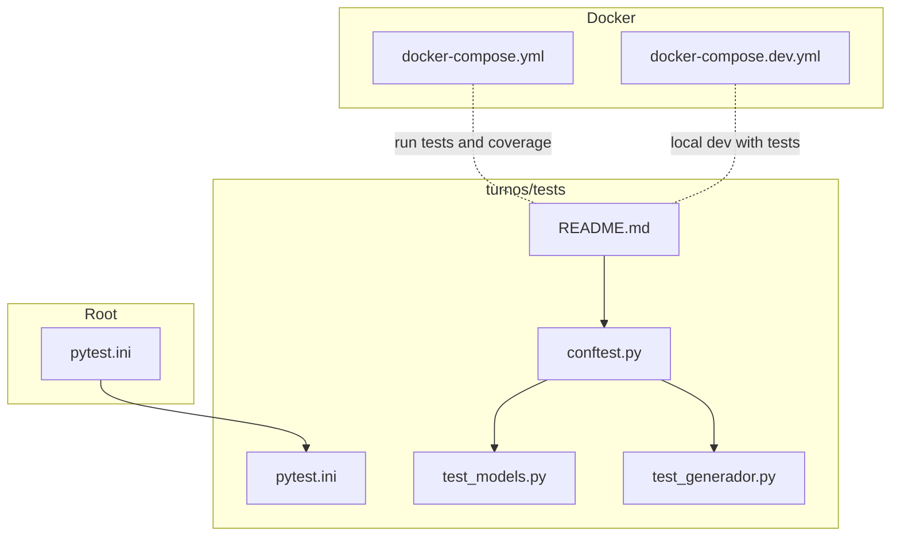
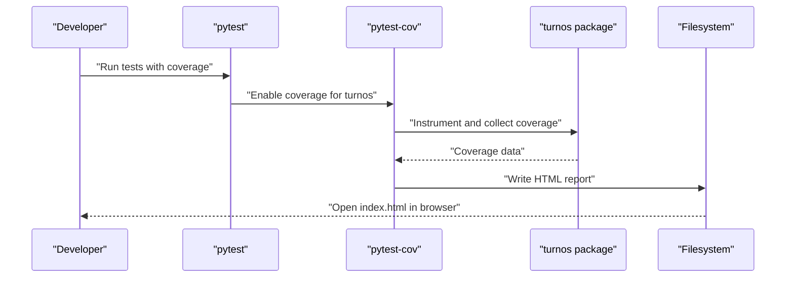
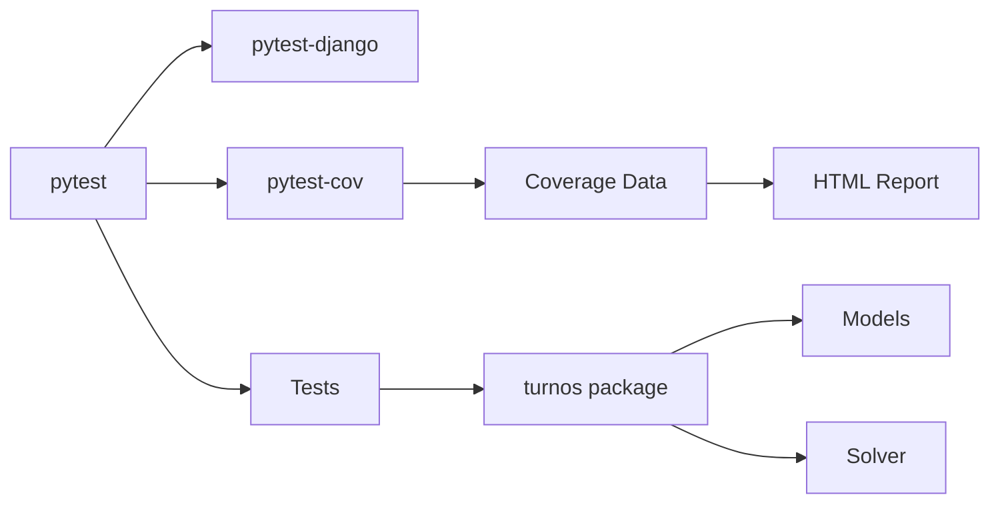

# Test Coverage and Quality Metrics

<cite>
**Referenced Files in This Document**
- [pytest.ini](file://pytest.ini)
- [turnos/tests/pytest.ini](file://turnos/tests/pytest.ini)
- [turnos/tests/README.md](file://turnos/tests/README.md)
- [turnos/tests/conftest.py](file://turnos/tests/conftest.py)
- [turnos/tests/test_models.py](file://turnos/tests/test_models.py)
- [turnos/tests/test_generador.py](file://turnos/tests/test_generador.py)
- [docker-compose.yml](file://docker-compose.yml)
- [docker-compose.dev.yml](file://docker-compose.dev.yml)
</cite>

## Table of Contents
1. [Introduction](#introduction)
2. [Project Structure](#project-structure)
3. [Core Components](#core-components)
4. [Architecture Overview](#architecture-overview)
5. [Detailed Component Analysis](#detailed-component-analysis)
6. [Dependency Analysis](#dependency-analysis)
7. [Performance Considerations](#performance-considerations)
8. [Troubleshooting Guide](#troubleshooting-guide)
9. [Conclusion](#conclusion)
10. [Appendices](#appendices)

## Introduction
This document explains how test coverage is measured and how quality assurance metrics are established in the project. It covers:
- Coverage reporting configuration and invocation via pytest-cov
- Reporting formats (HTML coverage reports)
- Threshold settings and gating strategies
- CI/CD integration points for coverage tracking
- Guidelines to maintain minimum coverage thresholds, identify untested code paths, and improve coverage systematically
- Quality metrics beyond coverage, including mutation testing considerations, code complexity analysis, and maintainability indicators
- Continuous monitoring and automated quality gates in development workflows

## Project Structure
The testing and coverage configuration is primarily located under the turnos/tests directory, with shared pytest configuration at the repository root. The project also includes Docker Compose configurations suitable for running tests and coverage in isolated environments.

**Diagram sources**
- [pytest.ini:1-6](file://pytest.ini#L1-L6)
- [turnos/tests/pytest.ini:1-6](file://turnos/tests/pytest.ini#L1-L6)
- [turnos/tests/README.md:1-32](file://turnos/tests/README.md#L1-L32)
- [turnos/tests/conftest.py:1-67](file://turnos/tests/conftest.py#L1-L67)
- [turnos/tests/test_models.py:1-36](file://turnos/tests/test_models.py#L1-L36)
- [turnos/tests/test_generador.py:1-25](file://turnos/tests/test_generador.py#L1-L25)
- [docker-compose.yml:1-168](file://docker-compose.yml#L1-L168)
- [docker-compose.dev.yml:1-68](file://docker-compose.dev.yml#L1-L68)

**Section sources**
- [pytest.ini:1-6](file://pytest.ini#L1-L6)
- [turnos/tests/pytest.ini:1-6](file://turnos/tests/pytest.ini#L1-L6)
- [turnos/tests/README.md:1-32](file://turnos/tests/README.md#L1-L32)
- [docker-compose.yml:1-168](file://docker-compose.yml#L1-L168)
- [docker-compose.dev.yml:1-68](file://docker-compose.dev.yml#L1-L68)

## Core Components
- pytest configuration: Both root and turnos/tests define pytest settings for Django projects, ensuring consistent discovery and execution of tests.
- Coverage invocation: The turnos/tests README demonstrates running pytest with coverage enabled for the turnos package and generating HTML reports.
- Test fixtures: conftest.py centralizes reusable fixtures for database-backed tests, enabling focused unit tests for models and solver components.
- Example tests: test_models.py and test_generador.py exercise model behavior and solver initialization, respectively.

Key capabilities:
- Coverage collection for the turnos package
- HTML coverage report generation
- Reusable fixtures for Django database tests
- Clear separation of test configuration and execution

**Section sources**
- [pytest.ini:1-6](file://pytest.ini#L1-L6)
- [turnos/tests/pytest.ini:1-6](file://turnos/tests/pytest.ini#L1-L6)
- [turnos/tests/README.md:13-24](file://turnos/tests/README.md#L13-L24)
- [turnos/tests/conftest.py:1-67](file://turnos/tests/conftest.py#L1-L67)
- [turnos/tests/test_models.py:1-36](file://turnos/tests/test_models.py#L1-L36)
- [turnos/tests/test_generador.py:1-25](file://turnos/tests/test_generador.py#L1-L25)

## Architecture Overview
The coverage measurement pipeline integrates pytest, pytest-cov, and the turnos package. The HTML coverage report is generated locally and can be integrated into CI/CD workflows.

**Diagram sources**
- [turnos/tests/README.md:19-20](file://turnos/tests/README.md#L19-L20)
- [turnos/tests/pytest.ini:1-6](file://turnos/tests/pytest.ini#L1-L6)

## Detailed Component Analysis

### pytest Configuration and Discovery
- Root pytest.ini sets Django settings module and naming conventions for Python test discovery.
- turnos/tests/pytest.ini mirrors the same settings for clarity and isolation.
- These configurations ensure pytest runs with Django’s settings and discovers tests consistently.

Best practices:
- Keep naming conventions aligned across both files to avoid confusion.
- Centralize Django settings configuration to prevent mismatches during test runs.

**Section sources**
- [pytest.ini:1-6](file://pytest.ini#L1-L6)
- [turnos/tests/pytest.ini:1-6](file://turnos/tests/pytest.ini#L1-L6)

### Coverage Reporting and Invocation
- The turnos/tests README documents running pytest with coverage for the turnos package and generating an HTML report.
- This enables developers to inspect per-file coverage, highlighting missing branches and lines.

Recommendations:
- Add coverage thresholds in CI to gate merges.
- Use coverage report formats suitable for artifact storage and diffing across PRs.

**Section sources**
- [turnos/tests/README.md:19-20](file://turnos/tests/README.md#L19-L20)

### Test Fixtures and Database-Backed Tests
- conftest.py defines reusable fixtures for users, nurses, shifts, and a basic scheduling configuration.
- These fixtures support database-backed tests and reduce duplication across test suites.

Usage patterns:
- Apply @pytest.mark.django_db to tests requiring database access.
- Leverage fixtures to construct realistic scenarios quickly.

**Section sources**
- [turnos/tests/conftest.py:1-67](file://turnos/tests/conftest.py#L1-L67)
- [turnos/tests/test_models.py:6-16](file://turnos/tests/test_models.py#L6-L16)
- [turnos/tests/test_generador.py:5-11](file://turnos/tests/test_generador.py#L5-L11)

### Example Tests: Models and Solver
- test_models.py validates nurse and shift model behavior, including duration calculations for day and night shifts.
- test_generador.py verifies solver initialization and basic result structure.

These tests demonstrate:
- Model-level assertions for correctness
- Integration-style checks for solver components

**Section sources**
- [turnos/tests/test_models.py:6-35](file://turnos/tests/test_models.py#L6-L35)
- [turnos/tests/test_generador.py:5-24](file://turnos/tests/test_generador.py#L5-L24)

### Docker-Based Execution Environment
- docker-compose.yml defines services for database, Redis, web app, Celery, and Nginx, suitable for running tests and coverage in containers.
- docker-compose.dev.yml supports local development with hot-reload and debugging.

Operational guidance:
- Use docker-compose.yml to run headless test and coverage jobs in CI.
- Use docker-compose.dev.yml for interactive local debugging.

**Section sources**
- [docker-compose.yml:1-168](file://docker-compose.yml#L1-L168)
- [docker-compose.dev.yml:1-68](file://docker-compose.dev.yml#L1-L68)

## Dependency Analysis
Coverage measurement depends on:
- pytest and pytest-django for test discovery and Django integration
- pytest-cov for coverage instrumentation and reporting
- The turnos package structure for accurate coverage attribution

**Diagram sources**
- [turnos/tests/README.md:10-10](file://turnos/tests/README.md#L10-L10)
- [turnos/tests/pytest.ini:1-6](file://turnos/tests/pytest.ini#L1-L6)

**Section sources**
- [turnos/tests/README.md:10-10](file://turnos/tests/README.md#L10-L10)
- [turnos/tests/pytest.ini:1-6](file://turnos/tests/pytest.ini#L1-L6)

## Performance Considerations
- Coverage overhead: Enabling coverage adds runtime overhead; prefer targeted coverage runs during CI and developer feedback loops.
- Report generation: HTML reports can be large; consider storing artifacts and diffs in CI for incremental analysis.
- Fixture reuse: Centralized fixtures reduce test setup costs and promote faster runs.

## Troubleshooting Guide
Common issues and resolutions:
- Django settings mismatch: Ensure pytest.ini sets DJANGO_SETTINGS_MODULE consistently across root and subdirectory configs.
- Missing pytest-django or pytest-cov: Install required plugins as documented in the README.
- Database fixture errors: Confirm @pytest.mark.django_db is applied to tests using database fixtures.
- Coverage not reported: Verify the --cov argument targets the correct package and that --cov-report includes html.

**Section sources**
- [pytest.ini:2-2](file://pytest.ini#L2-L2)
- [turnos/tests/pytest.ini:2-2](file://turnos/tests/pytest.ini#L2-L2)
- [turnos/tests/README.md:10-10](file://turnos/tests/README.md#L10-L10)
- [turnos/tests/conftest.py:9-15](file://turnos/tests/conftest.py#L9-L15)
- [turnos/tests/test_models.py:6-6](file://turnos/tests/test_models.py#L6-L6)

## Conclusion
The project provides a solid foundation for measuring and improving test coverage using pytest and pytest-cov. By leveraging centralized fixtures, consistent pytest configuration, and Docker-based execution, teams can reliably generate HTML coverage reports and integrate coverage checks into CI/CD workflows. Extending the approach to include mutation testing, complexity metrics, and maintainability indicators will further strengthen quality gates and continuous monitoring.

## Appendices

### A. Coverage Reporting Configuration
- Command-line invocation for coverage and HTML report generation is documented in the README.
- Recommended next steps:
  - Define coverage thresholds in CI to enforce minimums.
  - Store and compare coverage reports across PRs for trend analysis.

**Section sources**
- [turnos/tests/README.md:19-20](file://turnos/tests/README.md#L19-L20)

### B. CI/CD Integration Guidance
- Use docker-compose.yml to run tests and coverage in CI environments.
- Gate merges on coverage thresholds and report availability.
- Archive coverage artifacts for historical tracking.

**Section sources**
- [docker-compose.yml:1-168](file://docker-compose.yml#L1-L168)

### C. Maintaining Minimum Coverage Thresholds
- Establish project-wide and per-module thresholds.
- Fail builds when thresholds fall below defined limits.
- Track regressions and target remediation efforts.

[No sources needed since this section provides general guidance]

### D. Identifying Untested Code Paths
- Review HTML coverage reports to locate missing lines and branches.
- Focus on high-risk areas such as business logic and boundary conditions.
- Add targeted tests to increase coverage incrementally.

[No sources needed since this section provides general guidance]

### E. Improving Test Coverage Systematically
- Prioritize tests for critical modules and frequently modified code.
- Use fixtures to simulate realistic scenarios efficiently.
- Regularly review coverage trends and adjust testing strategy accordingly.

[No sources needed since this section provides general guidance]

### F. Quality Metrics Beyond Coverage
- Mutation testing: Introduce a mutation testing tool to assess fault detection strength.
- Code complexity: Track cyclomatic complexity and maintainability indices to identify risky areas.
- Maintainability indicators: Monitor churn, technical debt, and refactoring opportunities.

[No sources needed since this section provides general guidance]