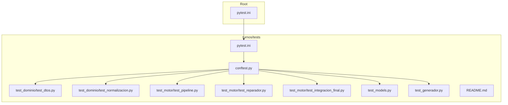
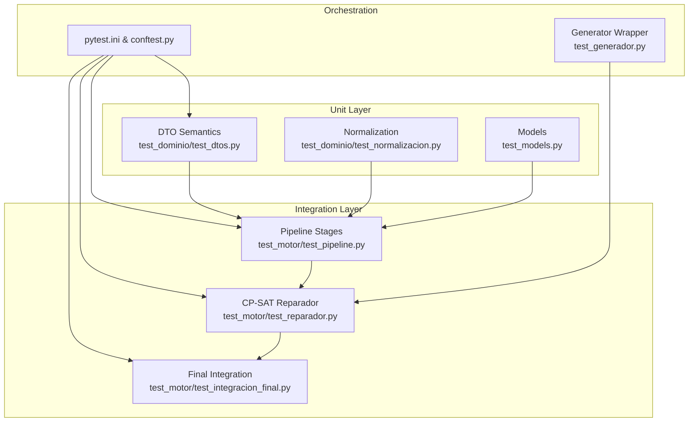
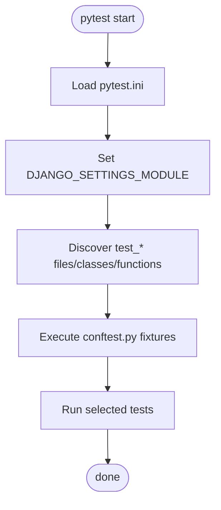
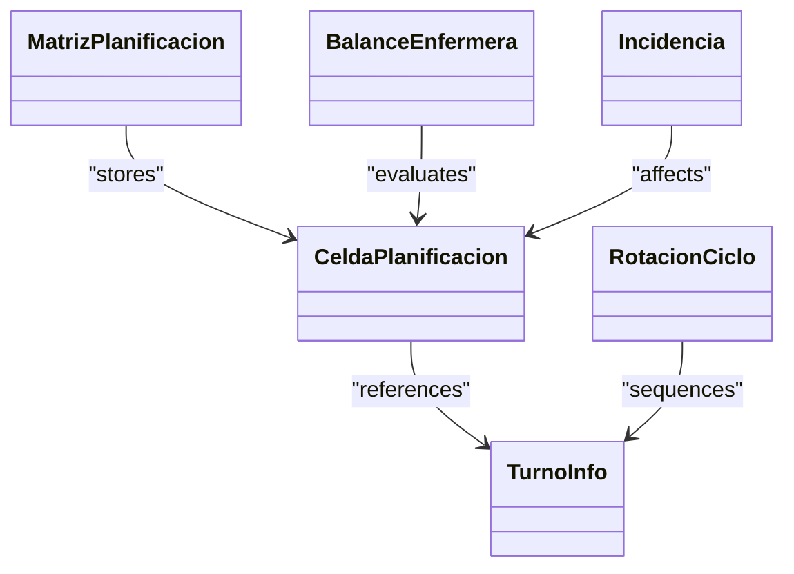
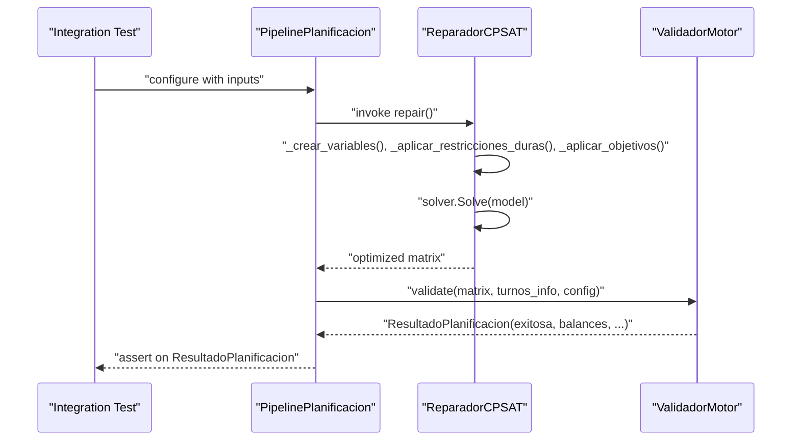
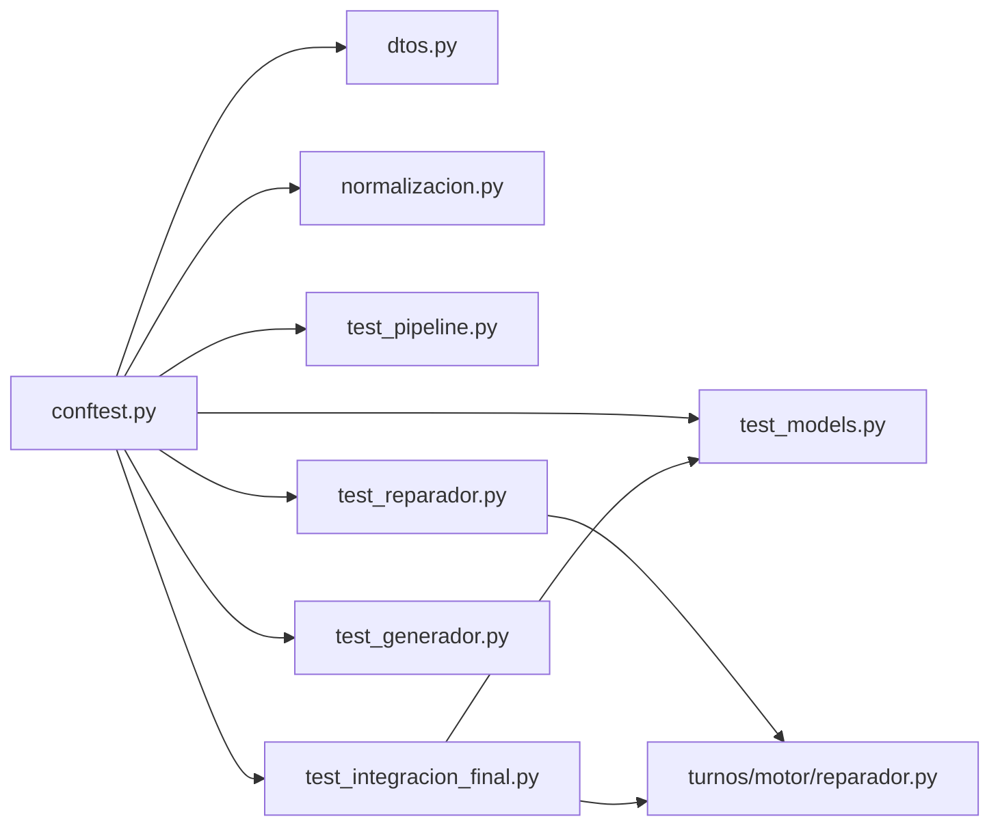

# Testing Strategy

<cite>
**Referenced Files in This Document**
- [pytest.ini](file://pytest.ini)
- [turnos/tests/pytest.ini](file://turnos/tests/pytest.ini)
- [turnos/tests/conftest.py](file://turnos/tests/conftest.py)
- [turnos/tests/README.md](file://turnos/tests/README.md)
- [turnos/tests/test_models.py](file://turnos/tests/test_models.py)
- [turnos/tests/test_generador.py](file://turnos/tests/test_generador.py)
- [turnos/tests/test_dominio/test_dtos.py](file://turnos/tests/test_dominio/test_dtos.py)
- [turnos/tests/test_dominio/test_normalizacion.py](file://turnos/tests/test_dominio/test_normalizacion.py)
- [turnos/tests/test_motor/test_pipeline.py](file://turnos/tests/test_motor/test_pipeline.py)
- [turnos/tests/test_motor/test_reparador.py](file://turnos/tests/test_motor/test_reparador.py)
- [turnos/tests/test_motor/test_integracion_final.py](file://turnos/tests/test_motor/test_integracion_final.py)
- [generador-corregido.py](file://generador-corregido.py)
- [turnos/motor/reparador.py](file://turnos/motor/reparador.py)
</cite>

## Table of Contents
1. [Introduction](#introduction)
2. [Project Structure](#project-structure)
3. [Core Components](#core-components)
4. [Architecture Overview](#architecture-overview)
5. [Detailed Component Analysis](#detailed-component-analysis)
6. [Dependency Analysis](#dependency-analysis)
7. [Performance Considerations](#performance-considerations)
8. [Troubleshooting Guide](#troubleshooting-guide)
9. [Conclusion](#conclusion)
10. [Appendices](#appendices)

## Introduction
This document describes the testing strategy and quality assurance approach for the project. It covers test organization across unit, integration, and end-to-end categories, test coverage methodology, mocking strategies for external dependencies (notably the CP-SAT solver), database testing patterns, and validation of domain objects and pipeline functionality. It also documents pytest configuration, fixtures, continuous integration considerations, guidelines for writing effective tests, test data management, debugging failures, performance and load testing considerations, and quality metrics.

## Project Structure
The testing suite is organized under the turnos/tests package with a clear separation by functional area:
- Domain-level tests for DTOs and normalization logic
- Motor-level tests for pipeline stages and solver integration
- Model-level tests for Django ORM entities
- Generator-level tests for solver orchestration

Key configuration and shared fixtures live in turnos/tests/, while top-level pytest configuration is duplicated at the repo root for convenience.

**Diagram sources**
- [pytest.ini:1-6](file://pytest.ini#L1-L6)
- [turnos/tests/pytest.ini:1-6](file://turnos/tests/pytest.ini#L1-L6)
- [turnos/tests/conftest.py:1-67](file://turnos/tests/conftest.py#L1-L67)
- [turnos/tests/test_dominio/test_dtos.py:1-238](file://turnos/tests/test_dominio/test_dtos.py#L1-L238)
- [turnos/tests/test_dominio/test_normalizacion.py:1-115](file://turnos/tests/test_dominio/test_normalizacion.py#L1-L115)
- [turnos/tests/test_motor/test_pipeline.py:1-362](file://turnos/tests/test_motor/test_pipeline.py#L1-L362)
- [turnos/tests/test_motor/test_reparador.py:1-286](file://turnos/tests/test_motor/test_reparador.py#L1-L286)
- [turnos/tests/test_motor/test_integracion_final.py:1-1086](file://turnos/tests/test_motor/test_integracion_final.py#L1-L1086)
- [turnos/tests/test_models.py:1-36](file://turnos/tests/test_models.py#L1-L36)
- [turnos/tests/test_generador.py:1-25](file://turnos/tests/test_generador.py#L1-L25)
- [turnos/tests/README.md:1-32](file://turnos/tests/README.md#L1-L32)

**Section sources**
- [pytest.ini:1-6](file://pytest.ini#L1-L6)
- [turnos/tests/pytest.ini:1-6](file://turnos/tests/pytest.ini#L1-L6)
- [turnos/tests/README.md:1-32](file://turnos/tests/README.md#L1-L32)

## Core Components
- pytest configuration and discovery rules are centralized in two locations to support both root and app-level execution.
- Shared Django database fixtures are defined in conftest.py to reduce duplication and speed up tests.
- Domain tests validate DTO semantics and normalization rules.
- Motor tests validate pipeline stages, solver behavior, and integration points.
- Model tests validate Django model behavior and basic invariants.
- Generator tests validate solver orchestration and result shape.

**Section sources**
- [turnos/tests/pytest.ini:1-6](file://turnos/tests/pytest.ini#L1-L6)
- [turnos/tests/conftest.py:1-67](file://turnos/tests/conftest.py#L1-L67)
- [turnos/tests/test_dominio/test_dtos.py:1-238](file://turnos/tests/test_dominio/test_dtos.py#L1-L238)
- [turnos/tests/test_motor/test_pipeline.py:1-362](file://turnos/tests/test_motor/test_pipeline.py#L1-L362)
- [turnos/tests/test_motor/test_reparador.py:1-286](file://turnos/tests/test_motor/test_reparador.py#L1-L286)
- [turnos/tests/test_models.py:1-36](file://turnos/tests/test_models.py#L1-L36)
- [turnos/tests/test_generador.py:1-25](file://turnos/tests/test_generador.py#L1-L25)

## Architecture Overview
The testing architecture emphasizes layered validation:
- Unit tests for pure domain logic and normalization
- Integration tests for pipeline stages and solver integration
- End-to-end tests validating solver behavior and persistence flows

**Diagram sources**
- [turnos/tests/test_dominio/test_dtos.py:1-238](file://turnos/tests/test_dominio/test_dtos.py#L1-L238)
- [turnos/tests/test_dominio/test_normalizacion.py:1-115](file://turnos/tests/test_dominio/test_normalizacion.py#L1-L115)
- [turnos/tests/test_models.py:1-36](file://turnos/tests/test_models.py#L1-L36)
- [turnos/tests/test_motor/test_pipeline.py:1-362](file://turnos/tests/test_motor/test_pipeline.py#L1-L362)
- [turnos/tests/test_motor/test_reparador.py:1-286](file://turnos/tests/test_motor/test_reparador.py#L1-L286)
- [turnos/tests/test_motor/test_integracion_final.py:1-1086](file://turnos/tests/test_motor/test_integracion_final.py#L1-L1086)
- [turnos/tests/pytest.ini:1-6](file://turnos/tests/pytest.ini#L1-L6)
- [turnos/tests/conftest.py:1-67](file://turnos/tests/conftest.py#L1-L67)
- [turnos/tests/test_generador.py:1-25](file://turnos/tests/test_generador.py#L1-L25)

## Detailed Component Analysis

### pytest Configuration and Fixtures
- Discovery rules enable automatic discovery of test files, classes, and functions with conventional names.
- Django settings module is configured for test runs.
- Shared fixtures provide reusable database entities for downstream tests.

**Diagram sources**
- [pytest.ini:1-6](file://pytest.ini#L1-L6)
- [turnos/tests/pytest.ini:1-6](file://turnos/tests/pytest.ini#L1-L6)
- [turnos/tests/conftest.py:1-67](file://turnos/tests/conftest.py#L1-L67)

**Section sources**
- [pytest.ini:1-6](file://pytest.ini#L1-L6)
- [turnos/tests/pytest.ini:1-6](file://turnos/tests/pytest.ini#L1-L6)
- [turnos/tests/conftest.py:1-67](file://turnos/tests/conftest.py#L1-L67)

### Domain-Level Tests (DTOs and Normalization)
- DTO tests validate object construction, derived properties, and relationships.
- Normalization tests validate canonicalization of constraint and pattern names, ensuring robust configuration parsing.

**Diagram sources**
- [turnos/tests/test_dominio/test_dtos.py:1-238](file://turnos/tests/test_dominio/test_dtos.py#L1-L238)

**Section sources**
- [turnos/tests/test_dominio/test_dtos.py:1-238](file://turnos/tests/test_dominio/test_dtos.py#L1-L238)
- [turnos/tests/test_dominio/test_normalizacion.py:1-115](file://turnos/tests/test_dominio/test_normalizacion.py#L1-L115)

### Motor-Level Pipeline and Solver Integration
- Pipeline tests validate rotation building, incidence application, coverage analysis, and end-to-end execution.
- Reparador tests validate CP-SAT solver behavior, status reporting, and optimization logic.
- Final integration tests validate solver usage, result semantics, historical balance integration, and persistence flows.

**Diagram sources**
- [turnos/tests/test_motor/test_pipeline.py:1-362](file://turnos/tests/test_motor/test_pipeline.py#L1-L362)
- [turnos/tests/test_motor/test_reparador.py:1-286](file://turnos/tests/test_motor/test_reparador.py#L1-L286)
- [turnos/tests/test_motor/test_integracion_final.py:1-1086](file://turnos/tests/test_motor/test_integracion_final.py#L1-L1086)
- [turnos/motor/reparador.py:60-96](file://turnos/motor/reparador.py#L60-L96)

**Section sources**
- [turnos/tests/test_motor/test_pipeline.py:1-362](file://turnos/tests/test_motor/test_pipeline.py#L1-L362)
- [turnos/tests/test_motor/test_reparador.py:1-286](file://turnos/tests/test_motor/test_reparador.py#L1-L286)
- [turnos/tests/test_motor/test_integracion_final.py:1-1086](file://turnos/tests/test_motor/test_integracion_final.py#L1-L1086)
- [turnos/motor/reparador.py:60-96](file://turnos/motor/reparador.py#L60-L96)

### Model-Level Tests
- Tests validate model creation, string representation, and computed properties.

**Section sources**
- [turnos/tests/test_models.py:1-36](file://turnos/tests/test_models.py#L1-L36)

### Generator-Level Tests
- Tests validate solver wrapper initialization, internal state, and high-level generation result shape.

**Section sources**
- [turnos/tests/test_generador.py:1-25](file://turnos/tests/test_generador.py#L1-L25)

## Dependency Analysis
- Tests depend on shared Django fixtures for database-backed entities.
- Integration and end-to-end tests depend on the CP-SAT solver via ReparadorCPSAT.
- Final integration tests exercise persistence and relationship semantics.

**Diagram sources**
- [turnos/tests/conftest.py:1-67](file://turnos/tests/conftest.py#L1-L67)
- [turnos/tests/test_dominio/test_dtos.py:1-238](file://turnos/tests/test_dominio/test_dtos.py#L1-L238)
- [turnos/tests/test_dominio/test_normalizacion.py:1-115](file://turnos/tests/test_dominio/test_normalizacion.py#L1-L115)
- [turnos/tests/test_models.py:1-36](file://turnos/tests/test_models.py#L1-L36)
- [turnos/tests/test_motor/test_pipeline.py:1-362](file://turnos/tests/test_motor/test_pipeline.py#L1-L362)
- [turnos/tests/test_motor/test_reparador.py:1-286](file://turnos/tests/test_motor/test_reparador.py#L1-L286)
- [turnos/tests/test_motor/test_integracion_final.py:1-1086](file://turnos/tests/test_motor/test_integracion_final.py#L1-L1086)
- [turnos/tests/test_generador.py:1-25](file://turnos/tests/test_generador.py#L1-L25)
- [turnos/motor/reparador.py:60-96](file://turnos/motor/reparador.py#L60-L96)

**Section sources**
- [turnos/tests/conftest.py:1-67](file://turnos/tests/conftest.py#L1-L67)
- [turnos/tests/test_motor/test_reparador.py:1-286](file://turnos/tests/test_motor/test_reparador.py#L1-L286)
- [turnos/tests/test_motor/test_integracion_final.py:1-1086](file://turnos/tests/test_motor/test_integracion_final.py#L1-L1086)

## Performance Considerations
- CP-SAT solver parameters are tuned for responsiveness during tests:
  - Max runtime and worker count are set to reasonable defaults for CI environments.
  - Solver status is captured to assess feasibility and performance characteristics.
- Pipeline tests validate reproducibility and idempotence of results.
- Coverage reports can be generated to track test breadth.

Guidelines:
- Keep test datasets minimal while preserving meaningful edge cases.
- Prefer deterministic fixtures and explicit tolerances for floating-point comparisons.
- Use coverage reports to identify untested code paths and expand targeted tests.

**Section sources**
- [turnos/motor/reparador.py:60-96](file://turnos/motor/reparador.py#L60-L96)
- [turnos/tests/test_motor/test_pipeline.py:331-362](file://turnos/tests/test_motor/test_pipeline.py#L331-L362)
- [turnos/tests/README.md:13-24](file://turnos/tests/README.md#L13-L24)

## Troubleshooting Guide
Common issues and resolutions:
- Solver failures due to undefined variables: Tests explicitly guard against regressions by asserting solver status and avoiding undefined variable names.
- Incorrect result attributes: Tests validate that ResultadoPlanificacion uses exitosa and not deprecated fields.
- Historical balance persistence: Tests verify update_or_create behavior and absence handling.
- Configuration duplication: Tests ensure JSON fields are preserved when duplicating configurations.

Debugging tips:
- Run specific test modules to isolate failures.
- Use verbose logging from the solver to inspect status and timing.
- Validate fixture data shapes before invoking pipeline stages.

**Section sources**
- [turnos/tests/test_motor/test_integracion_final.py:141-200](file://turnos/tests/test_motor/test_integracion_final.py#L141-L200)
- [turnos/tests/test_motor/test_integracion_final.py:202-244](file://turnos/tests/test_motor/test_integracion_final.py#L202-L244)
- [turnos/tests/test_motor/test_integracion_final.py:540-620](file://turnos/tests/test_motor/test_integracion_final.py#L540-L620)
- [turnos/tests/test_motor/test_integracion_final.py:622-688](file://turnos/tests/test_motor/test_integracion_final.py#L622-L688)
- [turnos/tests/test_motor/test_integracion_final.py:690-754](file://turnos/tests/test_motor/test_integracion_final.py#L690-L754)

## Conclusion
The testing strategy combines focused unit tests for domain logic, robust integration tests for pipeline stages and solver behavior, and comprehensive end-to-end tests covering persistence and result semantics. Shared fixtures streamline database-backed tests, while pytest configuration ensures consistent discovery and execution. Performance and reliability are addressed through solver tuning, reproducibility checks, and coverage reporting.

## Appendices

### Test Organization Summary
- Unit tests: DTOs, normalization, models
- Integration tests: pipeline stages, solver integration
- End-to-end tests: solver usage, persistence, result validation

**Section sources**
- [turnos/tests/README.md:1-32](file://turnos/tests/README.md#L1-L32)

### Continuous Integration Considerations
- Configure CI to run pytest with coverage and fail on uncovered critical paths.
- Use separate jobs for unit vs integration tests to optimize feedback loops.
- Cache Python dependencies and consider parallelizing long-running solver tests.

**Section sources**
- [turnos/tests/README.md:13-24](file://turnos/tests/README.md#L13-L24)

### Guidelines for Writing Effective Tests
- Use descriptive test names and clear assertions.
- Leverage shared fixtures to avoid duplication.
- Prefer deterministic inputs and explicit tolerances for numerical comparisons.
- Add docstrings to explain intent and edge cases.

**Section sources**
- [turnos/tests/test_dominio/test_dtos.py:1-238](file://turnos/tests/test_dominio/test_dtos.py#L1-L238)
- [turnos/tests/test_motor/test_pipeline.py:1-362](file://turnos/tests/test_motor/test_pipeline.py#L1-L362)

### Test Data Management
- Centralize fixture creation in conftest.py.
- Use small, realistic datasets for integration tests.
- Validate data shapes and relationships before invoking complex logic.

**Section sources**
- [turnos/tests/conftest.py:1-67](file://turnos/tests/conftest.py#L1-L67)

### Quality Metrics
- Track test coverage per module and overall.
- Monitor solver status distribution and failure rates.
- Measure pipeline execution time and reproducibility.

**Section sources**
- [turnos/tests/README.md:19-20](file://turnos/tests/README.md#L19-L20)
- [turnos/motor/reparador.py:60-96](file://turnos/motor/reparador.py#L60-L96)