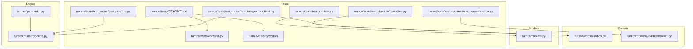
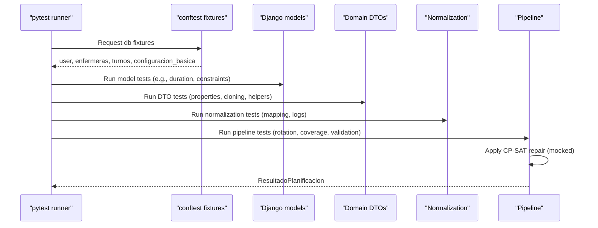
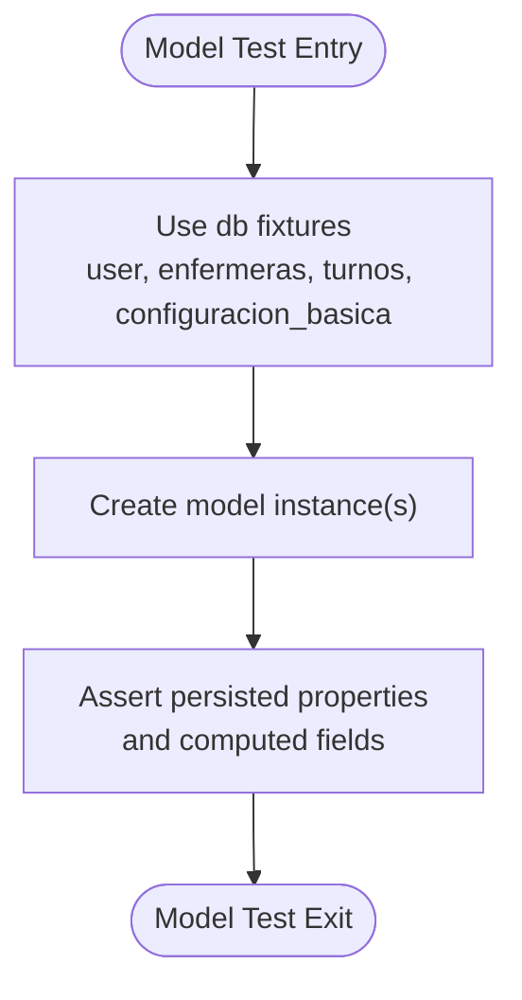
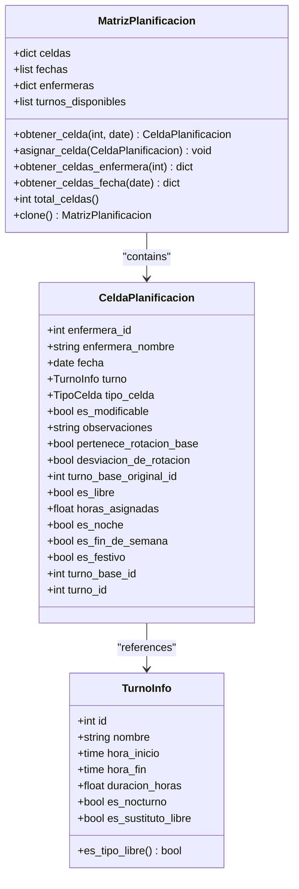
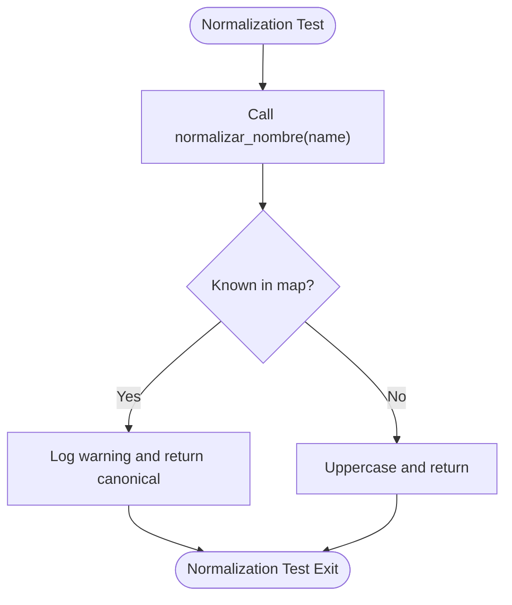
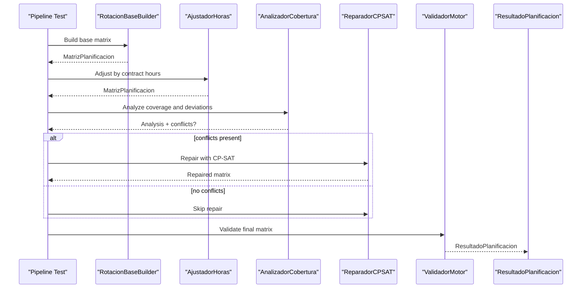
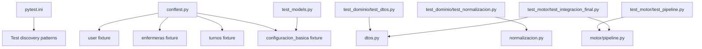

# Unit Testing

<cite>
**Referenced Files in This Document**
- [README.md](file://turnos/tests/README.md)
- [conftest.py](file://turnos/tests/conftest.py)
- [pytest.ini](file://turnos/tests/pytest.ini)
- [models.py](file://turnos/models.py)
- [dtos.py](file://turnos/dominio/dtos.py)
- [normalizacion.py](file://turnos/dominio/normalizacion.py)
- [test_models.py](file://turnos/tests/test_models.py)
- [test_dominio/test_dtos.py](file://turnos/tests/test_dominio/test_dtos.py)
- [test_dominio/test_normalizacion.py](file://turnos/tests/test_dominio/test_normalizacion.py)
- [generador.py](file://turnos/generador.py)
- [pipeline.py](file://turnos/motor/pipeline.py)
- [test_motor/test_pipeline.py](file://turnos/tests/test_motor/test_pipeline.py)
- [test_motor/test_integracion_final.py](file://turnos/tests/test_motor/test_integracion_final.py)
</cite>

## Table of Contents
1. [Introduction](#introduction)
2. [Project Structure](#project-structure)
3. [Core Components](#core-components)
4. [Architecture Overview](#architecture-overview)
5. [Detailed Component Analysis](#detailed-component-analysis)
6. [Dependency Analysis](#dependency-analysis)
7. [Performance Considerations](#performance-considerations)
8. [Troubleshooting Guide](#troubleshooting-guide)
9. [Conclusion](#conclusion)
10. [Appendices](#appendices)

## Introduction
This document describes the unit testing methodology and implementation for the turn scheduling application. It covers testing approaches for Django models, domain DTOs, normalization utilities, and the orchestration pipeline. It also documents pytest fixtures, mock strategies for external dependencies, test isolation techniques, and patterns for data transfer objects, normalization functions, and business rule validation. Guidance is included for managing test data, applying factory patterns, and structuring assertions for complex scenarios.

## Project Structure
The testing suite is organized under the turnos/tests package with dedicated modules for models, domain DTOs, motor pipeline, and integration tests. Configuration is centralized in pytest.ini and shared fixtures are defined in conftest.py. The README outlines installation and execution steps.

**Diagram sources**
- [README.md:1-32](file://turnos/tests/README.md#L1-L32)
- [conftest.py:1-67](file://turnos/tests/conftest.py#L1-L67)
- [pytest.ini:1-6](file://turnos/tests/pytest.ini#L1-L6)
- [test_models.py:1-36](file://turnos/tests/test_models.py#L1-L36)
- [test_dominio/test_dtos.py:1-238](file://turnos/tests/test_dominio/test_dtos.py#L1-L238)
- [test_dominio/test_normalizacion.py:1-115](file://turnos/tests/test_dominio/test_normalizacion.py#L1-L115)
- [test_motor/test_pipeline.py:1-362](file://turnos/tests/test_motor/test_pipeline.py#L1-L362)
- [test_motor/test_integracion_final.py:1-1086](file://turnos/tests/test_motor/test_integracion_final.py#L1-L1086)
- [dtos.py:1-274](file://turnos/dominio/dtos.py#L1-L274)
- [normalizacion.py:1-190](file://turnos/dominio/normalizacion.py#L1-L190)
- [models.py:1-825](file://turnos/models.py#L1-L825)
- [generador.py:1-65](file://turnos/generador.py#L1-L65)
- [pipeline.py:1-267](file://turnos/motor/pipeline.py#L1-L267)

**Section sources**
- [README.md:1-32](file://turnos/tests/README.md#L1-L32)
- [pytest.ini:1-6](file://turnos/tests/pytest.ini#L1-L6)

## Core Components
- Django models: Enfermera, TipoTurno, ConfiguracionPlanificacion, Ejecucion, Planilla, AsignacionTurno, and domain-related models. These include model-level validations, constraints, and property computations tested in isolation and with fixtures.
- Domain DTOs: TurnoInfo, CeldaPlanificacion, BalanceEnfermera, Incidencia, RotacionCiclo, MatrizPlanificacion, ResultadoPlanificacion, and supporting enums. These are pure data containers validated for correctness and behavior.
- Normalization utilities: Functions to normalize restriction and pattern names, with mapping dictionaries and logging behavior.
- Motor pipeline: Pipeline orchestrator integrating rotation base building, hours adjustment, coverage analysis, CP-SAT repair, and validation. Integration tests exercise end-to-end flows and external solver behavior.

Key testing characteristics:
- pytest markers and fixtures enable database-backed tests and deterministic setups.
- DTOs are tested independently from Django models to ensure pure-data correctness.
- Normalization functions are tested for canonicalization and edge cases.
- Pipeline tests validate orchestration, reproducibility, and separation of concerns (incidencias applied after generation).

**Section sources**
- [test_models.py:1-36](file://turnos/tests/test_models.py#L1-L36)
- [test_dominio/test_dtos.py:1-238](file://turnos/tests/test_dominio/test_dtos.py#L1-L238)
- [test_dominio/test_normalizacion.py:1-115](file://turnos/tests/test_dominio/test_normalizacion.py#L1-L115)
- [test_motor/test_pipeline.py:1-362](file://turnos/tests/test_motor/test_pipeline.py#L1-L362)
- [test_motor/test_integracion_final.py:1-1086](file://turnos/tests/test_motor/test_integracion_final.py#L1-L1086)

## Architecture Overview
The testing architecture separates concerns across layers:
- Model tests validate persistence, constraints, and computed properties.
- DTO tests validate pure-domain logic and data integrity.
- Normalization tests validate name canonicalization and mapping behavior.
- Motor pipeline tests validate orchestration and integration points, including mocks for external solvers.

**Diagram sources**
- [conftest.py:1-67](file://turnos/tests/conftest.py#L1-L67)
- [test_models.py:1-36](file://turnos/tests/test_models.py#L1-L36)
- [test_dominio/test_dtos.py:1-238](file://turnos/tests/test_dominio/test_dtos.py#L1-L238)
- [test_dominio/test_normalizacion.py:1-115](file://turnos/tests/test_dominio/test_normalizacion.py#L1-L115)
- [test_motor/test_pipeline.py:1-362](file://turnos/tests/test_motor/test_pipeline.py#L1-L362)
- [pipeline.py:1-267](file://turnos/motor/pipeline.py#L1-L267)

## Detailed Component Analysis

### Django Models Testing
Approach:
- Use @pytest.mark.django_db to enable database-backed tests.
- Leverage fixtures from conftest.py to create minimal, reproducible datasets (users, nurses, shift types, configurations).
- Validate model constraints, clean() logic, and computed properties.

Examples of covered areas:
- Enfermera creation and string representation.
- TipoTurno duration calculation for day and night shifts.
- Constraint validation for shift types (e.g., sustituto de Libre vs. regular turns).

**Diagram sources**
- [conftest.py:9-66](file://turnos/tests/conftest.py#L9-L66)
- [test_models.py:6-36](file://turnos/tests/test_models.py#L6-L36)
- [models.py:30-208](file://turnos/models.py#L30-L208)

**Section sources**
- [test_models.py:1-36](file://turnos/tests/test_models.py#L1-L36)
- [conftest.py:1-67](file://turnos/tests/conftest.py#L1-L67)
- [models.py:30-208](file://turnos/models.py#L30-L208)

### Domain DTOs Testing
Approach:
- Instantiate DTOs directly without Django models to isolate pure-domain logic.
- Validate properties derived from inputs (e.g., es_nocturno, es_fin_de_semana, horas_asignadas).
- Verify helper methods (e.g., MatrizPlanificacion operations, cloning, totals).

Examples of covered areas:
- TurnoInfo: creation, duration, nocturnal flag.
- CeldaPlanificacion: free day detection, weekend/festivity checks, turnover metadata.
- BalanceEnfermera: deviation percentage and historical totals.
- RotacionCiclo: cyclic lookup across offsets.
- MatrizPlanificacion: assignment, retrieval, iteration, cloning.

**Diagram sources**
- [dtos.py:43-238](file://turnos/dominio/dtos.py#L43-L238)

**Section sources**
- [test_dominio/test_dtos.py:1-238](file://turnos/tests/test_dominio/test_dtos.py#L1-L238)
- [dtos.py:1-274](file://turnos/dominio/dtos.py#L1-L274)

### Normalization Utilities Testing
Approach:
- Test canonicalization of restriction and pattern names using mapping dictionaries.
- Validate behavior for unknown names, mixed legacy/canonical inputs, and list normalization.
- Confirm logging behavior for legacy normalization events.

Coverage highlights:
- normalizar_nombre: uppercase fallback, legacy mapping, warning logs.
- normalizar_restriccion and normalizar_patron: field-specific normalization.
- normalizar_lista_nombres: deduplication option.

**Diagram sources**
- [normalizacion.py:68-93](file://turnos/dominio/normalizacion.py#L68-L93)
- [test_dominio/test_normalizacion.py:1-115](file://turnos/tests/test_dominio/test_normalizacion.py#L1-L115)

**Section sources**
- [test_dominio/test_normalizacion.py:1-115](file://turnos/tests/test_dominio/test_normalizacion.py#L1-L115)
- [normalizacion.py:1-190](file://turnos/dominio/normalizacion.py#L1-L190)

### Motor Pipeline Testing
Approach:
- Use DTO fixtures to construct deterministic inputs (shifts, dates, nurses, rotations).
- Validate pipeline stages: rotation base construction, hours adjustment, coverage analysis, optional CP-SAT repair, and final validation.
- Employ mocks for external solver components to avoid flakiness while asserting orchestration logic.

Highlights:
- RotationBaseBuilder: reproducibility and rotation membership flags.
- AplicadorIncidencias: overlay application semantics (incidencias applied post-generation).
- AnalizadorCobertura: balance computation and conflict detection.
- PipelinePlanificacion: end-to-end orchestration, configuration propagation, and result structure.
- Integration tests: semantic consistency, historical balance usage, and solver configuration.

**Diagram sources**
- [test_motor/test_pipeline.py:1-362](file://turnos/tests/test_motor/test_pipeline.py#L1-L362)
- [pipeline.py:92-246](file://turnos/motor/pipeline.py#L92-L246)

**Section sources**
- [test_motor/test_pipeline.py:1-362](file://turnos/tests/test_motor/test_pipeline.py#L1-L362)
- [test_motor/test_integracion_final.py:1-1086](file://turnos/tests/test_motor/test_integracion_final.py#L1-L1086)
- [pipeline.py:1-267](file://turnos/motor/pipeline.py#L1-L267)

### Legacy Compatibility Wrapper Testing
Approach:
- Validate compatibility wrappers delegate correctly to refactored engine components.
- Ensure attributes and method calls propagate as expected.

Coverage:
- GeneradorTurnos wrapper and delegation to GeneradorTurnosRefactorizado.
- ValidadorRestricciones wrapper and delegation to ValidadorRestriccionesNuevo.

**Section sources**
- [generador.py:26-65](file://turnos/generador.py#L26-L65)

## Dependency Analysis
Testing dependencies and isolation:
- pytest.ini defines discovery patterns and Django settings module for tests.
- conftest.py centralizes reusable fixtures for users, nurses, shift types, and configuration instances.
- Model tests rely on @pytest.mark.django_db and database fixtures.
- DTO and normalization tests are isolated from Django models.
- Pipeline tests combine DTO fixtures with mocked solver components.

**Diagram sources**
- [pytest.ini:1-6](file://turnos/tests/pytest.ini#L1-L6)
- [conftest.py:1-67](file://turnos/tests/conftest.py#L1-L67)
- [test_models.py:1-36](file://turnos/tests/test_models.py#L1-L36)
- [test_dominio/test_dtos.py:1-238](file://turnos/tests/test_dominio/test_dtos.py#L1-L238)
- [test_dominio/test_normalizacion.py:1-115](file://turnos/tests/test_dominio/test_normalizacion.py#L1-L115)
- [test_motor/test_pipeline.py:1-362](file://turnos/tests/test_motor/test_pipeline.py#L1-L362)
- [test_motor/test_integracion_final.py:1-1086](file://turnos/tests/test_motor/test_integracion_final.py#L1-L1086)
- [dtos.py:1-274](file://turnos/dominio/dtos.py#L1-L274)
- [normalizacion.py:1-190](file://turnos/dominio/normalizacion.py#L1-L190)
- [pipeline.py:1-267](file://turnos/motor/pipeline.py#L1-L267)

**Section sources**
- [pytest.ini:1-6](file://turnos/tests/pytest.ini#L1-L6)
- [conftest.py:1-67](file://turnos/tests/conftest.py#L1-L67)

## Performance Considerations
- Keep DTO and normalization tests fast by avoiding database access.
- Use small, deterministic fixtures for pipeline tests to reduce runtime variability.
- Mock external solver components to avoid flaky timing and resource contention.
- Prefer property-based assertions over heavy computation in tests.

## Troubleshooting Guide
Common issues and resolutions:
- Fixture scope and database state:
  - Ensure @pytest.mark.django_db is present for model tests.
  - Use separate fixtures for different test classes to minimize cross-test interference.
- Normalization warnings:
  - Unknown names are uppercased; confirm expected behavior in tests.
- Pipeline reproducibility:
  - Use identical fixtures and deterministic inputs to ensure repeatable outcomes.
- Solver-side effects:
  - Mock solver components in tests; assert orchestration logic rather than solver internals.
- Historical balance persistence:
  - Use database fixtures and update_or_create semantics to validate CRUD behavior.

**Section sources**
- [test_motor/test_integracion_final.py:540-620](file://turnos/tests/test_motor/test_integracion_final.py#L540-L620)
- [test_motor/test_pipeline.py:102-127](file://turnos/tests/test_motor/test_pipeline.py#L102-L127)

## Conclusion
The testing methodology emphasizes layered validation: Django models for persistence and constraints, DTOs for pure-domain correctness, normalization for robust name canonicalization, and pipeline tests for orchestration and integration. Fixtures and mocks ensure isolation and reproducibility, while assertions target both functional correctness and semantic consistency.

## Appendices

### Test Execution and Coverage
- Install dependencies and run tests as documented in the project’s test README.
- Use pytest configuration to discover and run tests by naming conventions.
- Generate coverage reports for the turnos app to track test completeness.

**Section sources**
- [README.md:1-32](file://turnos/tests/README.md#L1-L32)
- [pytest.ini:1-6](file://turnos/tests/pytest.ini#L1-L6)