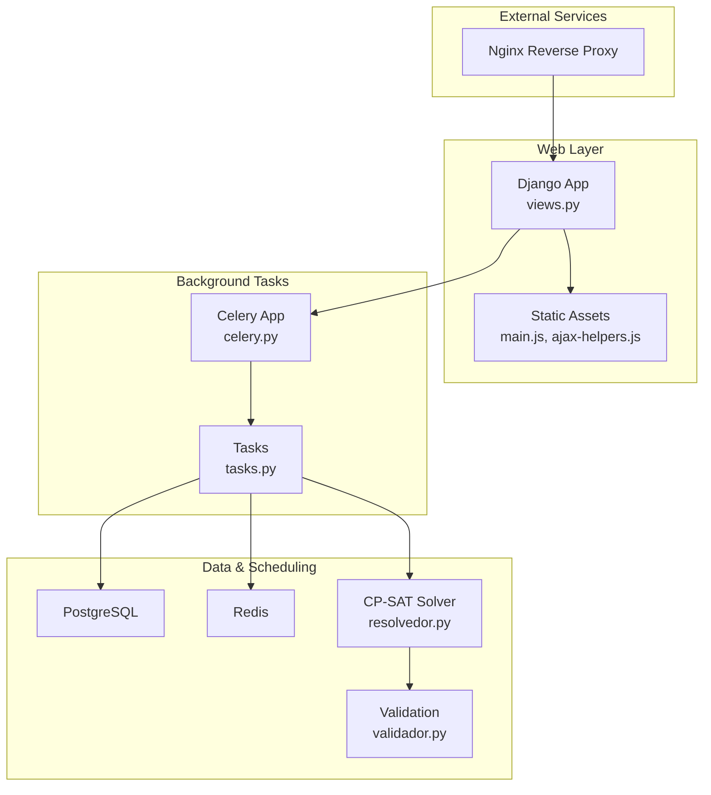
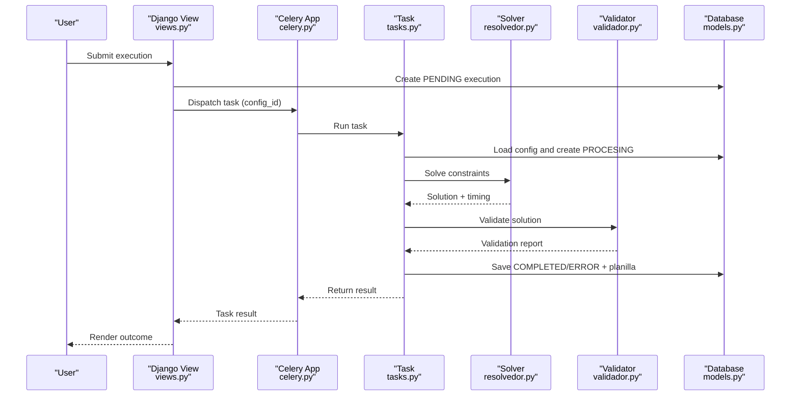
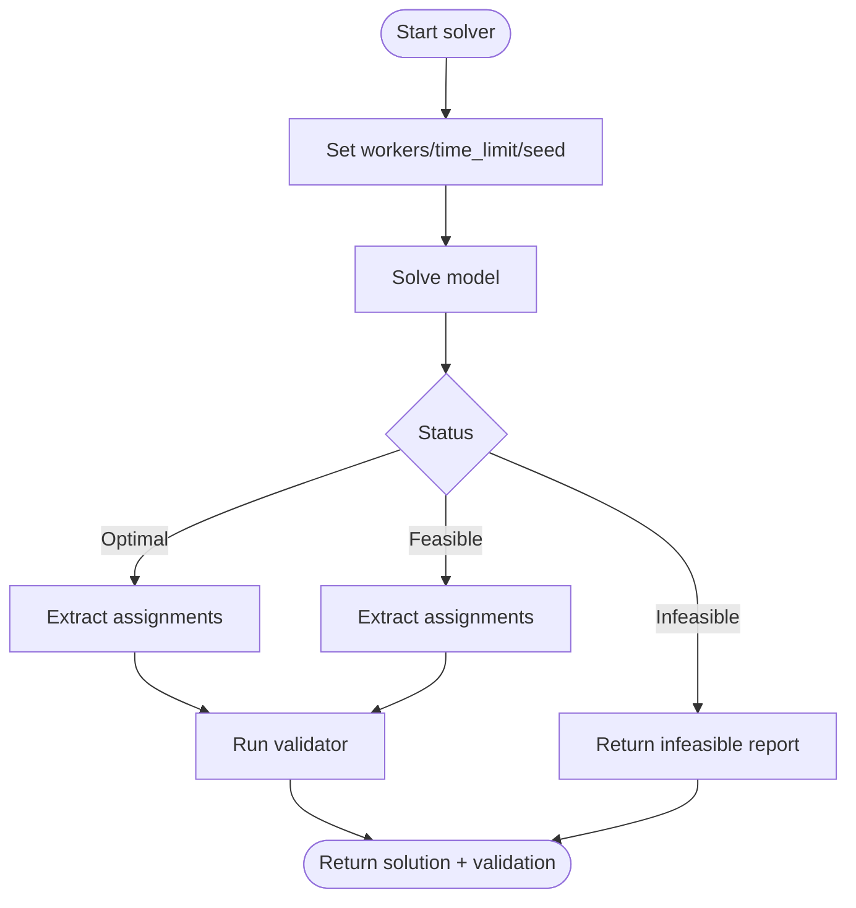
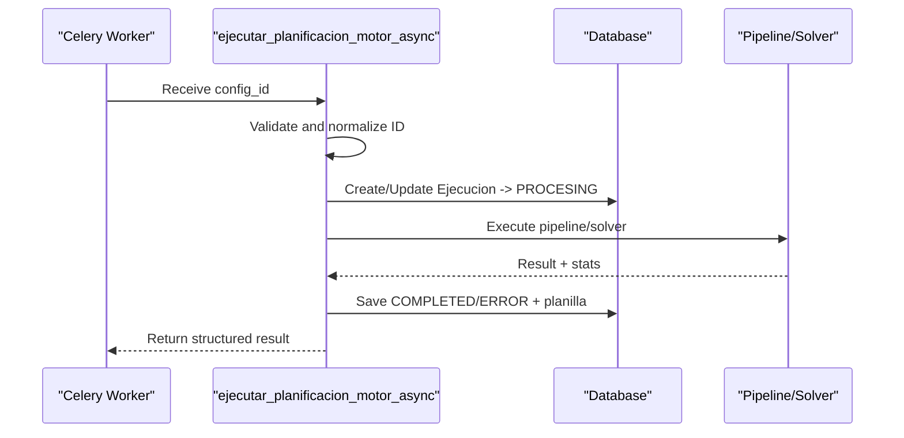
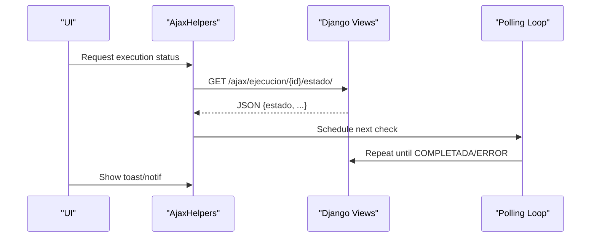
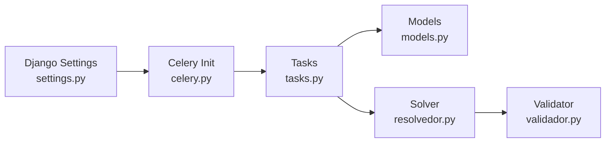

# Troubleshooting and FAQ

<cite>
**Referenced Files in This Document**
- [settings.py](file://proyecto_turnos/settings.py)
- [celery.py](file://proyecto_turnos/celery.py)
- [docker-compose.yml](file://docker-compose.yml)
- [tasks.py](file://turnos/tasks.py)
- [resolvedor.py](file://turnos/resolvedor.py)
- [logger_config.py](file://turnos/logger_config.py)
- [views.py](file://turnos/views.py)
- [models.py](file://turnos/models.py)
- [validador.py](file://turnos/validador.py)
- [ajax-helpers.js](file://static/js/ajax-helpers.js)
- [main.js](file://static/js/main.js)
- [ejecucion_error.html](file://turnos/templates/emails/ejecucion_error.html)
</cite>

## Table of Contents
1. [Introduction](#introduction)
2. [Project Structure](#project-structure)
3. [Core Components](#core-components)
4. [Architecture Overview](#architecture-overview)
5. [Detailed Component Analysis](#detailed-component-analysis)
6. [Dependency Analysis](#dependency-analysis)
7. [Performance Considerations](#performance-considerations)
8. [Troubleshooting Guide](#troubleshooting-guide)
9. [FAQ](#faq)
10. [Conclusion](#conclusion)

## Introduction
This document provides comprehensive troubleshooting, diagnostics, and optimization guidance for the shift scheduling system. It covers:
- OR-Tools solver issues and constraint-solving bottlenecks
- Database connectivity and maintenance
- Celery task failures and monitoring
- Frontend rendering and AJAX interactions
- Logging, debugging tools, and development workflow improvements
- Common configuration mistakes and their resolutions
- Support resources and escalation procedures

## Project Structure
The system integrates Django (backend), Celery (async tasks), Redis (broker/result backend), PostgreSQL (database), and Nginx (reverse proxy). The frontend uses vanilla JS with AJAX helpers and Bootstrap utilities.

**Diagram sources**
- [docker-compose.yml:1-168](file://docker-compose.yml#L1-L168)
- [celery.py:1-14](file://proyecto_turnos/celery.py#L1-L14)
- [tasks.py:1-716](file://turnos/tasks.py#L1-L716)
- [resolvedor.py:1-113](file://turnos/resolvedor.py#L1-L113)
- [validador.py:1-200](file://turnos/validador.py#L1-L200)
- [views.py:1-800](file://turnos/views.py#L1-L800)

**Section sources**
- [docker-compose.yml:1-168](file://docker-compose.yml#L1-L168)
- [settings.py:1-160](file://proyecto_turnos/settings.py#L1-L160)

## Core Components
- Django settings and environment variables for database, email, maintenance mode, and Celery configuration
- Celery app initialization and task definitions for scheduling execution and cleanup
- OR-Tools CP-SAT solver wrapper and validation pipeline
- Logging configuration and centralized logger utilities
- Views orchestrating execution requests and AJAX polling
- Frontend helpers for AJAX, polling, and UI feedback

**Section sources**
- [settings.py:62-160](file://proyecto_turnos/settings.py#L62-L160)
- [celery.py:1-14](file://proyecto_turnos/celery.py#L1-L14)
- [tasks.py:17-240](file://turnos/tasks.py#L17-L240)
- [resolvedor.py:11-51](file://turnos/resolvedor.py#L11-L51)
- [logger_config.py:6-33](file://turnos/logger_config.py#L6-L33)
- [views.py:683-792](file://turnos/views.py#L683-L792)
- [ajax-helpers.js:1-316](file://static/js/ajax-helpers.js#L1-L316)
- [main.js:1-590](file://static/js/main.js#L1-L590)

## Architecture Overview
End-to-end flow for executing a schedule:
1. User triggers execution via a view that creates a pending execution record and dispatches a Celery task.
2. The task validates configuration, prepares data, and runs the new pipeline or legacy generator.
3. The solver (CP-SAT) resolves constraints; results are validated and persisted.
4. Frontend polls execution status and renders outcomes.

**Diagram sources**
- [views.py:722-792](file://turnos/views.py#L722-L792)
- [tasks.py:17-240](file://turnos/tasks.py#L17-L240)
- [resolvedor.py:21-51](file://turnos/resolvedor.py#L21-L51)
- [validador.py:20-34](file://turnos/validador.py#L20-L34)
- [models.py:482-532](file://turnos/models.py#L482-L532)

## Detailed Component Analysis

### OR-Tools Solver and Constraint Validation
Key behaviors:
- Solver parameters: number of workers, time limit, seed
- Status handling: optimal vs feasible; fallback to infeasible report
- Post-resolution validation pipeline to detect violations

**Diagram sources**
- [resolvedor.py:21-51](file://turnos/resolvedor.py#L21-L51)
- [validador.py:20-34](file://turnos/validador.py#L20-L34)

**Section sources**
- [resolvedor.py:21-113](file://turnos/resolvedor.py#L21-L113)
- [validador.py:11-200](file://turnos/validador.py#L11-L200)

### Celery Task Execution and Retry Logic
Highlights:
- Task receives configuration ID, validates type and converts to int
- Creates or updates execution record atomically
- Runs generator or pipeline, persists results and planilla
- Handles exceptions, marks execution as error, retries up to configured limits

**Diagram sources**
- [tasks.py:334-697](file://turnos/tasks.py#L334-L697)
- [models.py:482-532](file://turnos/models.py#L482-L532)

**Section sources**
- [tasks.py:17-240](file://turnos/tasks.py#L17-L240)
- [tasks.py:334-697](file://turnos/tasks.py#L334-L697)

### Frontend AJAX and Polling
Features:
- CSRF token retrieval and inclusion
- Generic GET/POST/PUT/DELETE helpers
- Polling for execution status with intervals and max attempts
- Utility functions for toast notifications, debouncing, and live search

**Diagram sources**
- [ajax-helpers.js:204-224](file://static/js/ajax-helpers.js#L204-L224)
- [main.js:98-115](file://static/js/main.js#L98-L115)

**Section sources**
- [ajax-helpers.js:1-316](file://static/js/ajax-helpers.js#L1-L316)
- [main.js:1-590](file://static/js/main.js#L1-L590)

### Logging and Debugging Utilities
- Centralized logger configuration writing to file and console
- Structured logs in tasks and views for diagnosis
- Optional debug tasks for DB connectivity checks

**Section sources**
- [logger_config.py:6-33](file://turnos/logger_config.py#L6-L33)
- [tasks.py:317-332](file://turnos/tasks.py#L317-L332)
- [tasks.py:699-716](file://turnos/tasks.py#L699-L716)

## Dependency Analysis
- Django settings define database URL parsing, Celery broker/result backend, serialization, and time zone
- Celery app loads Django settings and autodiscovers tasks
- Tasks depend on models, generators, and solver/validation modules
- Frontend relies on AJAX helpers and Bootstrap utilities

**Diagram sources**
- [settings.py:134-160](file://proyecto_turnos/settings.py#L134-L160)
- [celery.py:1-14](file://proyecto_turnos/celery.py#L1-L14)
- [tasks.py:1-716](file://turnos/tasks.py#L1-L716)
- [models.py:1-825](file://turnos/models.py#L1-L825)
- [resolvedor.py:1-113](file://turnos/resolvedor.py#L1-L113)
- [validador.py:1-200](file://turnos/validador.py#L1-L200)

**Section sources**
- [settings.py:62-160](file://proyecto_turnos/settings.py#L62-L160)
- [celery.py:1-14](file://proyecto_turnos/celery.py#L1-L14)

## Performance Considerations
- Solver tuning
  - Workers: increase for speed, consider CPU availability
  - Time limit: adjust per problem size
  - Seed: deterministic runs when reproducibility matters
- Memory usage
  - Large periods and many nurses/shifts increase variable counts; reduce period length or scope when hitting memory limits
- Scaling
  - Use multiple workers and separate Redis instances for broker/backend
  - Offload heavy validations to background tasks
- Frontend
  - Debounce and throttle user interactions; avoid excessive polling intervals

[No sources needed since this section provides general guidance]

## Troubleshooting Guide

### OR-Tools Solver Issues
Symptoms:
- Long execution times or timeouts
- Infeasible solutions despite reasonable constraints
- Memory errors or slow convergence

Diagnostics:
- Verify solver parameters in the task and view configuration
- Check validation logs for reported violations
- Inspect solver status and timing in the resolvedor module

Actions:
- Increase workers cautiously and adjust time limits
- Simplify constraints or reduce scope (fewer nurses/shifts/period)
- Enable deterministic seed for reproducible runs
- Review validation reports to identify violated hard constraints

**Section sources**
- [resolvedor.py:21-51](file://turnos/resolvedor.py#L21-L51)
- [validador.py:20-34](file://turnos/validador.py#L20-L34)
- [tasks.py:334-697](file://turnos/tasks.py#L334-L697)

### Database Connectivity and Maintenance
Symptoms:
- Operational errors when accessing models
- Slow queries or timeouts
- Migration or connection failures

Diagnostics:
- Confirm DATABASE_URL or SQLite fallback
- Use the built-in DB test task to validate connectivity
- Monitor PostgreSQL health and disk space

Actions:
- Ensure environment variables match compose configuration
- Switch to PostgreSQL in production and configure accordingly
- Clean old execution records periodically to keep DB lean

**Section sources**
- [settings.py:62-76](file://proyecto_turnos/settings.py#L62-L76)
- [tasks.py:317-332](file://turnos/tasks.py#L317-L332)
- [docker-compose.yml:4-25](file://docker-compose.yml#L4-L25)

### Celery Task Failures
Symptoms:
- Tasks stuck in PENDING or failing with retried errors
- No progress after dispatch
- Exceptions logged with retry counts

Diagnostics:
- Check Celery worker and beat health
- Review task logs for conversion errors, missing configurations, or runtime exceptions
- Validate broker and result backend URLs

Actions:
- Restart Celery worker and beat
- Fix invalid configuration IDs passed to tasks
- Increase soft/hard time limits for long-running plans
- Ensure Redis is reachable and credentials match

**Section sources**
- [tasks.py:17-240](file://turnos/tasks.py#L17-L240)
- [tasks.py:334-697](file://turnos/tasks.py#L334-L697)
- [settings.py:134-160](file://proyecto_turnos/settings.py#L134-L160)
- [docker-compose.yml:81-127](file://docker-compose.yml#L81-L127)

### Frontend Rendering and AJAX Issues
Symptoms:
- Polling does not update status
- Forms fail CSRF validation
- Toast notifications or loaders not working

Diagnostics:
- Inspect browser network tab for AJAX errors
- Verify CSRF token presence and correctness
- Check console for helper function errors

Actions:
- Ensure CSRF meta tag and cookie are present
- Confirm AJAX endpoints exist and return expected JSON
- Adjust polling intervals and max attempts if needed
- Use Bootstrap utilities and helper functions consistently

**Section sources**
- [ajax-helpers.js:1-316](file://static/js/ajax-helpers.js#L1-L316)
- [main.js:1-590](file://static/js/main.js#L1-L590)

### Logging and Debugging Techniques
- Enable centralized logging to file and console
- Use structured logs in tasks and views for quick diagnosis
- Leverage debug tasks for DB connectivity checks

Actions:
- Tail logs from containers or local log files
- Add targeted logs around critical sections
- Use debug tasks to verify DB and Redis reachability

**Section sources**
- [logger_config.py:6-33](file://turnos/logger_config.py#L6-L33)
- [tasks.py:317-332](file://turnos/tasks.py#L317-L332)
- [tasks.py:699-716](file://turnos/tasks.py#L699-L716)

### Error Emails and Notifications
- Error emails are templated and sent on execution failures
- Ensure email backend is configured appropriately

Actions:
- Configure EMAIL_BACKEND for production
- Test sending emails via Django shell or management command

**Section sources**
- [settings.py:125-127](file://proyecto_turnos/settings.py#L125-L127)
- [ejecucion_error.html:1-68](file://turnos/templates/emails/ejecucion_error.html#L1-L68)

## FAQ

Q1: How do I fix “Invalid configuration ID” errors?
- Ensure the task receives a valid integer ID; tasks handle dict inputs by extracting keys
- Validate the configuration exists before dispatching

Q2: Why does the solver take too long or return infeasible?
- Reduce period length, number of nurses/shifts, or increase time limits
- Review hard constraint violations in validation logs

Q3: How do I monitor task progress?
- Use the frontend polling mechanism or inspect execution records
- Check Celery worker logs for task events

Q4: How do I switch from SQLite to PostgreSQL?
- Set DATABASE_URL to a PostgreSQL DSN
- Ensure environment variables match compose configuration

Q5: How do I scale Celery workers?
- Increase concurrency and run multiple workers
- Use separate Redis instances for broker and result backend

Q6: How do I troubleshoot CSRF errors in AJAX?
- Verify CSRF token presence and headers
- Ensure same-origin credentials and meta tags are correct

Q7: How do I clean old execution records?
- Use the provided task or management command to remove old records

Q8: How do I enable debug logging?
- Use the centralized logger configuration or Django DEBUG mode

Q9: How do I receive error notifications?
- Configure email backend and ensure templates render properly

Q10: How do I escalate issues?
- Collect logs, reproduce steps, and open an issue with environment details

**Section sources**
- [tasks.py:38-50](file://turnos/tasks.py#L38-L50)
- [tasks.py:242-268](file://turnos/tasks.py#L242-L268)
- [settings.py:62-76](file://proyecto_turnos/settings.py#L62-L76)
- [settings.py:134-160](file://proyecto_turnos/settings.py#L134-L160)
- [ajax-helpers.js:12-16](file://static/js/ajax-helpers.js#L12-L16)
- [logger_config.py:6-33](file://turnos/logger_config.py#L6-L33)
- [ejecucion_error.html:1-68](file://turnos/templates/emails/ejecucion_error.html#L1-L68)

## Conclusion
This guide consolidates practical troubleshooting, performance tuning, and debugging strategies for the shift scheduling system. By validating solver parameters, ensuring robust database and Celery configurations, and leveraging structured logging and frontend helpers, most operational issues can be diagnosed and resolved efficiently. For persistent problems, collect logs, reproduce minimal scenarios, and consult support channels with detailed environment and configuration information.