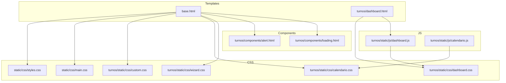
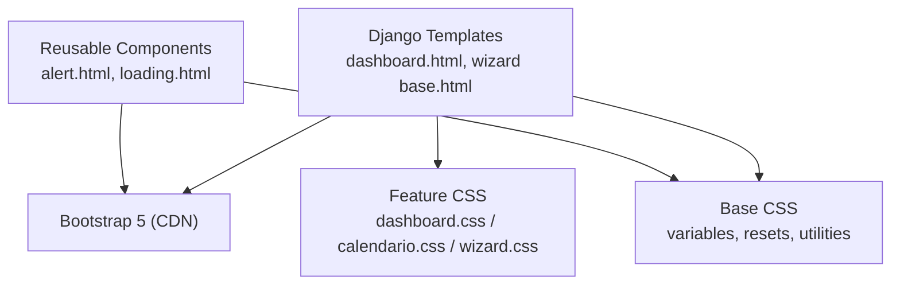
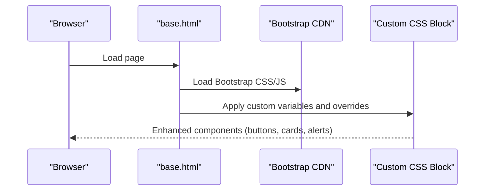
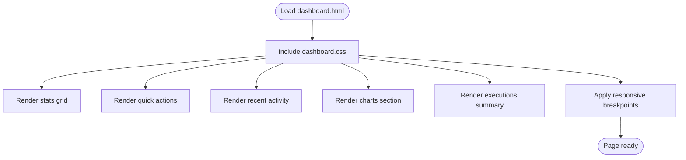
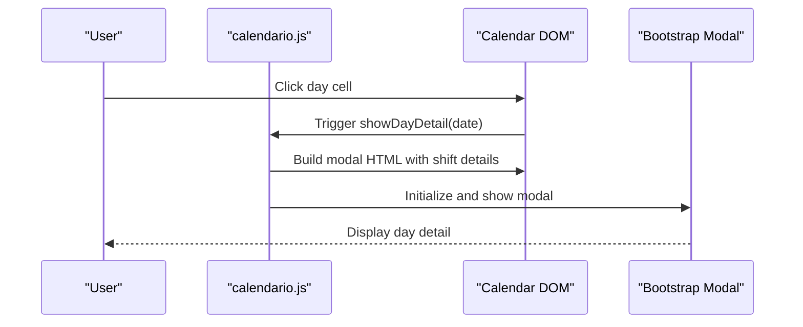
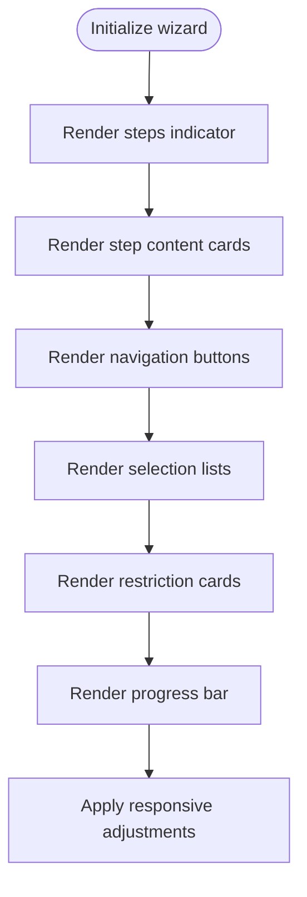
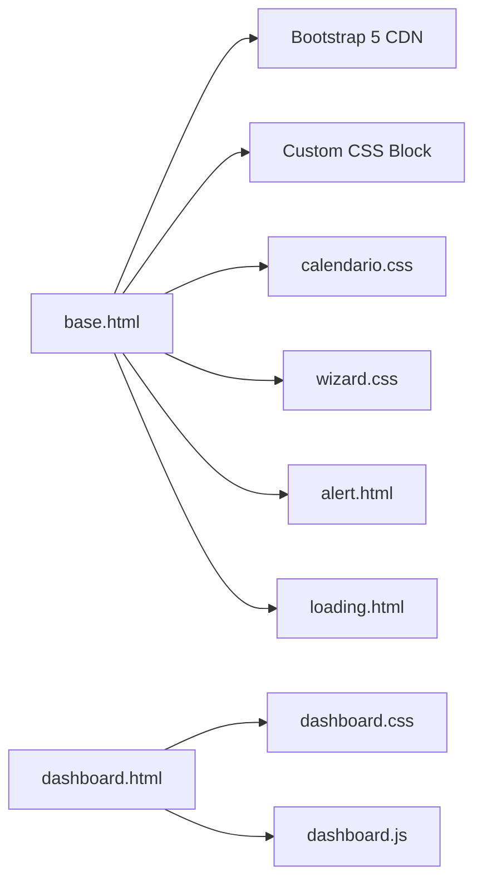

# Frontend Components and Styling

<cite>
**Referenced Files in This Document**
- [base.html](file://turnos/templates/base.html)
- [dashboard.html](file://turnos/templates/turnos/dashboard.html)
- [calendario.js](file://turnos/static/js/calendario.js)
- [dashboard.js](file://turnos/static/js/dashboard.js)
- [custom.css](file://turnos/static/css/custom.css)
- [styles.css](file://static/css/styles.css)
- [main.css](file://static/css/main.css)
- [dashboard.css](file://turnos/static/css/dashboard.css)
- [calendario.css](file://turnos/static/css/calendario.css)
- [wizard.css](file://turnos/static/css/wizard.css)
- [alert.html](file://turnos/components/alert.html)
- [loading.html](file://turnos/components/loading.html)
</cite>

## Table of Contents
1. [Introduction](#introduction)
2. [Project Structure](#project-structure)
3. [Core Components](#core-components)
4. [Architecture Overview](#architecture-overview)
5. [Detailed Component Analysis](#detailed-component-analysis)
6. [Dependency Analysis](#dependency-analysis)
7. [Performance Considerations](#performance-considerations)
8. [Troubleshooting Guide](#troubleshooting-guide)
9. [Conclusion](#conclusion)
10. [Appendices](#appendices)

## Introduction
This document describes the frontend component library and styling system used in the project. It explains how Bootstrap 5 is integrated, how custom CSS is organized by feature area, and how component-specific styling patterns are applied across the dashboard, calendar, wizard, and forms. It also covers responsive design, color schemes, typography, spacing, utility classes, customization guidelines, cross-browser compatibility, and mobile-first principles.

## Project Structure
The frontend styling is split into:
- Global base styles and Bootstrap integration in the base template
- Feature-specific stylesheets under turnos/static/css
- Shared components for alerts and loading indicators
- JavaScript helpers that drive dynamic interactions for dashboard and calendar

**Diagram sources**
- [base.html:11-12](file://turnos/templates/base.html#L11-L12)
- [base.html:365](file://turnos/templates/base.html#L365)
- [dashboard.html:8-10](file://turnos/templates/turnos/dashboard.html#L8-L10)
- [dashboard.js:1-61](file://turnos/static/js/dashboard.js#L1-L61)
- [calendario.js:1-243](file://turnos/static/js/calendario.js#L1-L243)
- [custom.css:1-46](file://turnos/static/css/custom.css#L1-L46)
- [styles.css:1-633](file://static/css/styles.css#L1-L633)
- [main.css:1-91](file://static/css/main.css#L1-L91)
- [dashboard.css:1-607](file://turnos/static/css/dashboard.css#L1-L607)
- [calendario.css:1-500](file://turnos/static/css/calendario.css#L1-L500)
- [wizard.css:1-448](file://turnos/static/css/wizard.css#L1-L448)
- [alert.html:1-7](file://turnos/components/alert.html#L1-L7)
- [loading.html:1-7](file://turnos/components/loading.html#L1-L7)

**Section sources**
- [base.html:11-12](file://turnos/templates/base.html#L11-L12)
- [base.html:365](file://turnos/templates/base.html#L365)
- [dashboard.html:8-10](file://turnos/templates/turnos/dashboard.html#L8-L10)

## Core Components
- Bootstrap 5 integration: The base template loads Bootstrap 5 CSS and JS via CDN and applies custom overrides and enhancements in a scoped style block.
- Global variables and utilities: Centralized CSS custom properties define color tokens, typography, spacing, borders, shadows, and transitions.
- Feature-specific styles:
  - Dashboard: Statistics cards, quick actions, recent activity, charts, executions summary, and welcome banner.
  - Calendar: Grid layout, daily cells, shift badges, weekly schedule, filters, and legends.
  - Wizard: Multi-step progress indicator, step navigation, selection lists, restriction cards, and responsive adjustments.
  - Forms: Labels, controls, validation feedback, and table styling.
- Utility classes: Extensive use of Bootstrap utility classes combined with custom utility classes for colors, backgrounds, rounded corners, and shadows.
- Cross-browser and accessibility: Viewport meta tag, X-UA-Compatible, and Bootstrap’s built-in utilities support modern browsers and assistive technologies.

**Section sources**
- [base.html:18-216](file://turnos/templates/base.html#L18-L216)
- [styles.css:9-79](file://static/css/styles.css#L9-L79)
- [dashboard.css:1-607](file://turnos/static/css/dashboard.css#L1-L607)
- [calendario.css:1-500](file://turnos/static/css/calendario.css#L1-L500)
- [wizard.css:1-448](file://turnos/static/css/wizard.css#L1-L448)
- [styles.css:500-523](file://static/css/styles.css#L500-L523)

## Architecture Overview
The styling architecture follows a layered approach:
- Base layer: Bootstrap 5 provides foundational layout, components, and utilities.
- Global layer: Centralized variables and base resets in styles.css and main.css.
- Feature layer: Component-specific stylesheets for dashboard, calendar, and wizard.
- Template layer: Feature pages include their stylesheet and Bootstrap classes.
- Component layer: Reusable partials for alerts and loading spinners.

**Diagram sources**
- [base.html:11-12](file://turnos/templates/base.html#L11-L12)
- [base.html:18-216](file://turnos/templates/base.html#L18-L216)
- [dashboard.html:8-10](file://turnos/templates/turnos/dashboard.html#L8-L10)
- [dashboard.css:1-607](file://turnos/static/css/dashboard.css#L1-L607)
- [calendario.css:1-500](file://turnos/static/css/calendario.css#L1-L500)
- [wizard.css:1-448](file://turnos/static/css/wizard.css#L1-L448)
- [alert.html:1-7](file://turnos/components/alert.html#L1-L7)
- [loading.html:1-7](file://turnos/components/loading.html#L1-L7)

## Detailed Component Analysis

### Bootstrap 5 Integration and Custom Overrides
- CDN inclusion ensures Bootstrap 5 CSS and JS are available globally.
- Custom style block in base.html defines CSS variables and augments Bootstrap components with gradients, shadows, transitions, and layout tweaks.
- Alerts, buttons, cards, and navbars receive custom styling while retaining Bootstrap’s responsive behavior.

**Diagram sources**
- [base.html:11-12](file://turnos/templates/base.html#L11-L12)
- [base.html:18-216](file://turnos/templates/base.html#L18-L216)

**Section sources**
- [base.html:11-12](file://turnos/templates/base.html#L11-L12)
- [base.html:18-216](file://turnos/templates/base.html#L18-L216)

### Dashboard Widget Styling
- Layout: Container with header, statistics grid, quick actions, recent activity, charts section, and executions summary.
- Statistics cards: Gradient accents, hover animations, icons, and value/label typography.
- Quick actions: Grid of actionable cards with hover effects and iconography.
- Recent activity: List items with hover highlighting and colored icons per action type.
- Charts: Dedicated chart containers sized for Chart.js rendering.
- Executions summary: Status badges with color-coded labels.
- Welcome banner: Gradient background with animated pseudo-elements and prominent call-to-action button.
- Responsive behavior: Adjusts grid columns and container sizes for tablet and mobile.

**Diagram sources**
- [dashboard.html:8-10](file://turnos/templates/turnos/dashboard.html#L8-L10)
- [dashboard.css:1-607](file://turnos/static/css/dashboard.css#L1-L607)

**Section sources**
- [dashboard.html:12-184](file://turnos/templates/turnos/dashboard.html#L12-L184)
- [dashboard.css:1-607](file://turnos/static/css/dashboard.css#L1-L607)

### Calendar Component Design
- Container and header: Card-like layout with navigation controls and title.
- Grid layout: 7-column grid for days of the week; day cells with hover, weekend, and “other month” states.
- Shift badges: Color-coded morning, afternoon, and night shifts with count indicators.
- Day detail view: Modal with shift breakdown and staff avatars.
- Weekly schedule: Optional grid with hourly rows and occupancy indicators.
- Filters and legend: Separate card for filters and a color-coded legend.
- Print mode: Hidden controls/filters and adjusted layouts for printing.
- Responsive behavior: Collapses grid to single column on small screens; adapts day labels and modal sizing.

**Diagram sources**
- [calendario.js:98-177](file://turnos/static/js/calendario.js#L98-L177)
- [calendario.css:1-500](file://turnos/static/css/calendario.css#L1-L500)

**Section sources**
- [calendario.js:1-243](file://turnos/static/js/calendario.js#L1-L243)
- [calendario.css:1-500](file://turnos/static/css/calendario.css#L1-L500)

### Wizard Interface Styling
- Steps indicator: Horizontal progress bar with gradient completion and numbered, animated step markers.
- Step content: Card-based layout with header gradient and body padding; active step visibility.
- Navigation: Buttons styled with directional emphasis and hover transforms.
- Form sections: Distinctive left border and typography hierarchy.
- Selection lists: Scrollable list with hover and selection states.
- Restriction cards: Left border differentiation for hard vs soft constraints.
- Progress bar: Full-width bar with gradient fill indicating completion percentage.
- Responsive behavior: Stacked steps on narrow screens, centered navigation, and reduced step marker sizes.

**Diagram sources**
- [wizard.css:1-448](file://turnos/static/css/wizard.css#L1-L448)

**Section sources**
- [wizard.css:1-448](file://turnos/static/css/wizard.css#L1-L448)

### Form Component Aesthetics
- Labels: Medium weight, muted color, and spacing aligned with Bootstrap defaults.
- Controls: Rounded corners, light borders, focus glow with primary color, and smooth transitions.
- Validation: Invalid state with danger border and focused glow; inline invalid feedback.
- Help text: Subtle muted color and compact spacing.
- Tables: Striped rows, bordered variants, hover states, and responsive adjustments.

**Section sources**
- [styles.css:406-456](file://static/css/styles.css#L406-L456)
- [styles.css:458-498](file://static/css/styles.css#L458-L498)

### Typography, Spacing, and Color Schemes
- Typography: Inter-based system with defined font weights and sizes; headings scale down progressively.
- Spacing: Consistent scale using custom properties for xs to 2xl; applied to margins, paddings, and gaps.
- Colors: Primary, secondary, and semantic colors (success, danger, warning, info) with light variants; shift-specific colors for calendar.
- Shadows and borders: Standardized radius and shadow tokens for consistent depth.

**Section sources**
- [styles.css:47-79](file://static/css/styles.css#L47-L79)
- [calendario.css:134-150](file://turnos/static/css/calendario.css#L134-L150)

### Responsive Design and Breakpoints
- Mobile-first: Base styles apply to small screens; media queries refine layouts for tablets and desktops.
- Breakpoints: Custom responsive rules adjust grid columns, font sizes, and component dimensions.
- Examples:
  - Dashboard: Charts stack below 1200px; executions table becomes list-like on small screens.
  - Calendar: Grid collapses to single column; day labels include weekday names; weekly view adapts.
  - Wizard: Steps stack vertically; navigation buttons become full-width.

**Section sources**
- [styles.css:549-606](file://static/css/styles.css#L549-L606)
- [dashboard.css:515-583](file://turnos/static/css/dashboard.css#L515-L583)
- [calendario.css:419-475](file://turnos/static/css/calendario.css#L419-L475)
- [wizard.css:381-418](file://turnos/static/css/wizard.css#L381-L418)

### Utility Classes and Organization by Feature Areas
- Utilities: Text/background color utilities, rounded corners, and shadow utilities derived from CSS variables.
- Feature organization:
  - Global: styles.css and main.css
  - Dashboard: dashboard.css
  - Calendar: calendario.css
  - Wizard: wizard.css
  - Shared components: alert.html and loading.html
- Integration: Templates link feature CSS and rely on Bootstrap utilities for layout and alignment.

**Section sources**
- [styles.css:500-523](file://static/css/styles.css#L500-L523)
- [dashboard.css:1-607](file://turnos/static/css/dashboard.css#L1-L607)
- [calendario.css:1-500](file://turnos/static/css/calendario.css#L1-L500)
- [wizard.css:1-448](file://turnos/static/css/wizard.css#L1-L448)
- [alert.html:1-7](file://turnos/components/alert.html#L1-L7)
- [loading.html:1-7](file://turnos/components/loading.html#L1-L7)

### Cross-Browser Compatibility and Accessibility
- Meta tags: viewport and X-UA-Compatible ensure consistent rendering.
- Bootstrap 5: Built-in cross-browser support and accessibility features.
- Focus states: Prominent focus rings for keyboard navigation.
- Semantic markup: Proper headings, lists, and ARIA roles where applicable.

**Section sources**
- [base.html:6-8](file://turnos/templates/base.html#L6-L8)
- [base.html:15-16](file://turnos/templates/base.html#L15-L16)
- [styles.css:427-433](file://static/css/styles.css#L427-L433)

## Dependency Analysis
The styling system depends on:
- Bootstrap 5 (CDN) for foundational components and utilities.
- Feature CSS files for domain-specific layouts and interactions.
- Template links to feature CSS and Bootstrap classes.
- JavaScript helpers for dynamic content (calendar) and charts (dashboard).

**Diagram sources**
- [base.html:11-12](file://turnos/templates/base.html#L11-L12)
- [base.html:18-216](file://turnos/templates/base.html#L18-L216)
- [dashboard.html:8-10](file://turnos/templates/turnos/dashboard.html#L8-L10)
- [dashboard.js:1-61](file://turnos/static/js/dashboard.js#L1-L61)
- [calendario.css:1-500](file://turnos/static/css/calendario.css#L1-L500)
- [wizard.css:1-448](file://turnos/static/css/wizard.css#L1-L448)
- [alert.html:1-7](file://turnos/components/alert.html#L1-L7)
- [loading.html:1-7](file://turnos/components/loading.html#L1-L7)

**Section sources**
- [base.html:11-12](file://turnos/templates/base.html#L11-L12)
- [dashboard.html:8-10](file://turnos/templates/turnos/dashboard.html#L8-L10)
- [dashboard.js:1-61](file://turnos/static/js/dashboard.js#L1-L61)
- [calendario.js:1-243](file://turnos/static/js/calendario.js#L1-L243)

## Performance Considerations
- Minimize repaints: Prefer transform/opacity animations over layout-affecting properties.
- Reduce specificity: Keep selectors shallow to improve cascade performance.
- Lazy initialization: Initialize charts and modals only when needed.
- Media queries: Use targeted breakpoints to avoid unnecessary recalculations.

## Troubleshooting Guide
- Bootstrap conflicts: Verify only one Bootstrap CSS is loaded; prefer the CDN version included in base.html.
- Missing feature styles: Ensure the feature template includes its stylesheet link.
- Calendar interactivity: Confirm the calendar helper is initialized and the container exists.
- Wizard navigation: Verify step content visibility and button event handlers.
- Alerts not dismissing: Ensure Bootstrap JS is loaded and the close button targets the correct selector.

**Section sources**
- [base.html:367-368](file://turnos/templates/base.html#L367-L368)
- [dashboard.html:186-188](file://turnos/templates/turnos/dashboard.html#L186-L188)
- [calendario.js:237-242](file://turnos/static/js/calendario.js#L237-L242)
- [alert.html:3-5](file://turnos/components/alert.html#L3-L5)

## Conclusion
The frontend styling system blends Bootstrap 5 with a cohesive set of custom CSS variables, global utilities, and feature-specific stylesheets. It emphasizes a mobile-first, accessible, and maintainable design that scales across the dashboard, calendar, wizard, and forms. By leveraging reusable components and clear separation of concerns, teams can extend and customize the UI consistently.

## Appendices
- Customization guidelines:
  - Define new tokens in the centralized variables section.
  - Add feature-specific styles in dedicated CSS files.
  - Use Bootstrap utility classes alongside custom ones for rapid prototyping.
  - Test responsiveness across breakpoints and validate accessibility.