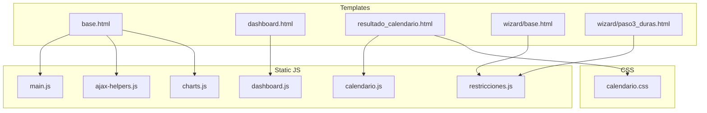
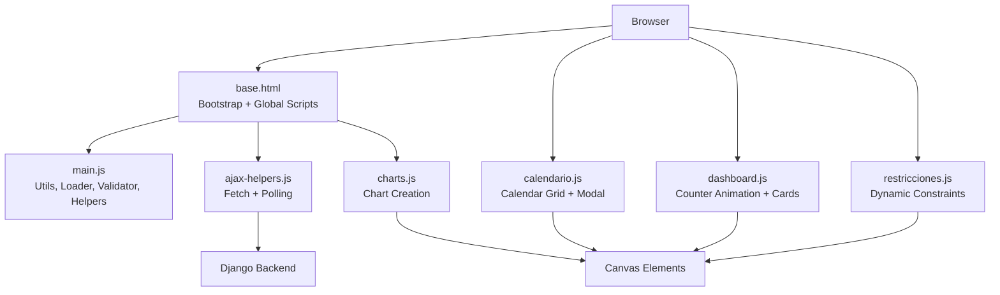
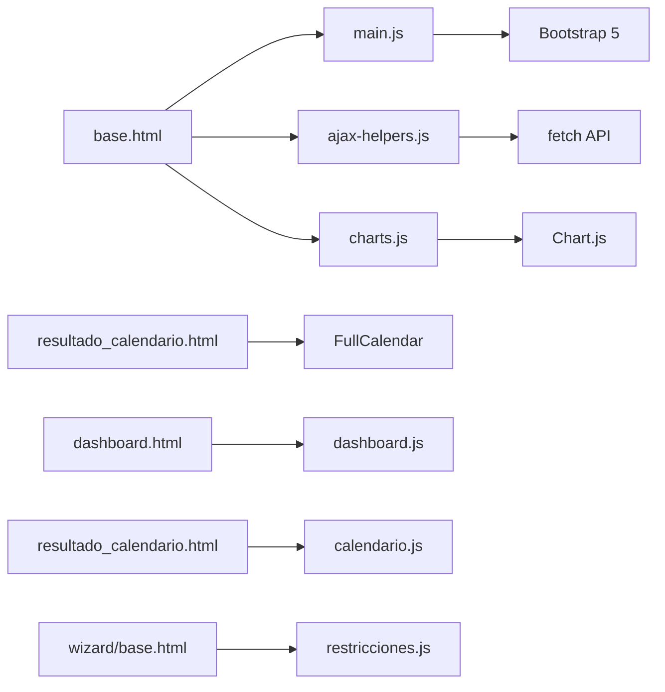

# JavaScript Modules and Interactions

<cite>
**Referenced Files in This Document**
- [main.js](file://static/js/main.js)
- [calendario.js](file://static/js/calendario.js)
- [dashboard.js](file://static/js/dashboard.js)
- [ajax-helpers.js](file://static/js/ajax-helpers.js)
- [restricciones.js](file://static/js/restricciones.js)
- [charts.js](file://static/js/charts.js)
- [base.html](file://turnos/templates/base.html)
- [dashboard.html](file://turnos/templates/turnos/dashboard.html)
- [resultado_calendario.html](file://turnos/templates/turnos/resultado_calendario.html)
- [paso3_duras.html](file://turnos/templates/turnos/wizard/paso3_duras.html)
- [calendario.css](file://static/css/calendario.css)
</cite>

## Table of Contents
1. [Introduction](#introduction)
2. [Project Structure](#project-structure)
3. [Core Components](#core-components)
4. [Architecture Overview](#architecture-overview)
5. [Detailed Component Analysis](#detailed-component-analysis)
6. [Dependency Analysis](#dependency-analysis)
7. [Performance Considerations](#performance-considerations)
8. [Troubleshooting Guide](#troubleshooting-guide)
9. [Conclusion](#conclusion)

## Introduction
This document explains the JavaScript functionality and interactive features of the turn scheduling application. It covers the main application module, calendar display, dashboard analytics, AJAX helpers, constraint management, form validation, dynamic content loading, Chart.js integration, modal interactions, and form submission handling. It also documents the modular architecture, dependency management, event handling patterns, browser compatibility, error handling, and performance optimization techniques.

## Project Structure
The JavaScript modules are organized under the static/js directory and are integrated into Django templates via the base template and page-specific templates. The main application module initializes shared utilities, loaders, validators, and helpers. Calendar and dashboard modules provide specialized UI interactions. AJAX helpers centralize HTTP requests and polling. Constraint management supports dynamic configuration of hard and soft constraints. Chart.js integration renders statistical visualizations.

**Diagram sources**
- [base.html](file://turnos/templates/base.html)
- [dashboard.html](file://turnos/templates/turnos/dashboard.html)
- [resultado_calendario.html](file://turnos/templates/turnos/resultado_calendario.html)
- [wizard/base.html](file://turnos/templates/turnos/wizard/base.html)
- [wizard/paso3_duras.html](file://turnos/templates/turnos/wizard/paso3_duras.html)
- [main.js](file://static/js/main.js)
- [calendario.js](file://static/js/calendario.js)
- [dashboard.js](file://static/js/dashboard.js)
- [ajax-helpers.js](file://static/js/ajax-helpers.js)
- [restricciones.js](file://static/js/restricciones.js)
- [charts.js](file://static/js/charts.js)
- [calendario.css](file://static/css/calendario.css)

**Section sources**
- [base.html](file://turnos/templates/base.html)
- [dashboard.html](file://turnos/templates/turnos/dashboard.html)
- [resultado_calendario.html](file://turnos/templates/turnos/resultado_calendario.html)
- [wizard/base.html](file://turnos/templates/turnos/wizard/base.html)
- [wizard/paso3_duras.html](file://turnos/templates/turnos/wizard/paso3_duras.html)
- [main.js](file://static/js/main.js)
- [calendario.js](file://static/js/calendario.js)
- [dashboard.js](file://static/js/dashboard.js)
- [ajax-helpers.js](file://static/js/ajax-helpers.js)
- [restricciones.js](file://static/js/restricciones.js)
- [charts.js](file://static/js/charts.js)
- [calendario.css](file://static/css/calendario.css)

## Core Components
- Global Application Module (main.js): Provides shared utilities, loader, form validation, table helpers, live search, auto-save, and confirmation dialogs. Exposes window-scoped APIs for global use.
- Calendar Display (calendario.js): Renders a month-based calendar grid, displays daily turn assignments, and opens a modal with detailed shift information per day.
- Dashboard Analytics (dashboard.js): Animates statistic counters and makes cards clickable for navigation.
- AJAX Helpers (ajax-helpers.js): Encapsulates CSRF-aware fetch requests, generic HTTP verbs, form submission, content loading, and polling for asynchronous updates.
- Constraint Management (restricciones.js): Dynamically builds hard and soft constraint configurations with parameter inputs, validation, and serialization to hidden form fields.
- Chart.js Integration (charts.js): Provides reusable chart creation functions for bars, lines, and pie/donut charts with consistent theming and responsive defaults.

**Section sources**
- [main.js](file://static/js/main.js)
- [calendario.js](file://static/js/calendario.js)
- [dashboard.js](file://static/js/dashboard.js)
- [ajax-helpers.js](file://static/js/ajax-helpers.js)
- [restricciones.js](file://static/js/restricciones.js)
- [charts.js](file://static/js/charts.js)

## Architecture Overview
The application follows a modular pattern where each JavaScript file encapsulates a domain-specific concern. The base template loads Bootstrap and global scripts, while page-specific templates include dedicated modules. AJAX helpers coordinate server communication, and Chart.js integrates with dashboard and report pages.

**Diagram sources**
- [base.html](file://turnos/templates/base.html)
- [main.js](file://static/js/main.js)
- [ajax-helpers.js](file://static/js/ajax-helpers.js)
- [charts.js](file://static/js/charts.js)
- [calendario.js](file://static/js/calendario.js)
- [dashboard.js](file://static/js/dashboard.js)
- [restricciones.js](file://static/js/restricciones.js)

## Detailed Component Analysis

### Global Application Module (main.js)
Responsibilities:
- Configuration: Centralized API base URL, CSRF token retrieval, and debug flag.
- Utilities: Cookie parsing, date/time formatting, number formatting, debouncing, toast notifications, confirmation dialogs, random colors, email validation, clipboard copy fallback.
- Loader: Overlay spinner with show/hide lifecycle.
- Form Validation: Field-level and form-level validation with Bootstrap classes and feedback elements.
- Sidebar: Collapsible state persistence and mobile close behavior.
- Table Helper: Sorting, filtering, and CSV export.
- Delete Confirmation: Confirmation dialogs for destructive actions.
- Auto Save: Debounced saving of form drafts.
- Live Search: Debounced client-side filtering of elements.
- Initialization: Bootstraps tooltips/popovers, auto-close alerts, real-time validation, and form submission handling.

Key patterns:
- IIFE encapsulation with strict mode.
- Window-scoped exports for global access.
- Event delegation and DOMContentLoaded initialization.
- Debounce for performance-sensitive events.

**Section sources**
- [main.js](file://static/js/main.js)

### Calendar Display (calendario.js)
Responsibilities:
- Calendar rendering: Generates month grid with headers, previous/next/current navigation, and day cells.
- Turn rendering: Displays assigned shifts per day with counts and labels.
- Day detail modal: Builds and shows a modal with shift details for selected dates.
- Navigation: Previous month, next month, and today buttons.
- Formatting: Short and long date formatting helpers.

Integration:
- Uses Bootstrap modals for detail presentation.
- Operates on a container element and expects structured data keyed by ISO date strings.

**Section sources**
- [calendario.js](file://static/js/calendario.js)
- [calendario.css](file://static/css/calendario.css)

### Dashboard Analytics (dashboard.js)
Responsibilities:
- Counter animation: Smoothly animates numeric stat cards.
- Clickable cards: Adds hover effects and click-to-navigate behavior for stat cards with data-url attributes.

Usage:
- Loaded by dashboard.html and invoked on DOMContentLoaded.

**Section sources**
- [dashboard.js](file://static/js/dashboard.js)
- [dashboard.html](file://turnos/templates/turnos/dashboard.html)

### AJAX Helpers (ajax-helpers.js)
Responsibilities:
- CSRF token resolution from meta tags, hidden inputs, or cookies.
- Generic HTTP verbs: GET, POST, PUT, DELETE with JSON payload/body and credentials handling.
- Form submission: FormData-based submission with CSRF inclusion.
- Content loading: Loads HTML fragments into containers.
- Polling: Periodic GET requests with callbacks and termination conditions.
- Domain-specific helpers: Execution status monitoring, nurse search, configuration validation/duplication, export triggers, dashboard stats retrieval, and user preferences saving.

Patterns:
- Async/await for readable asynchronous flows.
- Centralized error logging and propagation.
- Reusable polling with configurable intervals and max attempts.

**Section sources**
- [ajax-helpers.js](file://static/js/ajax-helpers.js)

### Constraint Management (restricciones.js)
Responsibilities:
- Hard constraints: Dynamic cards with type selection, activation toggles, and parameter inputs. Supports min/max parameters and help text.
- Soft constraints: Cards with type selection, weight sliders/ranges synchronized with numeric inputs, and activation toggles.
- Serialization: Aggregates configured constraints into JSON for hidden form fields.
- Validation: Ensures at least one hard constraint exists before form submission.

Integration:
- Loaded by wizard templates to support configuration creation.
- Uses Bootstrap components and custom styling.

**Section sources**
- [restricciones.js](file://static/js/restricciones.js)
- [wizard/base.html](file://turnos/templates/turnos/wizard/base.html)
- [wizard/paso3_duras.html](file://turnos/templates/turnos/wizard/paso3_duras.html)

### Chart.js Integration (charts.js)
Responsibilities:
- Theming: Consistent color palette and typography.
- Defaults: Responsive charts with legend and tooltip customization.
- Chart types: Bar, line, and pie/donut charts with optional gradients.
- Specialized charts: Distribution by nurse, coverage by shift type, temporal evolution, and success rate doughnuts.
- Cleanup: Destroy all instances to prevent memory leaks.

Integration:
- Consumed by dashboard/report pages to visualize statistics.

**Section sources**
- [charts.js](file://static/js/charts.js)

### Calendar Template Integration (resultado_calendario.html)
Responsibilities:
- Provides a FullCalendar-based view with event rendering, modal detail, and view switching.
- Includes filters for nurse and shift type.
- Uses Bootstrap modals and FullCalendar CDN.

Note: While this template uses FullCalendar, the calendario.js module remains available for alternative calendar implementations.

**Section sources**
- [resultado_calendario.html](file://turnos/templates/turnos/resultado_calendario.html)

## Dependency Analysis
Module interdependencies:
- main.js depends on Bootstrap for tooltips/popovers/alerts and provides shared utilities consumed by other modules.
- ajax-helpers.js is used globally for server communication and is loaded via base.html.
- calendario.js and dashboard.js are page-specific and loaded by their respective templates.
- charts.js complements dashboard analytics with visualizations.
- restricciones.js is loaded by wizard templates for constraint configuration.

External dependencies:
- Bootstrap 5 (CSS/JS) for UI components and modals.
- Chart.js for statistical visualizations.
- FullCalendar for advanced calendar rendering (template-specific).

**Diagram sources**
- [base.html](file://turnos/templates/base.html)
- [dashboard.html](file://turnos/templates/turnos/dashboard.html)
- [resultado_calendario.html](file://turnos/templates/turnos/resultado_calendario.html)
- [wizard/base.html](file://turnos/templates/turnos/wizard/base.html)
- [main.js](file://static/js/main.js)
- [ajax-helpers.js](file://static/js/ajax-helpers.js)
- [charts.js](file://static/js/charts.js)
- [calendario.js](file://static/js/calendario.js)
- [dashboard.js](file://static/js/dashboard.js)
- [restricciones.js](file://static/js/restricciones.js)

**Section sources**
- [base.html](file://turnos/templates/base.html)
- [dashboard.html](file://turnos/templates/turnos/dashboard.html)
- [resultado_calendario.html](file://turnos/templates/turnos/resultado_calendario.html)
- [wizard/base.html](file://turnos/templates/turnos/wizard/base.html)
- [main.js](file://static/js/main.js)
- [ajax-helpers.js](file://static/js/ajax-helpers.js)
- [charts.js](file://static/js/charts.js)
- [calendario.js](file://static/js/calendario.js)
- [dashboard.js](file://static/js/dashboard.js)
- [restricciones.js](file://static/js/restricciones.js)

## Performance Considerations
- Debouncing: Used for live search and resize events to reduce unnecessary computations.
- Lazy initialization: Modules initialize on DOMContentLoaded to avoid blocking.
- Minimal DOM queries: Batched updates and efficient selectors.
- Polling limits: Max attempts and intervals prevent excessive server load.
- Chart cleanup: Destroying chart instances prevents memory leaks.
- Clipboard fallback: Graceful degradation for older browsers.

[No sources needed since this section provides general guidance]

## Troubleshooting Guide
Common issues and resolutions:
- CSRF errors during AJAX: Ensure CSRF token is present in meta tags or hidden inputs; ajax-helpers.js retrieves tokens from multiple locations.
- Toast notifications not appearing: Verify the toast container exists or is created by the utility.
- Calendar not rendering: Confirm the container element exists and data is properly formatted with ISO date keys.
- Modals not closing: Ensure Bootstrap modal APIs are called after DOM insertion.
- Form validation not working: Check for needs-validation class and proper field binding on blur and submit.
- Polling stops unexpectedly: Inspect error logs and verify endpoint availability and response format.

**Section sources**
- [ajax-helpers.js](file://static/js/ajax-helpers.js)
- [main.js](file://static/js/main.js)
- [calendario.js](file://static/js/calendario.js)

## Conclusion
The JavaScript layer is modular, robust, and designed for maintainability and performance. It leverages Bootstrap for UI consistency, Chart.js for data visualization, and FullCalendar for advanced calendar rendering. The architecture separates concerns clearly, with centralized utilities, specialized modules, and template-driven integrations. Proper error handling, browser compatibility measures, and performance optimizations ensure a smooth user experience across scenarios.