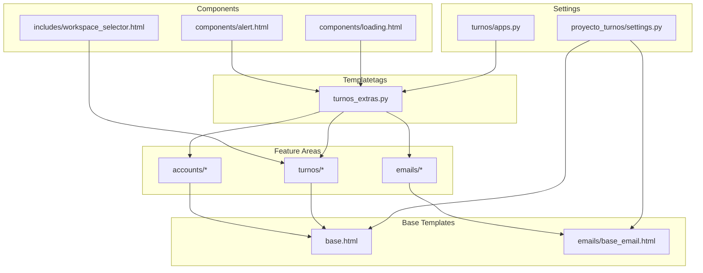
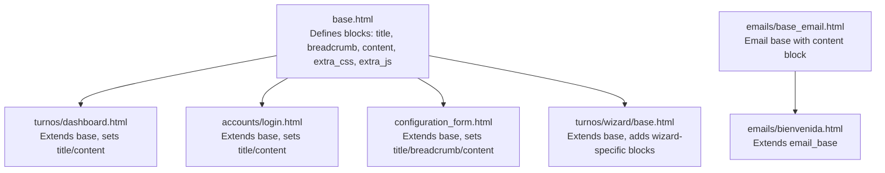
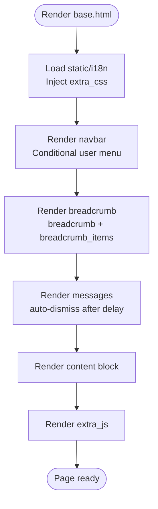
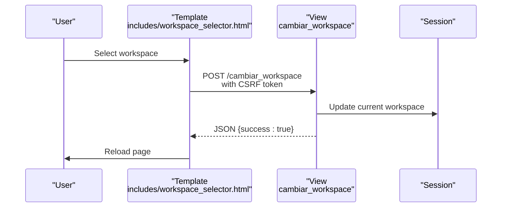
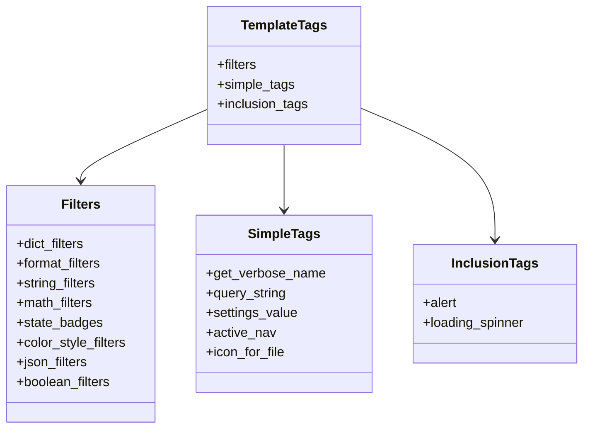
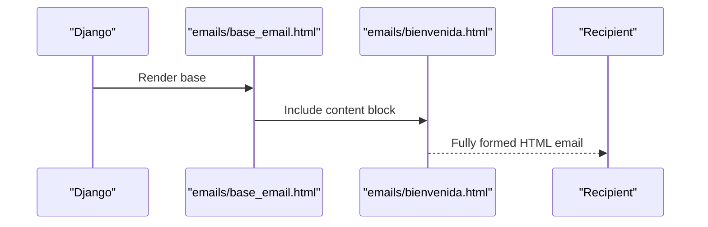
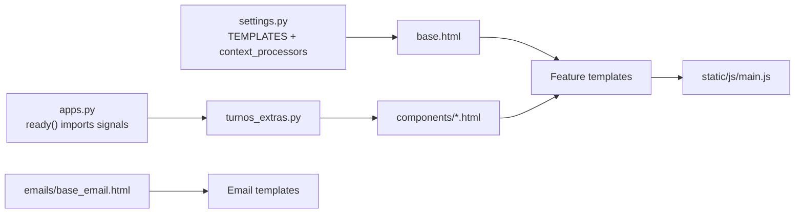

# Template System and Structure

<cite>
**Referenced Files in This Document**
- [base.html](file://turnos/templates/base.html)
- [workspace_selector.html](file://turnos/templates/includes/workspace_selector.html)
- [turnos_extras.py](file://turnos/templatetags/turnos_extras.py)
- [settings.py](file://proyecto_turnos/settings.py)
- [apps.py](file://turnos/apps.py)
- [login.html](file://turnos/templates/accounts/login.html)
- [dashboard.html](file://turnos/templates/turnos/dashboard.html)
- [base_email.html](file://turnos/templates/emails/base_email.html)
- [bienvenida.html](file://turnos/templates/emails/bienvenida.html)
- [configuration_form.html](file://turnos/templates/configuration_form.html)
- [wizard_base.html](file://turnos/templates/turnos/wizard/base.html)
- [alert.html](file://turnos/components/alert.html)
- [loading.html](file://turnos/components/loading.html)
- [mixins.py](file://turnos/mixins.py)
- [main.js](file://static/js/main.js)
- [django.po (English)](file://locale/en/LC_MESSAGES/django.po)
</cite>

## Table of Contents
1. [Introduction](#introduction)
2. [Project Structure](#project-structure)
3. [Core Components](#core-components)
4. [Architecture Overview](#architecture-overview)
5. [Detailed Component Analysis](#detailed-component-analysis)
6. [Dependency Analysis](#dependency-analysis)
7. [Performance Considerations](#performance-considerations)
8. [Troubleshooting Guide](#troubleshooting-guide)
9. [Conclusion](#conclusion)
10. [Appendices](#appendices)

## Introduction
This document explains the Django template system architecture used in the project, focusing on the base template inheritance pattern, template hierarchy, reusable component structure, workspace selector integration, template tags usage, and context processors. It also documents the organization by feature areas (accounts, turnos, emails), inheritance chains, block definitions, template composition patterns, variable passing mechanisms, conditional rendering, internationalization support via template tags, and responsive design integration with Bootstrap classes.

## Project Structure
The template system is organized around a single base template that defines global layout blocks and reusable components. Feature-specific templates extend the base and override content blocks. Email templates reuse a shared base for consistent presentation. A dedicated app module registers custom template tags and components.

**Diagram sources**
- [base.html](file://turnos/templates/base.html)
- [base_email.html](file://turnos/templates/emails/base_email.html)
- [workspace_selector.html](file://turnos/templates/includes/workspace_selector.html)
- [turnos_extras.py](file://turnos/templatetags/turnos_extras.py)
- [settings.py](file://proyecto_turnos/settings.py)
- [apps.py](file://turnos/apps.py)
- [alert.html](file://turnos/components/alert.html)
- [loading.html](file://turnos/components/loading.html)

**Section sources**
- [base.html](file://turnos/templates/base.html)
- [settings.py](file://proyecto_turnos/settings.py)

## Core Components
- Base template: Provides global layout, navigation, breadcrumbs, messages, and content blocks.
- Workspace selector: A reusable include that updates the current workspace via AJAX.
- Template tags: A comprehensive library offering filters, simple tags, inclusion tags, and helpers for formatting, badges, icons, and more.
- Reusable components: Alert and loading spinners rendered via inclusion tags.
- Email base: A responsive HTML email base with consistent styling and placeholders.
- Mixins: View mixins that populate breadcrumbs, page titles, and active menu markers for dynamic navigation.

Key responsibilities:
- Layout and responsiveness: Bootstrap 5 classes and custom CSS define a responsive, accessible UI.
- Internationalization: Built-in i18n tags and message blocks enable localized content.
- Composition: Extends and blocks create modular, maintainable templates.
- UX: Floating messages, badges, and icons improve clarity and feedback.

**Section sources**
- [base.html](file://turnos/templates/base.html)
- [workspace_selector.html](file://turnos/templates/includes/workspace_selector.html)
- [turnos_extras.py](file://turnos/templatetags/turnos_extras.py)
- [alert.html](file://turnos/components/alert.html)
- [loading.html](file://turnos/components/loading.html)
- [base_email.html](file://turnos/templates/emails/base_email.html)
- [mixins.py](file://turnos/mixins.py)

## Architecture Overview
The template architecture follows Django’s inheritance model:
- A root base template defines blocks for title, breadcrumb, content, extra CSS/JS, and global UI.
- Feature-specific templates extend the base and override content blocks.
- Email templates extend a dedicated email base and fill the content block.
- Template tags encapsulate formatting, UI helpers, and reusable logic.

**Diagram sources**
- [base.html](file://turnos/templates/base.html)
- [dashboard.html](file://turnos/templates/turnos/dashboard.html)
- [login.html](file://turnos/templates/accounts/login.html)
- [configuration_form.html](file://turnos/templates/configuration_form.html)
- [wizard_base.html](file://turnos/templates/turnos/wizard/base.html)
- [base_email.html](file://turnos/templates/emails/base_email.html)
- [bienvenida.html](file://turnos/templates/emails/bienvenida.html)

## Detailed Component Analysis

### Base Template and Blocks
The base template establishes:
- Global head assets (Bootstrap, Font Awesome, custom CSS).
- Navigation bar with conditional user menu.
- Breadcrumb block and optional breadcrumb_items override.
- Floating messages container with automatic dismissal.
- Main content area with a content block.
- Footer and optional extra_js block.

**Diagram sources**
- [base.html](file://turnos/templates/base.html)

**Section sources**
- [base.html](file://turnos/templates/base.html)

### Workspace Selector Integration
The workspace selector is a reusable include that:
- Renders a select dropdown of available workspaces for the current user.
- Sends a POST request to change the workspace via AJAX.
- Reloads the page upon successful change.

**Diagram sources**
- [workspace_selector.html](file://turnos/templates/includes/workspace_selector.html)

**Section sources**
- [workspace_selector.html](file://turnos/templates/includes/workspace_selector.html)

### Template Tags Library
The template tags module provides:
- Dictionary/list filters (get_item, get_attr, in_list, make_list, split).
- Formatting filters (format_number, replace_underscores, format_percentage, format_duration, format_time, format_date_es, time_ago).
- String filters (replace, truncate_chars_middle, initials, capitalize_first, remove_spaces, slugify_custom).
- Math filters (multiply, divide, percentage_of, abs_value, round_number).
- State badges (estado_badge, turno_badge, activo_badge).
- Color and style filters (color_from_string, progress_color).
- JSON filters (jsonify, parse_json).
- Boolean filters (is_weekend, is_today, is_past, is_empty, is_number).
- Simple tags (get_verbose_name, query_string, settings_value, active_nav, icon_for_file).
- Inclusion tags (alert, loading_spinner) backed by components/alert.html and components/loading.html.
- Restriction-related filters (restriccion_icon, peso_label).
- Optimization and compatibility filters (cache_buster, estado_badge, format_duration, format_json_params).

**Diagram sources**
- [turnos_extras.py](file://turnos/templatetags/turnos_extras.py)

**Section sources**
- [turnos_extras.py](file://turnos/templatetags/turnos_extras.py)

### Reusable Components
- Alert component: Renders a Bootstrap alert with optional dismissibility.
- Loading component: Renders a centered spinner with a message.

These are consumed via inclusion tags in templates for consistent UX.

**Section sources**
- [alert.html](file://turnos/components/alert.html)
- [loading.html](file://turnos/components/loading.html)
- [turnos_extras.py](file://turnos/templatetags/turnos_extras.py)

### Email Templates
The email base template defines:
- A responsive HTML wrapper with dark mode support.
- A header, body, and footer region.
- A content block for child templates.

Child templates extend the base and fill the content block with structured HTML and inline styles.

**Diagram sources**
- [base_email.html](file://turnos/templates/emails/base_email.html)
- [bienvenida.html](file://turnos/templates/emails/bienvenida.html)

**Section sources**
- [base_email.html](file://turnos/templates/emails/base_email.html)
- [bienvenida.html](file://turnos/templates/emails/bienvenida.html)

### Feature Area Templates

#### Accounts Area
- Login template extends the base, sets title and content, and renders messages and form errors.
- Uses i18n tags for localization and Bootstrap form controls.

**Section sources**
- [login.html](file://turnos/templates/accounts/login.html)

#### Turnos Area
- Dashboard extends the base, loads extra CSS/JS, and displays statistics and recent executions using template tags for formatting and badges.
- Configuration form extends the base, builds breadcrumbs dynamically, and renders a generic form with field-level help and errors.
- Wizard base extends the base, defines sidebar steps and help content, and injects wizard-specific CSS/JS.

**Section sources**
- [dashboard.html](file://turnos/templates/turnos/dashboard.html)
- [configuration_form.html](file://turnos/templates/configuration_form.html)
- [wizard_base.html](file://turnos/templates/turnos/wizard/base.html)

### Context Processors and Settings
- Settings configure DjangoTemplates with APP_DIRS enabled and include context processors for i18n, ensuring translation availability in templates.
- Locale files provide translations for common UI strings and plural forms.

**Section sources**
- [settings.py](file://proyecto_turnos/settings.py)
- [django.po (English)](file://locale/en/LC_MESSAGES/django.po)

### Mixins for Dynamic Navigation
- BreadcrumbMixin and TitleMixin add breadcrumbs and page titles to view contexts.
- ActiveMenuMixin marks the active menu item for navigation highlighting.

**Section sources**
- [mixins.py](file://turnos/mixins.py)

## Dependency Analysis
Template dependencies and relationships:
- Feature templates depend on the base template for layout and global UI.
- Email templates depend on the email base for consistent presentation.
- Template tags are globally available across templates after registration in the app.
- Components are included via inclusion tags, promoting reuse and separation of concerns.
- JavaScript utilities rely on CSRF tokens injected by templates and settings.

**Diagram sources**
- [settings.py](file://proyecto_turnos/settings.py)
- [apps.py](file://turnos/apps.py)
- [turnos_extras.py](file://turnos/templatetags/turnos_extras.py)
- [base.html](file://turnos/templates/base.html)
- [base_email.html](file://turnos/templates/emails/base_email.html)
- [main.js](file://static/js/main.js)

**Section sources**
- [settings.py](file://proyecto_turnos/settings.py)
- [apps.py](file://turnos/apps.py)
- [turnos_extras.py](file://turnos/templatetags/turnos_extras.py)
- [base.html](file://turnos/templates/base.html)
- [base_email.html](file://turnos/templates/emails/base_email.html)
- [main.js](file://static/js/main.js)

## Performance Considerations
- Minimize heavy computations in templates; use template tags for formatting and reuse components to avoid duplication.
- Keep extra CSS/JS scoped to feature pages to reduce payload.
- Use inclusion tags for frequently reused UI elements to simplify maintenance and improve caching.
- Leverage Bootstrap utility classes for responsive layouts to reduce custom CSS overhead.

## Troubleshooting Guide
Common issues and resolutions:
- Missing translations: Ensure i18n context processor is configured and translation files are compiled.
- Workspace selector not updating: Verify CSRF token injection and endpoint URL resolution.
- Alerts not dismissible: Confirm inclusion tag parameters and Bootstrap JS initialization.
- Email rendering inconsistencies: Use the email base template and avoid external resources; test in multiple clients.

**Section sources**
- [settings.py](file://proyecto_turnos/settings.py)
- [workspace_selector.html](file://turnos/templates/includes/workspace_selector.html)
- [turnos_extras.py](file://turnos/templatetags/turnos_extras.py)
- [base_email.html](file://turnos/templates/emails/base_email.html)

## Conclusion
The template system leverages Django’s inheritance and reusable component patterns to deliver a consistent, responsive, and internationalized interface. The base template centralizes layout and UX, while feature-specific templates focus on domain content. Template tags encapsulate formatting and UI helpers, and email templates ensure consistent communication. Together, these patterns promote maintainability, scalability, and a strong developer experience.

## Appendices

### Template Composition Patterns
- Extend base and override content block for page-level templates.
- Use breadcrumb_items for dynamic breadcrumbs.
- Employ inclusion tags for alerts and loading spinners.
- Apply template filters for formatting and conditional rendering.

### Variable Passing Mechanisms
- Views pass context data; mixins enrich context with breadcrumbs, titles, and active menu.
- Template tags receive context implicitly (e.g., active_nav) or explicitly (e.g., alert parameters).

### Conditional Rendering Examples
- User authentication state controls navbar links and dropdown visibility.
- Messages render conditionally and auto-dismiss after a timeout.
- Badges and icons reflect state and metadata via template filters.