# UI Views and Page Layouts

<cite>
**Referenced Files in This Document**
- [base.html](file://turnos/templates/base.html)
- [dashboard.html](file://turnos/templates/turnos/dashboard.html)
- [wizard/base.html](file://turnos/templates/turnos/wizard/base.html)
- [ejecutar_planificacion.html](file://turnos/templates/turnos/ejecutar_planificacion.html)
- [enfermera_list.html](file://turnos/templates/turnos/enfermera_list.html)
- [reportes.html](file://turnos/templates/turnos/reportes.html)
- [estadisticas.html](file://turnos/templates/turnos/partials/estadisticas.html)
- [planilla_tabla.html](file://turnos/templates/turnos/partials/planilla_tabla.html)
- [resultado_calendario.html](file://turnos/templates/turnos/resultado_calendario.html)
- [tipo_turno_list.html](file://turnos/templates/turnos/tipo_turno_list.html)
- [workspace_selector.html](file://turnos/templates/includes/workspace_selector.html)
- [dashboard.css](file://static/css/dashboard.css)
- [wizard.css](file://static/css/wizard.css)
- [calendario.css](file://static/css/calendario.css)
- [dashboard.js](file://static/js/dashboard.js)
- [main.js](file://static/js/main.js)
- [calendario.js](file://static/js/calendario.js)
</cite>

## Table of Contents
1. [Introduction](#introduction)
2. [Project Structure](#project-structure)
3. [Core Components](#core-components)
4. [Architecture Overview](#architecture-overview)
5. [Detailed Component Analysis](#detailed-component-analysis)
6. [Dependency Analysis](#dependency-analysis)
7. [Performance Considerations](#performance-considerations)
8. [Troubleshooting Guide](#troubleshooting-guide)
9. [Conclusion](#conclusion)

## Introduction
This document describes the user interface views and page layouts across the application. It covers the dashboard with statistics widgets, the step-by-step planning wizard, staff management interfaces, and reporting pages. It also explains layout patterns, navigation structures, user workflows, form and table layouts, calendar views, modal dialogs, responsive behavior, accessibility features, and the integration between server-side rendering and client-side interactivity.

## Project Structure
The UI is built with Django templates extending a shared base layout. Styles are organized per view (dashboard, wizard, calendar) and global utilities live in a main stylesheet and JavaScript module. Client-side scripts handle interactive features such as animated counters, calendar rendering, and workspace switching.

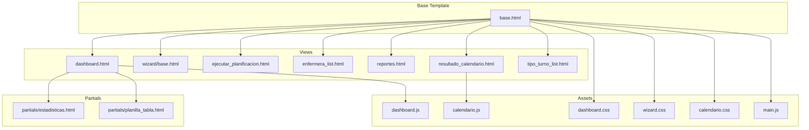

**Diagram sources**
- [base.html](file://turnos/templates/base.html)
- [dashboard.html](file://turnos/templates/turnos/dashboard.html)
- [wizard/base.html](file://turnos/templates/turnos/wizard/base.html)
- [ejecutar_planificacion.html](file://turnos/templates/turnos/ejecutar_planificacion.html)
- [enfermera_list.html](file://turnos/templates/turnos/enfermera_list.html)
- [reportes.html](file://turnos/templates/turnos/reportes.html)
- [resultado_calendario.html](file://turnos/templates/turnos/resultado_calendario.html)
- [tipo_turno_list.html](file://turnos/templates/turnos/tipo_turno_list.html)
- [estadisticas.html](file://turnos/templates/turnos/partials/estadisticas.html)
- [planilla_tabla.html](file://turnos/templates/turnos/partials/planilla_tabla.html)
- [dashboard.css](file://static/css/dashboard.css)
- [wizard.css](file://static/css/wizard.css)
- [calendario.css](file://static/css/calendario.css)
- [dashboard.js](file://static/js/dashboard.js)
- [main.js](file://static/js/main.js)
- [calendario.js](file://static/js/calendario.js)

**Section sources**
- [base.html](file://turnos/templates/base.html)
- [dashboard.html](file://turnos/templates/turnos/dashboard.html)
- [wizard/base.html](file://turnos/templates/turnos/wizard/base.html)
- [ejecutar_planificacion.html](file://turnos/templates/turnos/ejecutar_planificacion.html)
- [enfermera_list.html](file://turnos/templates/turnos/enfermera_list.html)
- [reportes.html](file://turnos/templates/turnos/reportes.html)
- [resultado_calendario.html](file://turnos/templates/turnos/resultado_calendario.html)
- [tipo_turno_list.html](file://turnos/templates/turnos/tipo_turno_list.html)
- [estadisticas.html](file://turnos/templates/turnos/partials/estadisticas.html)
- [planilla_tabla.html](file://turnos/templates/turnos/partials/planilla_tabla.html)
- [dashboard.css](file://static/css/dashboard.css)
- [wizard.css](file://static/css/wizard.css)
- [calendario.css](file://static/css/calendario.css)
- [dashboard.js](file://static/js/dashboard.js)
- [main.js](file://static/js/main.js)
- [calendario.js](file://static/js/calendario.js)

## Core Components
- Base layout with navigation, breadcrumbs, and global messages
- Dashboard with statistics cards, recent executions, and quick actions
- Planning wizard with step indicators, help panel, and dynamic restriction editing
- Staff management list with filtering, pagination, and card-based entries
- Reporting hub with KPI cards, report cards, and system status
- Calendar view with FullCalendar integration, filters, and modal details
- Turn types management with predefined creation and status badges
- Partial components for execution statistics and printable timetable

Key interactive features:
- Animated counters on dashboard
- Bootstrap-based modals and alerts
- Sticky table headers and scrollable areas
- Workspace selector with AJAX post

**Section sources**
- [base.html](file://turnos/templates/base.html)
- [dashboard.html](file://turnos/templates/turnos/dashboard.html)
- [wizard/base.html](file://turnos/templates/turnos/wizard/base.html)
- [enfermera_list.html](file://turnos/templates/turnos/enfermera_list.html)
- [reportes.html](file://turnos/templates/turnos/reportes.html)
- [resultado_calendario.html](file://turnos/templates/turnos/resultado_calendario.html)
- [tipo_turno_list.html](file://turnos/templates/turnos/tipo_turno_list.html)
- [estadisticas.html](file://turnos/templates/turnos/partials/estadisticas.html)
- [planilla_tabla.html](file://turnos/templates/turnos/partials/planilla_tabla.html)
- [workspace_selector.html](file://turnos/templates/includes/workspace_selector.html)
- [dashboard.css](file://static/css/dashboard.css)
- [wizard.css](file://static/css/wizard.css)
- [calendario.css](file://static/css/calendario.css)
- [dashboard.js](file://static/js/dashboard.js)
- [main.js](file://static/js/main.js)
- [calendario.js](file://static/js/calendario.js)

## Architecture Overview
The UI follows a layered pattern:
- Server-side rendering generates HTML with Django templates
- Shared base layout injects global CSS and JS
- View-specific CSS and JS enhance interactivity
- Bootstrap 5 provides responsive components and modals
- FullCalendar powers the calendar view

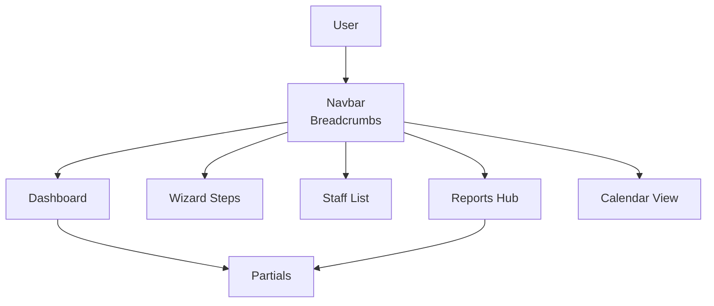

**Diagram sources**
- [base.html](file://turnos/templates/base.html)
- [dashboard.html](file://turnos/templates/turnos/dashboard.html)
- [wizard/base.html](file://turnos/templates/turnos/wizard/base.html)
- [enfermera_list.html](file://turnos/templates/turnos/enfermera_list.html)
- [reportes.html](file://turnos/templates/turnos/reportes.html)
- [resultado_calendario.html](file://turnos/templates/turnos/resultado_calendario.html)
- [estadisticas.html](file://turnos/templates/turnos/partials/estadisticas.html)

## Detailed Component Analysis

### Dashboard Interface
The dashboard presents a summary of system activity with:
- Statistics cards for configurations, successful runs, active nurses, and planned days
- Recent executions table with status badges and duration
- Quick actions buttons for common tasks
- Responsive grid layout with animations and hover effects

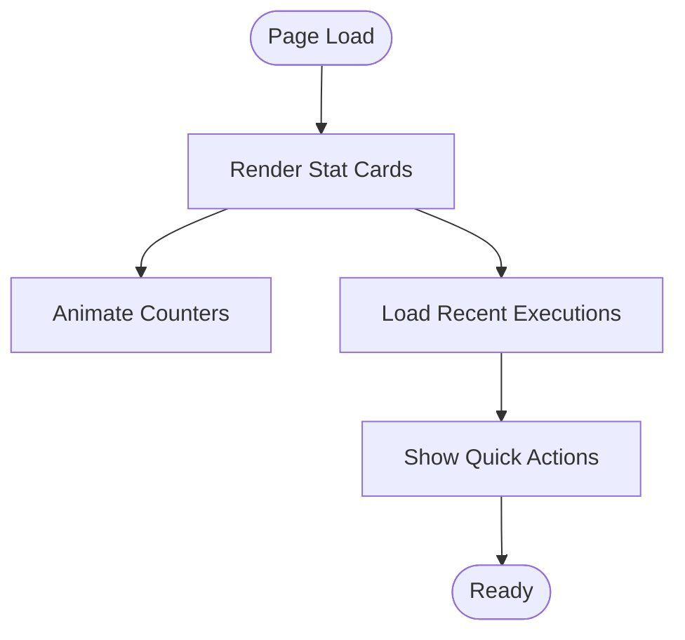

**Diagram sources**
- [dashboard.html](file://turnos/templates/turnos/dashboard.html)
- [dashboard.css](file://static/css/dashboard.css)
- [dashboard.js](file://static/js/dashboard.js)

**Section sources**
- [dashboard.html](file://turnos/templates/turnos/dashboard.html)
- [dashboard.css](file://static/css/dashboard.css)
- [dashboard.js](file://static/js/dashboard.js)

### Planning Wizard
The wizard guides users through four steps:
- Step indicators with active/completed states and help content
- Dynamic restriction editing (hard and soft constraints)
- Navigation controls and progress bar
- Sticky sidebar for improved usability on long forms

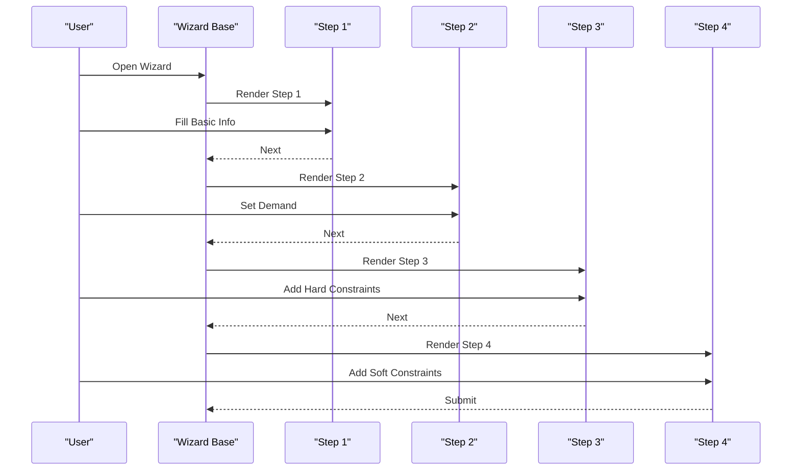

**Diagram sources**
- [wizard/base.html](file://turnos/templates/turnos/wizard/base.html)
- [wizard.css](file://static/css/wizard.css)

**Section sources**
- [wizard/base.html](file://turnos/templates/turnos/wizard/base.html)
- [wizard.css](file://static/css/wizard.css)

### Staff Management Interfaces
The staff list uses a card grid with:
- Search and filter controls (status, order)
- Pagination with page links
- Hover and selection effects
- Inline actions per staff member

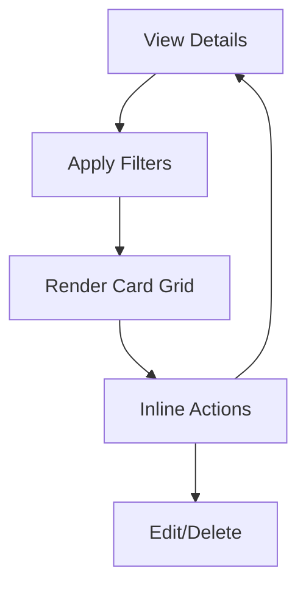

**Diagram sources**
- [enfermera_list.html](file://turnos/templates/turnos/enfermera_list.html)
- [main.js](file://static/js/main.js)

**Section sources**
- [enfermera_list.html](file://turnos/templates/turnos/enfermera_list.html)
- [main.js](file://static/js/main.js)

### Reporting Pages
The reporting hub provides:
- KPI summary cards
- Report cards for workload, conflicts, and trends
- System status and last update timestamps
- Quick navigation to related lists

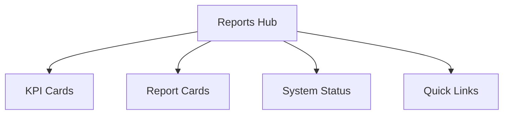

**Diagram sources**
- [reportes.html](file://turnos/templates/turnos/reportes.html)
- [reportes.html](file://turnos/templates/turnos/reportes.html)

**Section sources**
- [reportes.html](file://turnos/templates/turnos/reportes.html)

### Execution Result Views
Execution details include:
- Statistics cards for runtime, days, nurses, and assignments
- Quality metrics (optimal/facible solution, total penalty)
- Distribution of shifts by type
- Workload distribution per nurse with progress bars

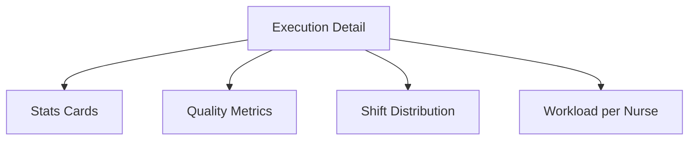

**Diagram sources**
- [estadisticas.html](file://turnos/templates/turnos/partials/estadisticas.html)

**Section sources**
- [estadisticas.html](file://turnos/templates/turnos/partials/estadisticas.html)

### Timetable Display
The printable timetable uses:
- Sticky headers and first column for nurse names
- Scrollable viewport with responsive adjustments
- Color-coded shift badges and time labels

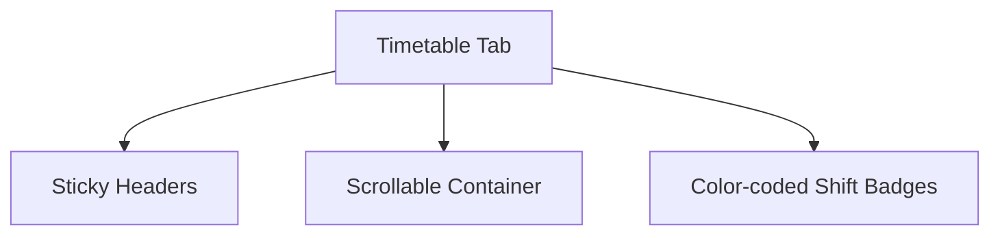

**Diagram sources**
- [planilla_tabla.html](file://turnos/templates/turnos/partials/planilla_tabla.html)
- [planilla_tabla.html](file://turnos/templates/turnos/partials/planilla_tabla.html)

**Section sources**
- [planilla_tabla.html](file://turnos/templates/turnos/partials/planilla_tabla.html)

### Calendar View
The calendar integrates FullCalendar:
- Month/week/day view toggles
- Filter by nurse and shift type
- Legend for shift types
- Modal dialog for event details

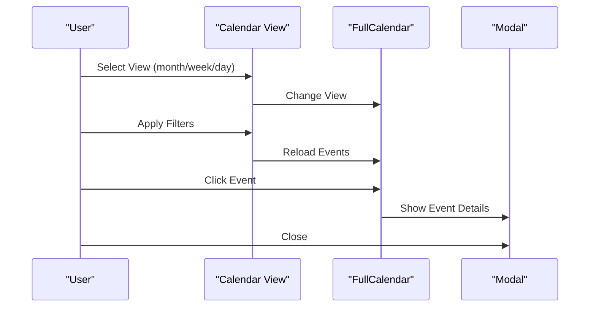

**Diagram sources**
- [resultado_calendario.html](file://turnos/templates/turnos/resultado_calendario.html)
- [calendario.css](file://static/css/calendario.css)
- [calendario.js](file://static/js/calendario.js)

**Section sources**
- [resultado_calendario.html](file://turnos/templates/turnos/resultado_calendario.html)
- [calendario.css](file://static/css/calendario.css)
- [calendario.js](file://static/js/calendario.js)

### Turn Types Management
Turn types are presented as:
- Card-based list with color-coded headers
- Status badges and usage counts
- Quick-create presets for common shifts
- Edit/delete actions with safety checks

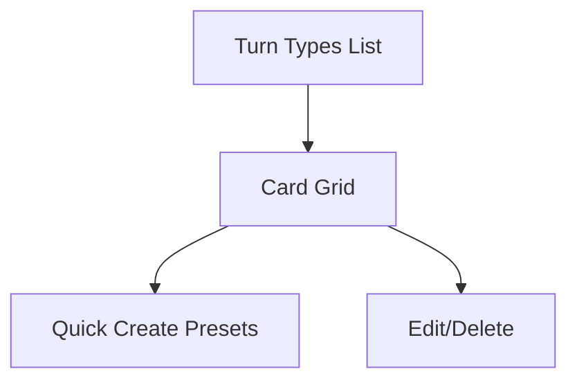

**Diagram sources**
- [tipo_turno_list.html](file://turnos/templates/turnos/tipo_turno_list.html)

**Section sources**
- [tipo_turno_list.html](file://turnos/templates/turnos/tipo_turno_list.html)

### Workspace Selector
The workspace selector enables switching workspaces via AJAX:
- Dropdown with current selection
- POST request with CSRF token
- Automatic reload on success

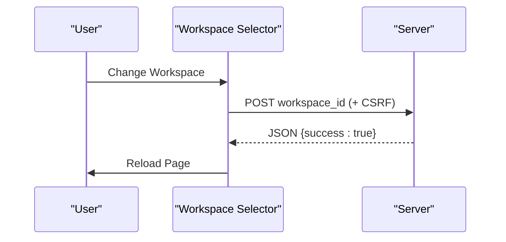

**Diagram sources**
- [workspace_selector.html](file://turnos/templates/includes/workspace_selector.html)

**Section sources**
- [workspace_selector.html](file://turnos/templates/includes/workspace_selector.html)

## Dependency Analysis
The UI relies on:
- Bootstrap 5 for responsive components and modals
- Font Awesome for icons
- FullCalendar for calendar interactions
- Localized date/time formatting
- Sticky positioning for headers and sidebars
- CSS custom properties for theme colors

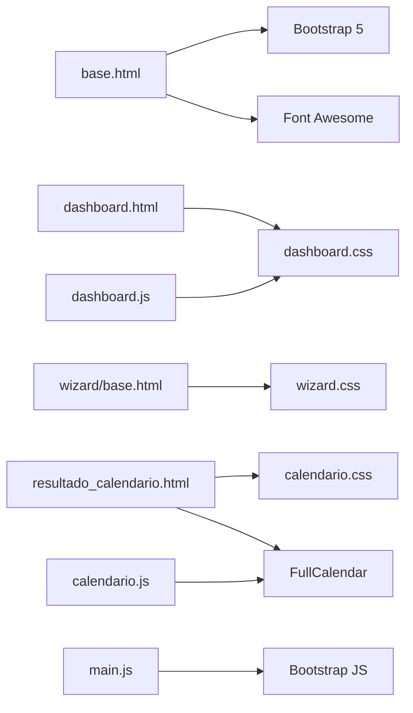

**Diagram sources**
- [base.html](file://turnos/templates/base.html)
- [dashboard.html](file://turnos/templates/turnos/dashboard.html)
- [wizard/base.html](file://turnos/templates/turnos/wizard/base.html)
- [resultado_calendario.html](file://turnos/templates/turnos/resultado_calendario.html)
- [dashboard.css](file://static/css/dashboard.css)
- [wizard.css](file://static/css/wizard.css)
- [calendario.css](file://static/css/calendario.css)
- [main.js](file://static/js/main.js)
- [dashboard.js](file://static/js/dashboard.js)
- [calendario.js](file://static/js/calendario.js)

**Section sources**
- [base.html](file://turnos/templates/base.html)
- [dashboard.css](file://static/css/dashboard.css)
- [wizard.css](file://static/css/wizard.css)
- [calendario.css](file://static/css/calendario.css)
- [main.js](file://static/js/main.js)
- [dashboard.js](file://static/js/dashboard.js)
- [calendario.js](file://static/js/calendario.js)

## Performance Considerations
- Use sticky headers and scrollable containers judiciously to avoid layout thrashing
- Lazy-load heavy calendars and tables when possible
- Minimize DOM updates during animations and filters
- Leverage Bootstrap’s compiled bundle to reduce script overhead
- Cache frequently accessed data (e.g., workspace preferences) client-side

## Troubleshooting Guide
Common UI issues and resolutions:
- Alerts not dismissing: Verify Bootstrap Alert initialization and auto-close timing
- Wizard step navigation: Ensure step indicator click handlers are attached after DOMContentLoaded
- Calendar view not updating: Confirm FullCalendar view change triggers and event reload
- Table sorting/filtering: Check column indices and text content normalization
- Workspace switch failing: Validate CSRF token presence and POST response handling

**Section sources**
- [base.html](file://turnos/templates/base.html)
- [main.js](file://static/js/main.js)
- [dashboard.js](file://static/js/dashboard.js)
- [calendario.js](file://static/js/calendario.js)

## Conclusion
The application’s UI combines a robust base layout with specialized views for planning, staff management, reporting, and calendar visualization. The design emphasizes responsiveness, accessibility, and user-friendly workflows, integrating server-side rendering with Bootstrap components and targeted JavaScript enhancements for interactivity.