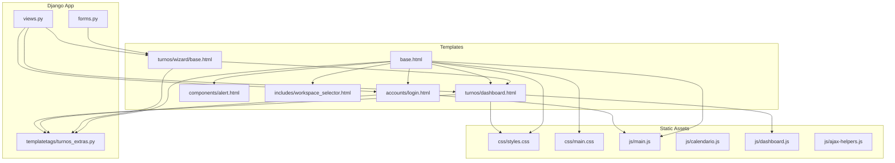
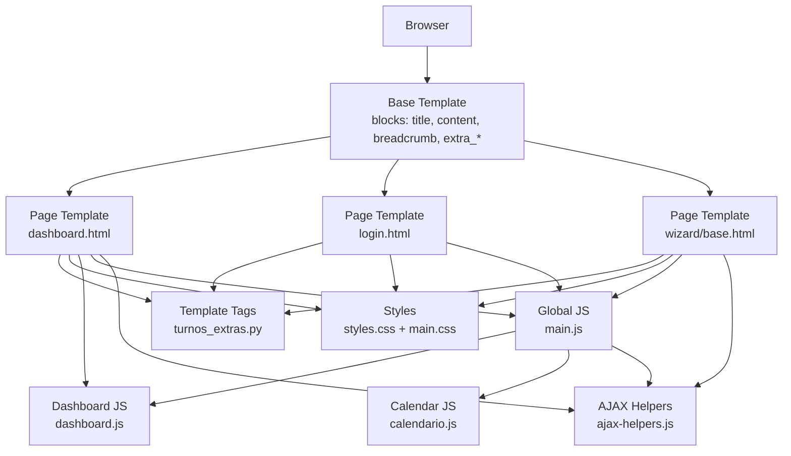
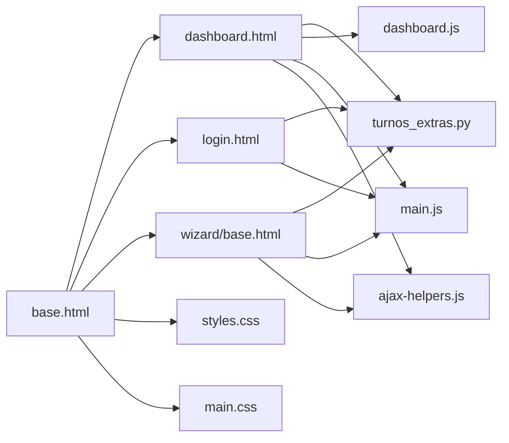

# User Interface and Templates

<cite>
**Referenced Files in This Document**
- [base.html](file://turnos/templates/base.html)
- [login.html](file://turnos/templates/accounts/login.html)
- [dashboard.html](file://turnos/templates/turnos/dashboard.html)
- [wizard/base.html](file://turnos/templates/turnos/wizard/base.html)
- [main.js](file://static/js/main.js)
- [calendario.js](file://static/js/calendario.js)
- [dashboard.js](file://static/js/dashboard.js)
- [ajax-helpers.js](file://static/js/ajax-helpers.js)
- [main.css](file://static/css/main.css)
- [styles.css](file://static/css/styles.css)
- [turnos_extras.py](file://turnos/templatetags/turnos_extras.py)
- [alert.html](file://turnos/components/alert.html)
- [workspace_selector.html](file://turnos/templates/includes/workspace_selector.html)
- [views.py](file://turnos/views.py)
- [forms.py](file://turnos/forms.py)
</cite>

## Table of Contents
1. [Introduction](#introduction)
2. [Project Structure](#project-structure)
3. [Core Components](#core-components)
4. [Architecture Overview](#architecture-overview)
5. [Detailed Component Analysis](#detailed-component-analysis)
6. [Dependency Analysis](#dependency-analysis)
7. [Performance Considerations](#performance-considerations)
8. [Troubleshooting Guide](#troubleshooting-guide)
9. [Conclusion](#conclusion)
10. [Appendices](#appendices)

## Introduction
This document describes the user interface and templates powering the turn scheduling application. It covers the Bootstrap 5-based template inheritance system, responsive design patterns, component organization, and interactive JavaScript modules for calendar display, dashboard analytics, AJAX interactions, and form validation. It also documents the wizard interface for configuration, dashboard widgets for statistics, specialized views for staff management, template tags and context processors, and static asset management. Accessibility, cross-browser compatibility, and mobile responsiveness are addressed, along with guidelines for UI customization and theme modifications.

## Project Structure
The UI is organized around a shared base template that all pages inherit from. Specific page templates extend the base and inject content blocks. Static assets (CSS and JS) are served via CDN and local bundles. Template tags encapsulate reusable filters and tags for formatting, badges, and inclusion components. The wizard pattern organizes multi-step configuration into a cohesive experience.

**Diagram sources**
- [base.html:1-384](file://turnos/templates/base.html#L1-L384)
- [dashboard.html:1-189](file://turnos/templates/turnos/dashboard.html#L1-L189)
- [login.html:1-143](file://turnos/templates/accounts/login.html#L1-L143)
- [wizard/base.html:1-157](file://turnos/templates/turnos/wizard/base.html#L1-L157)
- [alert.html:1-7](file://turnos/components/alert.html#L1-L7)
- [workspace_selector.html:1-18](file://turnos/templates/includes/workspace_selector.html#L1-L18)
- [styles.css:1-633](file://static/css/styles.css#L1-L633)
- [main.css:1-91](file://static/css/main.css#L1-L91)
- [main.js:1-590](file://static/js/main.js#L1-L590)
- [calendario.js:1-243](file://static/js/calendario.js#L1-L243)
- [dashboard.js:1-77](file://static/js/dashboard.js#L1-L77)
- [ajax-helpers.js:1-316](file://static/js/ajax-helpers.js#L1-L316)
- [turnos_extras.py:1-855](file://turnos/templatetags/turnos_extras.py#L1-L855)
- [views.py:1-2495](file://turnos/views.py#L1-L2495)
- [forms.py:1-905](file://turnos/forms.py#L1-L905)

**Section sources**
- [base.html:1-384](file://turnos/templates/base.html#L1-L384)
- [dashboard.html:1-189](file://turnos/templates/turnos/dashboard.html#L1-L189)
- [login.html:1-143](file://turnos/templates/accounts/login.html#L1-L143)
- [wizard/base.html:1-157](file://turnos/templates/turnos/wizard/base.html#L1-L157)
- [styles.css:1-633](file://static/css/styles.css#L1-L633)
- [main.css:1-91](file://static/css/main.css#L1-L91)
- [main.js:1-590](file://static/js/main.js#L1-L590)
- [calendario.js:1-243](file://static/js/calendario.js#L1-L243)
- [dashboard.js:1-77](file://static/js/dashboard.js#L1-L77)
- [ajax-helpers.js:1-316](file://static/js/ajax-helpers.js#L1-L316)
- [turnos_extras.py:1-855](file://turnos/templatetags/turnos_extras.py#L1-L855)
- [views.py:50-96](file://turnos/views.py#L50-L96)
- [forms.py:148-200](file://turnos/forms.py#L148-L200)

## Core Components
- Base template and layout: Provides the global shell, navigation, breadcrumbs, messages, and shared styles/scripts. It defines blocks for title, content, breadcrumb, and extra CSS/JS.
- Dashboard: Displays summary statistics, recent executions, and quick actions. Integrates with dashboard-specific JS for animations and interactivity.
- Wizard: Multi-step configuration interface with a sticky sidebar, step indicators, and help content. Loads wizard-specific CSS/JS.
- Authentication: Login page built on the base template with floating labels, validation feedback, and animated card entrance.
- Template tags: Custom filters and tags for formatting, badges, inclusion components, and restriction metadata.
- Static assets: Centralized CSS with Bootstrap 5 variables and utilities; modular JS for global utilities, calendar, dashboard, and AJAX helpers.

Key implementation references:
- Base template blocks and navigation: [base.html:1-384](file://turnos/templates/base.html#L1-L384)
- Dashboard template and script injection: [dashboard.html:1-189](file://turnos/templates/turnos/dashboard.html#L1-L189)
- Wizard base template and scripts: [wizard/base.html:1-157](file://turnos/templates/turnos/wizard/base.html#L1-L157)
- Login template with form validation: [login.html:1-143](file://turnos/templates/accounts/login.html#L1-L143)
- Template tags registry and filters: [turnos_extras.py:1-855](file://turnos/templatetags/turnos_extras.py#L1-L855)
- Global JS utilities and initialization: [main.js:1-590](file://static/js/main.js#L1-L590)
- Calendar module: [calendario.js:1-243](file://static/js/calendario.js#L1-L243)
- Dashboard JS: [dashboard.js:1-77](file://static/js/dashboard.js#L1-L77)
- AJAX helpers: [ajax-helpers.js:1-316](file://static/js/ajax-helpers.js#L1-L316)

**Section sources**
- [base.html:1-384](file://turnos/templates/base.html#L1-L384)
- [dashboard.html:1-189](file://turnos/templates/turnos/dashboard.html#L1-L189)
- [wizard/base.html:1-157](file://turnos/templates/turnos/wizard/base.html#L1-L157)
- [login.html:1-143](file://turnos/templates/accounts/login.html#L1-L143)
- [turnos_extras.py:1-855](file://turnos/templatetags/turnos_extras.py#L1-L855)
- [main.js:1-590](file://static/js/main.js#L1-L590)
- [calendario.js:1-243](file://static/js/calendario.js#L1-L243)
- [dashboard.js:1-77](file://static/js/dashboard.js#L1-L77)
- [ajax-helpers.js:1-316](file://static/js/ajax-helpers.js#L1-L316)

## Architecture Overview
The UI architecture follows a layered pattern:
- Template layer: Base template with blocks; page templates extend base; includes for reusable components.
- Asset layer: CSS variables and utilities; modular JS modules for distinct features.
- Logic layer: Views populate context for templates; forms handle server-side validation; template tags enrich presentation.

**Diagram sources**
- [base.html:1-384](file://turnos/templates/base.html#L1-L384)
- [dashboard.html:1-189](file://turnos/templates/turnos/dashboard.html#L1-L189)
- [login.html:1-143](file://turnos/templates/accounts/login.html#L1-L143)
- [wizard/base.html:1-157](file://turnos/templates/turnos/wizard/base.html#L1-L157)
- [turnos_extras.py:1-855](file://turnos/templatetags/turnos_extras.py#L1-L855)
- [styles.css:1-633](file://static/css/styles.css#L1-L633)
- [main.css:1-91](file://static/css/main.css#L1-L91)
- [main.js:1-590](file://static/js/main.js#L1-L590)
- [dashboard.js:1-77](file://static/js/dashboard.js#L1-L77)
- [calendario.js:1-243](file://static/js/calendario.js#L1-L243)
- [ajax-helpers.js:1-316](file://static/js/ajax-helpers.js#L1-L316)

## Detailed Component Analysis

### Base Template and Layout
- Defines viewport meta, Bootstrap 5 CSS/JS via CDN, Font Awesome, and custom CSS/JS injection points.
- Provides navigation bar with links to dashboard, configurations, executions, staff, shifts, reports, and user menu.
- Implements breadcrumb block and floating messages container with auto-dismiss.
- Includes a custom CSS bundle and injects extra CSS/JS blocks for page-specific needs.

Accessibility and responsive design:
- Uses Bootstrap 5 grid and components; viewport meta ensures mobile scaling.
- Navigation toggler enables collapsible mobile menu.
- Alerts and messages are dismissible and styled for visibility.

**Section sources**
- [base.html:1-384](file://turnos/templates/base.html#L1-L384)

### Dashboard
- Extends base and injects dashboard-specific CSS and JS.
- Renders summary cards for configurations, successful runs, active nurses, and scheduled days.
- Displays recent executions table with state badges and quick actions.
- Initializes dashboard animations and clickable cards.

Interactive elements:
- Stat cards animate numeric counters.
- Clickable stat cards navigate to related lists.
- Quick action buttons provide shortcuts to common tasks.

**Section sources**
- [dashboard.html:1-189](file://turnos/templates/turnos/dashboard.html#L1-L189)
- [dashboard.js:1-77](file://static/js/dashboard.js#L1-L77)
- [turnos_extras.py:379-450](file://turnos/templatetags/turnos_extras.py#L379-L450)

### Wizard Interface
- Extends base with wizard-specific CSS and JS.
- Sticky sidebar with step indicators and completion states.
- Help panel dynamically updates based on current step.
- Step navigation highlights active/completed steps.

Integration:
- Loads wizard and restrictions JS bundles.
- Uses breadcrumb to reflect wizard context.

**Section sources**
- [wizard/base.html:1-157](file://turnos/templates/turnos/wizard/base.html#L1-L157)
- [turnos_extras.py:668-689](file://turnos/templatetags/turnos_extras.py#L668-L689)

### Authentication Pages
- Login page extends base with floating label inputs, validation feedback, and animated card entrance.
- Utilizes Django messages and form errors for user feedback.
- CSRF token handling is implicit via Django’s .

**Section sources**
- [login.html:1-143](file://turnos/templates/accounts/login.html#L1-L143)

### Template Tags and Filters
- Dictionary/list accessors, formatting (numbers, percentages, durations, dates), and string manipulation.
- Badge generators for states, shift types, and activity.
- Color and progress helpers, JSON conversion, and boolean checks.
- Inclusion tags for alert and loading spinners.
- Restriction metadata helpers and icon mapping.
- Utility tags for active nav highlighting and query string generation.

Examples of usage:
- State badges in dashboard tables: [turnos_extras.py:379-450](file://turnos/templatetags/turnos_extras.py#L379-L450)
- Alert inclusion: [alert.html:1-7](file://turnos/components/alert.html#L1-L7)
- Active nav tag: [turnos_extras.py:629-640](file://turnos/templatetags/turnos_extras.py#L629-L640)

**Section sources**
- [turnos_extras.py:1-855](file://turnos/templatetags/turnos_extras.py#L1-L855)
- [alert.html:1-7](file://turnos/components/alert.html#L1-L7)

### Static Assets Management
- Centralized variables and utilities in styles.css; Bootstrap 5 variables and custom spacing/typography.
- Additional global styles in main.css for cards, gradients, buttons, and animations.
- Scripts loaded via CDN (Bootstrap 5) plus local bundles for app-specific functionality.

Responsive behavior:
- Media queries adjust typography and table readability on small screens.
- Print styles hide UI chrome for paper exports.

**Section sources**
- [styles.css:1-633](file://static/css/styles.css#L1-L633)
- [main.css:1-91](file://static/css/main.css#L1-L91)
- [base.html:1-384](file://turnos/templates/base.html#L1-L384)

### JavaScript Modules

#### Global Utilities (main.js)
- Configuration object for API base URL, CSRF token, and debug flag.
- Utilities: cookie parsing, date/time formatting, number formatting, debounce, toast notifications, confirm dialogs, random color, email validation, clipboard copy.
- Loader/spinner overlay management.
- Form validation: per-field and full-form validation with Bootstrap classes and feedback.
- Sidebar persistence and mobile close behavior.
- Table helpers: sorting, filtering, CSV export.
- Delete confirmations via data attributes.
- Auto-save for forms with callbacks.
- Live search with debounced requests.

Initialization:
- On DOMContentLoaded, initializes loader, sidebar, delete confirmations, Bootstrap tooltips/popovers, auto-dismiss alerts, and live validation for forms with class “needs-validation”.

**Section sources**
- [main.js:1-590](file://static/js/main.js#L1-L590)

#### Calendar Display (calendario.js)
- Renders a month grid with day headers and colored turnos indicators.
- Highlights today and weekends.
- Clicking a day opens a modal with turnos breakdown and assigned nurses.
- Navigation controls for previous/next month and “today”.
- Date formatting helpers for short and long formats.

**Section sources**
- [calendario.js:1-243](file://static/js/calendario.js#L1-L243)

#### Dashboard Analytics (dashboard.js)
- Animates numeric counters inside stat cards.
- Adds click handlers to stat cards to navigate to linked URLs.
- Provides hook for future AJAX-driven refresh.

**Section sources**
- [dashboard.js:1-77](file://static/js/dashboard.js#L1-L77)

#### AJAX Interactions (ajax-helpers.js)
- Unified helpers for GET/POST/PUT/DELETE with CSRF token extraction.
- FormData submission and HTML content loading.
- Polling mechanism for long-running tasks.
- Application-specific helpers: execution status monitoring, nurse search, configuration validation/duplication, export triggers, dashboard stats retrieval, and user preferences saving.

**Section sources**
- [ajax-helpers.js:1-316](file://static/js/ajax-helpers.js#L1-L316)

### Staff Management Views and Forms
- Dashboard view aggregates counts and recent executions for rendering in the dashboard template.
- Configuration creation view prepares JSON for shift types and handles pattern processing.
- Forms define field widgets, validation rules, and constraints for staff and shift types.

**Section sources**
- [views.py:50-96](file://turnos/views.py#L50-L96)
- [views.py:148-200](file://turnos/views.py#L148-L200)
- [forms.py:14-73](file://turnos/forms.py#L14-L73)
- [forms.py:75-162](file://turnos/forms.py#L75-L162)
- [forms.py:164-200](file://turnos/forms.py#L164-L200)

## Dependency Analysis
The UI components depend on:
- Base template for shared layout and assets.
- Template tags for formatting and badges.
- Local JS modules for specific features.
- Views for context data and routing.

**Diagram sources**
- [base.html:1-384](file://turnos/templates/base.html#L1-L384)
- [dashboard.html:1-189](file://turnos/templates/turnos/dashboard.html#L1-L189)
- [login.html:1-143](file://turnos/templates/accounts/login.html#L1-L143)
- [wizard/base.html:1-157](file://turnos/templates/turnos/wizard/base.html#L1-L157)
- [turnos_extras.py:1-855](file://turnos/templatetags/turnos_extras.py#L1-L855)
- [dashboard.js:1-77](file://static/js/dashboard.js#L1-L77)
- [main.js:1-590](file://static/js/main.js#L1-L590)
- [ajax-helpers.js:1-316](file://static/js/ajax-helpers.js#L1-L316)
- [styles.css:1-633](file://static/css/styles.css#L1-L633)
- [main.css:1-91](file://static/css/main.css#L1-L91)

**Section sources**
- [base.html:1-384](file://turnos/templates/base.html#L1-L384)
- [turnos_extras.py:1-855](file://turnos/templatetags/turnos_extras.py#L1-L855)
- [main.js:1-590](file://static/js/main.js#L1-L590)
- [dashboard.js:1-77](file://static/js/dashboard.js#L1-L77)
- [ajax-helpers.js:1-316](file://static/js/ajax-helpers.js#L1-L316)
- [styles.css:1-633](file://static/css/styles.css#L1-L633)
- [main.css:1-91](file://static/css/main.css#L1-L91)

## Performance Considerations
- Minimize DOM manipulations: Calendar and dashboard modules rely on efficient innerHTML updates and Bootstrap components; avoid frequent reflows.
- Debounce user interactions: Live search and resize events use debounce to reduce workload.
- Lazy initialization: Some features initialize only when elements exist.
- Asset delivery: Bootstrap and Font Awesome loaded via CDN; keep local scripts minimal and concatenated where appropriate.
- Image and icon optimization: Prefer SVG icons (Font Awesome) and vector graphics for crisp rendering.

## Troubleshooting Guide
Common issues and resolutions:
- Toast notifications not appearing: Ensure the toast container exists or allow the utility to create it; verify Bootstrap Alert integration.
- Form validation not working: Confirm forms include the “needs-validation” class and fields trigger blur/validation events.
- Sidebar not persisting: Verify localStorage availability and correct keys.
- Calendar clicks not opening modals: Ensure event delegation targets non-empty day cells and that Bootstrap Modal is available.
- AJAX requests failing: Check CSRF token presence and correct header usage; review network tab for 4xx/5xx responses.
- Wizard step indicators not updating: Confirm step indicator items have proper “active/completed” classes and data-step attributes.

**Section sources**
- [main.js:98-176](file://static/js/main.js#L98-L176)
- [main.js:219-314](file://static/js/main.js#L219-L314)
- [main.js:319-362](file://static/js/main.js#L319-L362)
- [calendario.js:98-177](file://static/js/calendario.js#L98-L177)
- [ajax-helpers.js:8-16](file://static/js/ajax-helpers.js#L8-L16)
- [wizard/base.html:83-125](file://turnos/templates/turnos/wizard/base.html#L83-L125)

## Conclusion
The UI leverages a robust Bootstrap 5 foundation with a clear template inheritance model, modular JavaScript, and reusable template tags. The dashboard and wizard provide intuitive, responsive experiences, while AJAX helpers streamline asynchronous interactions. With thoughtful accessibility and responsive design choices, the system supports diverse devices and user needs. The provided guidelines enable safe customization and theme modifications.

## Appendices

### Accessibility Considerations
- Keyboard navigation: Ensure focus order aligns with visual layout; use semantic markup.
- Screen reader support: Provide meaningful alt text for icons; use ARIA roles where dynamic content is inserted.
- Contrast and readability: Maintain sufficient contrast for text and interactive elements; avoid color-only indicators.
- Focus management: Manage focus after modal open/close and dynamic content updates.

### Cross-Browser Compatibility
- Bootstrap 5 and Font Awesome are widely supported; test on latest Chrome, Firefox, Safari, and Edge.
- Polyfills may be needed for older browsers (e.g., Promise, fetch, or FormData polyfills) if legacy support is required.

### Mobile Responsiveness
- Responsive breakpoints are handled via Bootstrap 5; adjust custom media queries as needed.
- Touch-friendly controls: Increase tap areas for buttons and links; ensure adequate spacing.

### UI Customization and Theme Modifications
- Centralize theme variables in CSS custom properties for easy overrides.
- Extend base template blocks minimally to preserve consistency.
- Use template tags for consistent formatting and badge generation.
- Keep local JS modular to facilitate incremental updates.